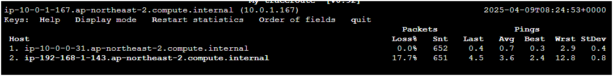
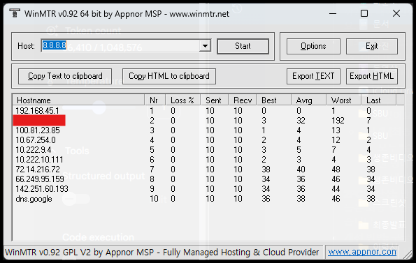
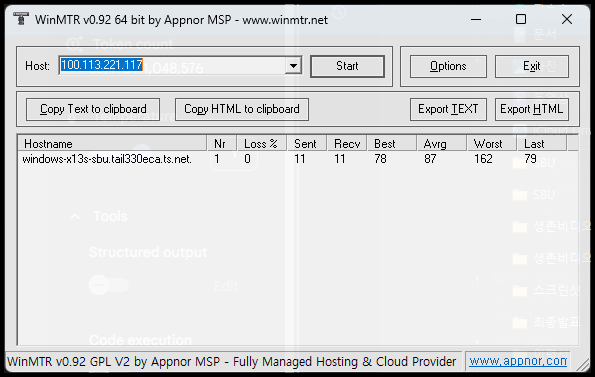
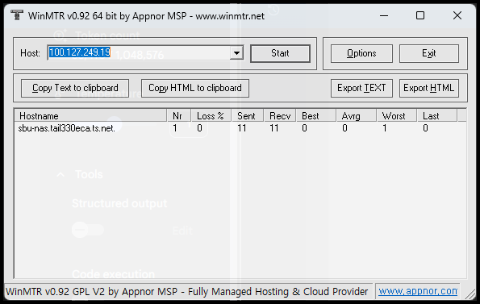

# mtr을 따라 알아보는 VPN에 대한 재밌는사실 : VPN 간 통신은 홉이 없는것처럼 보임 ㄷㄷ

> **Summary**
> AWS에서 VPN을 구축하며 mtr로 VPC 간 통신을 분석한 결과, IPSec으로 암호화된 홉은 보이지 않지만 지연시간으로 거리를 유추할 수 있다. tailscale을 이용해 내부 및 외부 네트워크 속도를 비교한 결과, 내부 네트워크는 매우 빠른 속도를 보였고, 외부 네트워크는 홉이 많지만 평균 속도는 87로 나타났다.

---

AWS에서 VPN을 구축해보면서, mtr로 다른 VPC로 ping 홉 따라가보니 인스턴스 사이에 홉이 안보였음

근데 또 8.8.8.8로 찍으면, 뭔가 홉이 많이 나옴…

엥? 같은 계정 , 같은 리전이라, VPC끼리 1:1 로 뭔가 내부적으로 연결되어있나?

라고 생각했지만~~?

아님… IPSec으로 암호화된 친구들은 사이에 홉들이 암호화되어 안보이는것임…

그러면 홉 사이사이 어케 분석함?

→ 못함… 근데 지연시간으로 어느정도의 거리를 유추해낼 수 있진 않을까?

그래서, tailscale로 묶여있는 우리집 네트워크로도 분석해봄… VPN으로 묶여있더라도, 내부, 외부 속도가 얼마나 차이날까?

### 8.8.8.8 외부 네트워크로 나가보자~

### Tailscale VPN (외부) 네트워크로 가보자~

### Tailscale VPN (내부) 네트워크로 가보자~

