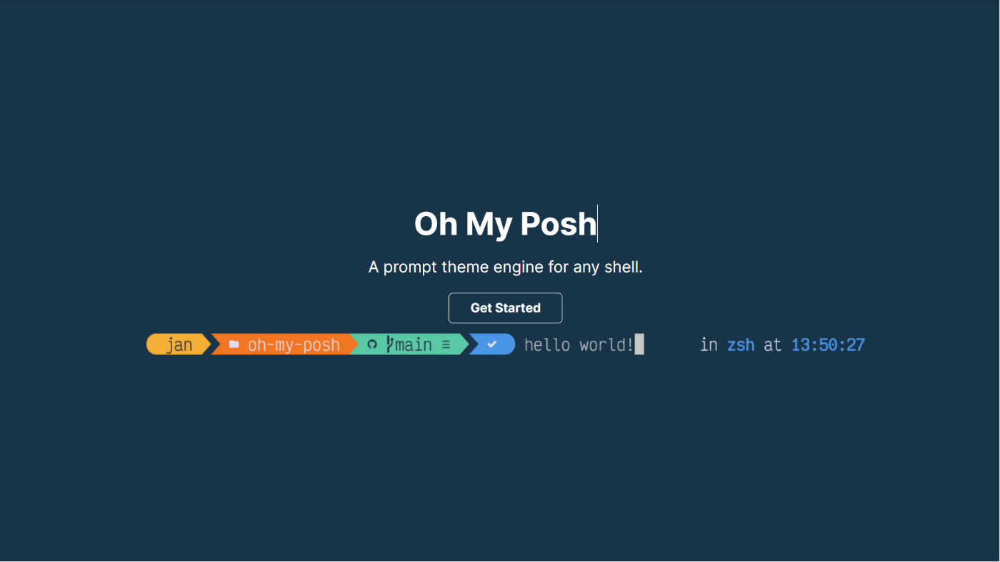

# oh my posh 윈도우 터미널 커스터마이징

> **Summary**
> Oh My Posh를 윈도우 터미널에 설치하고 커스터마이징하는 방법을 설명합니다. Scoop을 사용하여 설치하고, Nerd Font를 다운로드하여 설치한 후, Powershell에서 테마를 설정하는 방법을 안내합니다. 테마 적용을 위해 $PROFILE 파일을 수정하는 과정도 포함되어 있습니다.

---



## 설치

🔗 [https://ohmyposh.dev/docs/installation/windows](https://ohmyposh.dev/docs/installation/windows)

```javascript
scoop install https://github.com/JanDeDobbeleer/oh-my-posh/releases/latest/download/oh-my-posh.json
```

## Nerd Font 글꼴 설치

아래 URL에 접속하여 원하는 Font를 다운로드하고 Windows에 설치해주세요. 저는 Nerd Font 사이트에서 Caskaydia Cove Nerd Font를 선택해서 설치 했습니다.

[https://www.nerdfonts.com/font-downloads](https://www.nerdfonts.com/font-downloads)

## 테마 설정

🔗 [https://backstreet-programmer.tistory.com/176](https://backstreet-programmer.tistory.com/176)

🔗 [https://ohmyposh.dev/docs/themes](https://ohmyposh.dev/docs/themes)

> 아래 작업 전부 powershell에서 실행만 하면 됩니다

```livescript
New-Item -Path $PROFILE -Type File -Force
```

```livescript
oh-my-posh init pwsh --config 'https://raw.githubusercontent.com/JanDeDobbeleer/oh-my-posh/main/themes/clean-detailed.omp.json' | Invoke-Expression
```

```livescript
. $PROFILE
```

> 시작할때마다 theme가 적용되길 원한다면. $PROFILE 을 수정해야합니다

```livescript
code $PROFILE
```

```livescript
oh-my-posh init pwsh --config 'https://raw.githubusercontent.com/JanDeDobbeleer/oh-my-posh/main/themes/clean-detailed.omp.json' | Invoke-Expression
```

