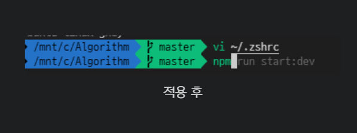
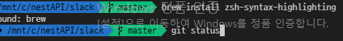
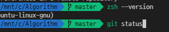

# oh my zsh - 플러그인 (자동완성,구문강조 등)

> **Summary**
> oh-my-zsh의 구문 강조 및 자동 완성 플러그인 설치 방법을 설명합니다. 구문 강조는 사용 가능한 명령어를 색상으로 구분해 보여주며, 자동 완성은 자주 사용하는 명령어를 제안합니다. 설치는 간단하며, .zshrc 파일에 플러그인을 추가하고 터미널을 재시작하면 적용됩니다.

---



🔗 [https://tasddc.tistory.com/41](https://tasddc.tistory.com/41)

syntax-highlighting라는 플러그인은 말 그대로 **'구문 강조'** 플러그인입니다..!

터미널에서 구문 강조라 함은 **내가 사용할 수 있는 명령어인지,, 아닌지를 강조**를 통해서 보여준다는 말입니다!

바로 사진을 보시면



적용 전



적용 후

바로 차이가 보이시죠?

현재의 터미널에서 사용할 수 있는 명령어는 **초록색**으로, 아니면 **빨간색**으로 나타내 줍니다.

설치는 매우 간단합니다. (저는 아래와 같은 순서로 설치 & 적용을 하였습니다.)

```shell
# 경로로 들어가서 git clone 받기
cd ~/.oh-my-zsh/plugins
git clone https://github.com/zsh-users/zsh-syntax-highlighting.git

# echo 명령어 사용
echo "source ${(q-)PWD}/zsh-syntax-highlighting/zsh-syntax-highlighting.zsh" >> ${ZDOTDIR:-$HOME}/.zshrc

# .zshrc의 plugins 부분에 추가해주기
vi ~/.zshrc
plugins=(git ... zsh-syntax-highlighting)
```

마지막 부분에 제가 실제로 작성한 모습은 다음과 같습니다!

```shell
plugins=(git zsh-syntax-highlighting zsh-autosuggestions)
```

처음에는 **plugins = (git)** 이라고만 되어있을 거예요.

그 뒤에 공백을 주고 연결해주면 됩니다.

그러고 나서 터미널을 껐다가 다시 켜주면 적용이 완료됩니다!

### [[ auto-suggestions 소개 및 적용 법 ]](https://tasddc.tistory.com/41#%-B%--auto-suggestions%C-%A-%EC%--%-C%EA%B-%-C%--%EB%B-%-F%--%EC%A-%--%EC%-A%A-%--%EB%B-%--%--%-D)

이번에 소개할 플러그인은 **auto-suggestions입니다!**

이 플러그인은 **내가 자주 사용하는 명령어 또는 파일 이름 등을 제안**을 해주는 플러그인입니다.

바로 이런 식으로 말이죠!


적용 후

서버를 실행한다거나 자주 사용하는 명령어들을 말 그대로 추천(제안?) 해주는 것입니다!

위의 사진에서 윗 방향키(↑) 바로 위에 있는 **end 키를 입력**하면 제안된 명령어가 자동 입력됩니다!

설치 과정은 아래와 같습니다!

```shell
# 경로로 들어가서 git clone 받기
cd ~/.oh-my-zsh/plugins
git clone https://github.com/zsh-users/zsh-autosuggestions.git

# echo 명령어 사용
echo "source ${(q-)PWD}/zsh-autosuggestions/zsh-autosuggestions.zsh" >> ${ZDOTDIR:-$HOME}/.zshrc

# .zshrc의 plugins 부분에 추가해주기
vi ~/.zshrc
plugins=(git ... zsh-autosuggestions)
```

위에서 했던 방식과 동일합니다!

