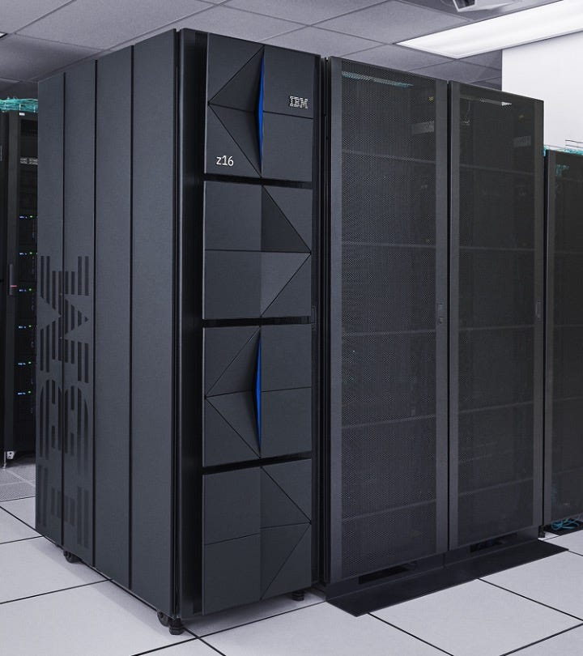

# s390x는 무슨 아키텍처인가?

> **Summary**
> s390x는 IBM 메인프레임에서 사용되는 64비트 아키텍처로, 금융, 의료 등에서 신뢰성과 성능으로 널리 활용됩니다. 포춘 500대 기업의 71%가 메인프레임을 사용하며, 신용카드 거래의 90%를 처리합니다. 최근 AI와 머신러닝 작업을 지원하기 위해 진화하고 있으며, TensorFlow와 같은 도구가 s390x에서 사용 가능합니다. 하이브리드 클라우드와 AI 통합을 통해 미래에도 중요한 역할을 할 것으로 기대됩니다.

---

도커 공식문서를 읽다가, s390x 라는 처음보는아키텍처가 있어 이게뭔고~ 하고 조사하게되었다.

요즘 grok 과 perflexity 등 딥 리서치 기능이 너무 사기라… 사실상 슬슬 삽질저장소가 AI 딸깍 저장소로 바뀌고있는것같다.

### s390x에 대한 재미있는 글: 현대 컴퓨팅의 숨은 영웅

- **s390x는 무엇인가?** IBM 메인프레임에서 사용되는 64비트 아키텍처로, 금융, 의료 등 중요한 산업에서 신뢰성과 성능으로 널리 사용됩니다.
- **왜 여전히 중요할까?** 포춘 500대 기업의 71%가 메인프레임을 사용하며, 신용카드 거래의 90%를 처리합니다.
- **AI와의 연결점** AI 작업을 위한 TensorFlow와 같은 도구가 s390x에서 지원되며, 컨테이너 기술로 현대화되고 있습니다.
### s390x 소개

s390x는 IBM의 메인프레임 컴퓨터에서 사용되는 64비트 아키텍처로, System/360과 System/370의 후속 버전입니다. 이 아키텍처는 대규모 트랜잭션 처리와 높은 보안이 필요한 환경에서 뛰어난 성능을 발휘하며, 특히 금융, 의료, 정부 부문에서 필수적입니다.

### 현재 사용 상태와 중요성

메인프레임은 클라우드 컴퓨팅의 시대에도 여전히 중요한 역할을 합니다. [BMC Software의 2024년 보고서](https://www.bmc.com/blogs/state-of-mainframe/)에 따르면, 포춘 500대 기업의 71%가 메인프레임을 사용하며, 신용카드 거래의 90%를 처리합니다. 이는 s390x 기반 메인프레임이 고속 트랜잭션 처리와 데이터 처리 능력에서 여전히 경쟁력이 있음을 보여줍니다.

### AI와의 통합

최근 s390x는 AI와 머신러닝 작업을 지원하기 위해 진화하고 있습니다. 예를 들어, TensorFlow는 s390x에서 사용할 수 있어 데이터 과학자들이 메인프레임에서 AI 모델을 훈련하고 배포할 수 있습니다. 또한, Docker와 Podman 같은 컨테이너 기술이 s390x에 도입되며, AI 워크로드를 효율적으로 관리할 수 있게 되었습니다.

### 놀라운 사실: 지속적인 현대화

s390x는 단순히 과거의 기술이 아니라, 하이브리드 클라우드와 AI를 통합하며 미래를 준비하고 있습니다. 이는 메인프레임이 여전히 IT 환경의 핵심 역할을 한다는 점에서 놀랍습니다.

---

### s390x에 대한 심층 보고서: 현대 컴퓨팅에서의 역할과 미래 전망

s390x 아키텍처는 IBM 메인프레임 컴퓨터의 핵심 구성 요소로, 64비트 컴퓨팅 환경을 제공하며, 금융, 의료, 정부와 같은 중요한 산업에서 신뢰성과 성능으로 널리 사용됩니다. 이 보고서는 s390x의 역사적 배경, 현재 사용 상태, 그리고 특히 AI와 현대 컴퓨팅 트렌드와의 통합을 탐구하며, 독자들에게 이 아키텍처에 대한 깊은 통찰을 제공하고자 합니다.

### 1. s390x의 정의와 역사적 배경

s390x는 IBM의 System/360과 System/370 아키텍처의 후속 버전으로, 64비트 z/Architecture를 기반으로 합니다. 이 아키텍처는 2000년대 초반부터 사용되며, 이전 32비트 s390 아키텍처와의 호환성을 유지하면서 더 큰 메모리 주소 공간과 성능 향상을 제공합니다. [Wikipedia의 IBM System/390 페이지](https://en.wikipedia.org/wiki/IBM_System/390)에 따르면, s390x는 메인프레임의 다섯 번째 세대 아키텍처로, 높은 가용성과 확장성을 특징으로 합니다.

s390x는 빅 엔디안(big-endian) 아키텍처로, x86과 같은 리틀 엔디안 아키텍처와 달리 메모리 접근 방식에서 차별점이 있습니다. 이는 소프트웨어 개발에서 특정 호환성 문제를 초래하지만, 메인프레임의 고유한 워크로드에 최적화되어 있습니다.

### 2. 현재 메인프레임 사용 상태

메인프레임, 특히 s390x 기반 시스템은 클라우드 컴퓨팅의 부상에도 불구하고 여전히 중요한 역할을 합니다. [Precisely의 보고서](https://www.precisely.com/blog/mainframe/9-mainframe-statistics)에 따르면, 포춘 500대 기업의 71%가 메인프레임을 사용하며, 신용카드 거래의 90%를 처리합니다. 또한, 메인프레임은 세계 생산 IT 워크로드의 68%를 처리하면서 IT 비용의 단 6%만 차지합니다.

이러한 통계는 메인프레임이 고속 트랜잭션 처리와 대규모 데이터 관리에서 여전히 경쟁력이 있음을 보여줍니다. 예를 들어, 은행은 실시간 온라인 트랜잭션 처리(OLTP)와 야간 배치 작업을 위해 메인프레임을 계속 사용하며, 고객 명세서와 내부 재무 보고서를 처리합니다.

### 3. Linux on s390x: 유연성과 확장성

s390x에서 Linux의 채택은 이 아키텍처의 현대화에 중요한 역할을 했습니다. [Linux on IBM Z Wikipedia 페이지](https://en.wikipedia.org/wiki/Linux_on_IBM_Z)에 따르면, Linux on s390x는 Red Hat Enterprise Linux, SUSE Linux Enterprise Server, Ubuntu와 같은 주요 배포판을 지원하며, 일반적인 메인프레임 중앙 프로세서(CP)와 통합된 Linux 시설(IFL)에서 실행됩니다.

Linux on s390x는 개발자들에게 친숙한 오픈 소스 환경을 제공하며, 메인프레임의 강력한 하드웨어를 활용할 수 있게 합니다. 이는 특히 소프트웨어 포팅과 새로운 애플리케이션 개발에서 유리하며, [Open Mainframe Project의 개발자 리소스](https://openmainframeproject.org/news/developer-resources-for-linux-on-s390x/)에 따르면, Go, Python, Kubernetes와 같은 최신 기술도 s390x에서 지원됩니다.

### 4. AI와 s390x: 새로운 가능성

AI와 머신러닝의 부상은 s390x의 역할을 재정의하고 있습니다. [Medium의 TensorFlow on s390x 글](https://medium.com/ibm-data-ai/tensorflow-and-more-with-ibm-z-169c4a4817f7)에 따르면, TensorFlow는 s390x에서 사용할 수 있으며, 데이터 과학자들이 메인프레임에서 AI 모델을 훈련하고 배포할 수 있습니다. 이는 금융과 의료와 같은 데이터 집약적 산업에서 특히 유용합니다.

또한, IBM은 [GitHub의 ai-on-z-containers 저장소](https://github.com/IBM/ai-on-z-containers)를 통해 AI 소프트웨어 스택을 위한 컨테이너 파일을 제공하며, Docker와 Podman을 통해 AI 워크로드를 효율적으로 관리할 수 있습니다. 이는 s390x가 하이브리드 클라우드 환경에서 AI 애플리케이션을 지원할 수 있음을 보여줍니다.

### 5. 미래 전망: 하이브리드 클라우드와 AI 통합

s390x의 미래는 하이브리드 클라우드와 AI 기술과의 통합에 크게 의존합니다. [IBM의 메인프레임 페이지](https://www.ibm.com/think/topics/mainframe)에 따르면, 현대 메인프레임은 DevOps와 DevSecOps를 통해 애플리케이션 개발을 가속화하며, 에너지 효율성을 높여 데이터 센터의 지속 가능성을 개선합니다. 이는 s390x가 AI와 클라우드 네이티브 애플리케이션을 지원하며, 기업의 디지털 전환을 촉진할 잠재력을 가지고 있음을 시사합니다.

### 6. 결론

s390x는 단순히 과거의 기술이 아니라, 현대 컴퓨팅의 핵심 구성 요소로 계속 진화하고 있습니다. AI와 컨테이너 기술의 통합을 통해, s390x는 금융, 의료, 정부와 같은 산업에서 여전히 중요한 역할을 하며, 하이브리드 클라우드와 AI 시대에서도 경쟁력을 유지할 것으로 보입니다.

### 표: s390x 주요 특징과 통계

---

