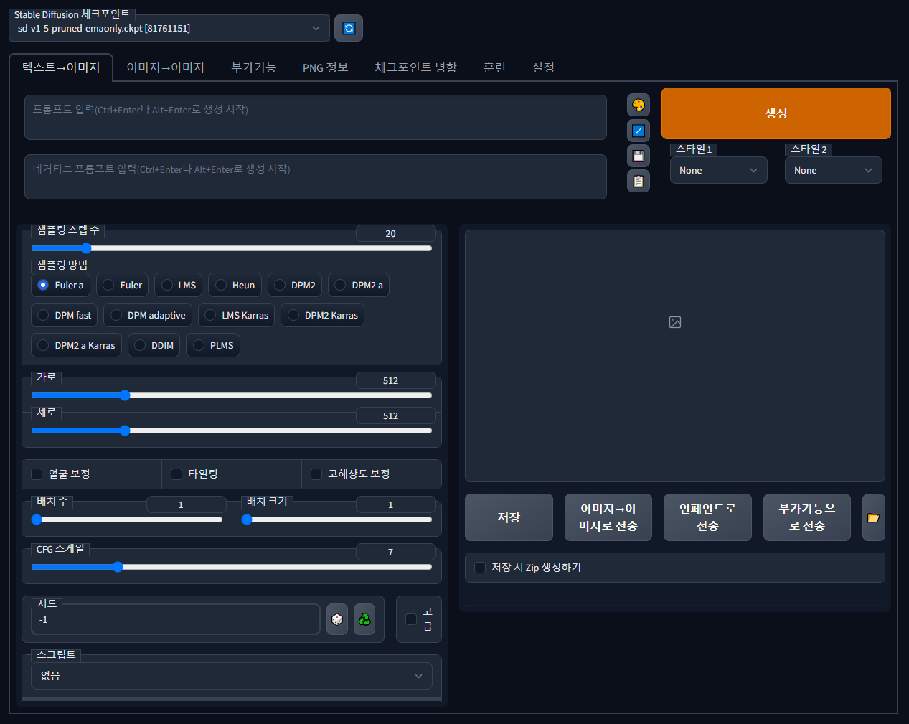
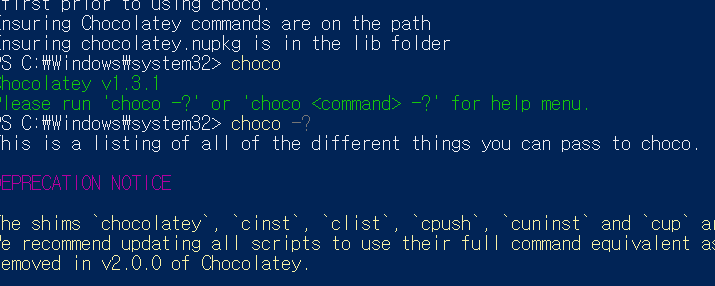

# stable-diffusion Web UI 설치

> **Summary**
> Stable Diffusion 웹 UI 설치를 위한 가이드로, GitHub에서 레포지토리를 다운로드하고 Python 3.10으로 다운그레이드하여 설치 오류를 해결하는 방법을 설명합니다. VRAM을 줄이는 방법과 다양한 프롬프트 입력 방식, 필수 및 추천 익스텐션에 대한 정보도 포함되어 있습니다. 로컬 서버 웹 호스팅 방법도 간단히 언급됩니다.

---



아래 레파토지로 다운로드받는것을 추천드립니다.

🔗 [https://github.com/AUTOMATIC1111/stable-diffusion-webui](https://github.com/AUTOMATIC1111/stable-diffusion-webui)

```shell
git clone https://github.com/AUTOMATIC1111/stable-diffusion-webui.git
```

# 이 웹사이트만 따라해주시면 됩니다

🔗 [https://rentry.org/voldy](https://rentry.org/voldy)

<details>
<summary>한국어 튜토리얼 따라하기(비추천)</summary>

🔗 [https://skyksit.com/useful/install-stable-diffusion-for-windows/](https://skyksit.com/useful/install-stable-diffusion-for-windows/)

# Windows Chocolatey 설치

🔗 [https://chocolatey.org/install](https://chocolatey.org/install)


윈도우 PowerShell 관리자권한으로 실행하여 다음 명령어를 입력합니다

```shell
Set-ExecutionPolicy Bypass -Scope Process -Force; [System.Net.ServicePointManager]::SecurityProtocol = [System.Net.ServicePointManager]::SecurityProtocol -bor 3072; iex ((New-Object System.Net.WebClient).DownloadString('https://community.chocolatey.org/install.ps1'))
```


설치가 완료되면, 다음 명령어로 설치를 확인할 수 있습니다

```shell
choco
choco -?
```



‘[launch.py](http://launch.py/)’ 파일에서 발생한 오류는 'RuntimeError: Couldn’t install torch.'입니다. 이 오류는 PyTorch를 설치할 때 발생하는 것으로 보입니다. 오류 메시지에 따르면 Python 버전이 호환되지 않아 발생한 것 같습니다.

오류 메시지에서 제안하는 대로 Python 버전을 3.10으로 다운그레이드하고 WebUI 디렉토리의 현재 Python 및 ‘venv’ 폴더를 삭제한 후 다시 시도해보세요. 또는 WebUI의 바이너리 릴리스를 사용할 수도 있습니다.

[Python 3.10 (Windows 7 버전)](https://github.com/adang1345/PythonWin7/raw/master/3.10.6/python-3.10.6-amd64-full.exe)

[**설치**](https://www.python.org/ftp/python/3.10.6/python-3.10.6-amd64.exe)

[(페이지)](https://www.python.org/downloads/windows/)

- 설치 시** " PATH에 추가**" 를 선택해야 합니다.

</details>

<details>
<summary>vram 줄이기</summary>

**6단계****(선택 사항):**

이렇게 하면 VRAM이 줄어들고 더 큰 해상도 또는 배치 크기에서 원시 생성 속도 를 10% 미만으로

생성할 수 있습니다. 평균 **25% 더 빠름 ) ***대부분의* 사용자 에게 권장됨 -편집 - 다음으로 변경

```plain text
webui-user.bat
```

```plain text
COMMANDLINE_ARGS=COMMANDLINE_ARGS=--medvram
```

</details>

## Chechkpoint / lora / vae / embedding 정리

🔗 [https://ai-designer-allan.tistory.com/entry/스테이블-디퓨전-Checkpoint-lora-vae-embedding-완벽정리](https://ai-designer-allan.tistory.com/entry/스테이블-디퓨전-Checkpoint-lora-vae-embedding-완벽정리)

### lora 개요

🔗 [https://github.com/civitai/civitai/wiki/How-to-use-models#lora](https://github.com/civitai/civitai/wiki/How-to-use-models#lora)


<details>
<summary>기본 사용법 (프롬프트 문법)</summary>

🔗 [https://rupicat.com/entry/Stable-Diffusion-프롬프트prompt-입력-방법-정리](https://rupicat.com/entry/Stable-Diffusion-프롬프트prompt-입력-방법-정리)

프롬프트 입력은 크게 두가지로 나뉨

- Prompt
  - 의도하고자하는 요소
- Negative prompt
  - 피하고자하는 요소

Checkpoint , Lora에대한 설명이 잘 되어있음

🎥 [동영상 보기](https://youtu.be/lIeUcj9LJyQ)

### **| 기본 문법**

프롬프트는 콤마 "," 로 구분

() 괄호로 프롬프트에 가중치를 줄수 있다. [] 는 가중치를 줄인다.

(프롬프트:가중치) 가중치는 보통 0.1~1.8까지 적는다. 기본값은 1

(프롬프트, 프롬프트:가중치) 여러개의 프롬프트를 묶어서 가중치 적용

(프롬프트) = (프롬프트:1.1)

[프롬프트] = (프롬프트:0.9)

외모, 상태, 배경 등은 태그로 적고 구도나 상황, 행위 묘사등은 문장으로 입력한다.


얼굴보정(Restore Faces) 체크해 주시면 얼굴을 뚜렸하고 섬세하게 그려주는 것 같습니다.

</details>

<details>
<summary>익스텐션</summary>

🔗 [https://rupicat.com/entry/Stable-Diffusion-Webui-필수-유용한-Extensions-익스텐션-들](https://rupicat.com/entry/Stable-Diffusion-Webui-필수-유용한-Extensions-익스텐션-들)

1. ControlNet
🔗 [https://youtu.be/ABn25X18wfM](https://youtu.be/ABn25X18wfM)

  1. OpenPose Editor
  1. Posex
  1. [Civitai.com](http://civitai.com/) Poses
1. [Civitai Helper](https://github.com/butaixianran/Stable-Diffusion-Webui-Civitai-Helper.git)
  1. 결과 미리보기 확인하고 모델 선택 [튜토리얼](https://youtu.be/ZVjWQY-NxyQ)
  1. 익스텐션에서 직접 URL 입력하여 설치해야함
1. [ddetailer](https://github.com/dustysys/ddetailer.git)
  1. 결과의 퀄리티를 높여줌 [C++ 비주얼 스튜디오](https://visualstudio.microsoft.com/ko/downloads/) 도구가 요구됨 [튜토리얼](https://youtu.be/xJAyZG-ssAM)
1. [rembg](https://github.com/AUTOMATIC1111/stable-diffusion-webui-rembg.git)
  1. 배경제거 [튜토리얼](https://youtu.be/S-39H5KXOUo)
  1. 혹은 [coolai](https://bgsub.com/webapp/?utm_source=coolai.app) 에서 웹상으로 수동으로도 가능합니다
1. [ModelKeyworld](https://github.com/mix1009/model-keyword.git)
  1. 모델에서 사용하는 키워드를 볼 수 있음
</details>

<details>
<summary>img2img 사용법</summary>

🎥 [동영상 보기](https://youtu.be/0CUHf3Gp4WQ)

</details>

<details>
<summary>참고사항</summary>

## 플러그인 모음

web ui 도 많이 업그레이드 되어 파생 기능이 엄청나게 많아졌습니다.

[Civitai.com](https://civitai.com/)

사이트에서 수많은 모델, Lora, Textual Inversion 을 구할 수 있습니다.

## **webui + novel ai 설정**

[티스토리 블로그](https://skyksit.tistory.com/entry/novel-ai-stable-diffusion-%EC%84%A4%EC%B9%98-%EB%B0%8F-%EC%84%A4%EC%A0%95-%EB%B0%A9%EB%B2%95)


</details>

# 로컬서버 웹 호스팅

ssh 키를 윈도우 설정에서 설치하고 로컬호스트에 접속하고자하는 외부 컴퓨터에서 (같은 망에 있어야함) ssh키 입력하고 뭐 하니까 되든데..

