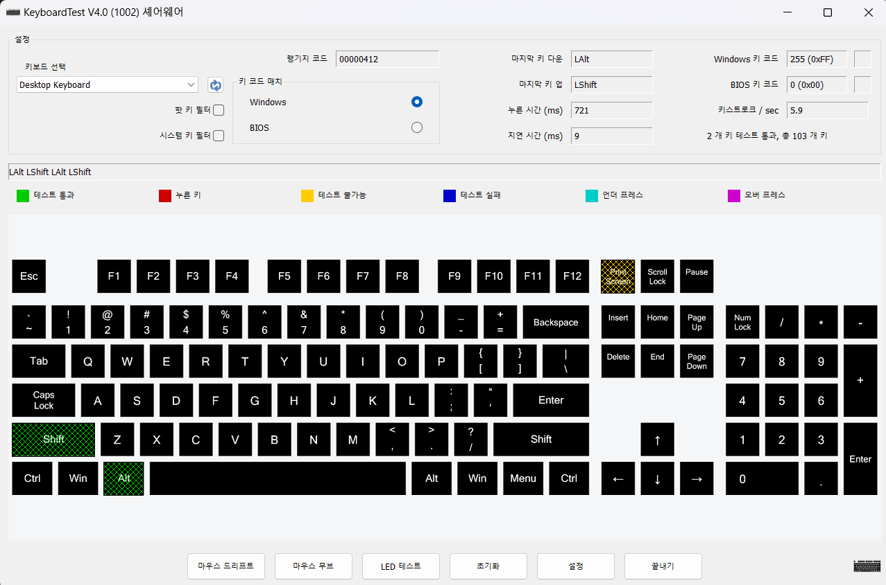

# tex shinobi 구매기념 윈도우 키보드 맵핑 레지스트리로 변경하기

> **Summary**
> 키보드의 키 맵핑을 변경하는 방법에 대한 안내로, Scancode Map 레지스트리 변경과 관련된 링크와 유료 및 무료 키보드 입력 프로그램을 소개합니다.

---

🔗 [https://gigglehd.com/gg/soft/12015825](https://gigglehd.com/gg/soft/12015825)

🔗 [https://www.passmark.com/products/keytest/](https://www.passmark.com/products/keytest/)

🔗 [https://www.majorgeeks.com/files/details/switch_hitter.html](https://www.majorgeeks.com/files/details/switch_hitter.html)

