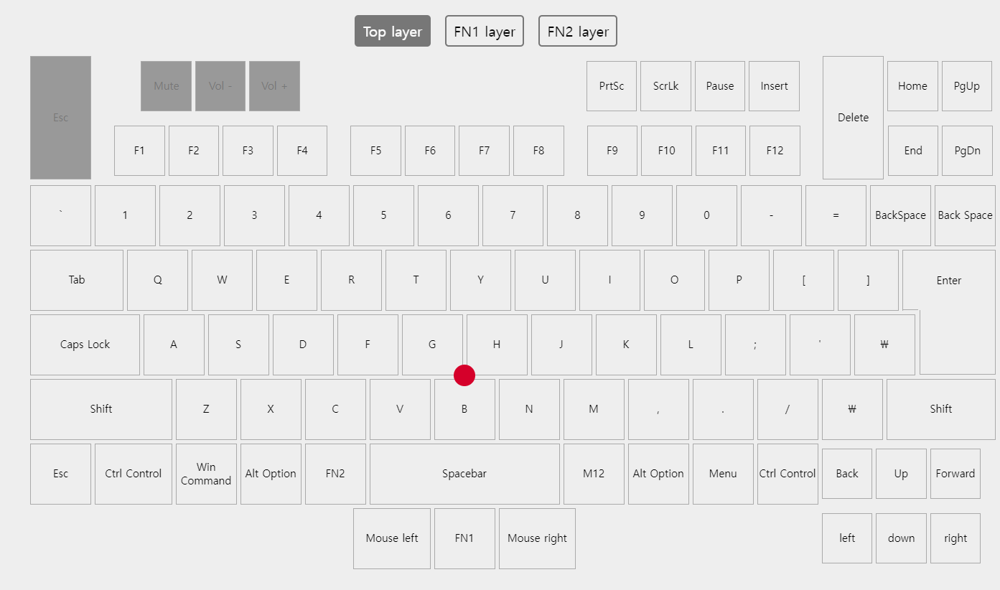
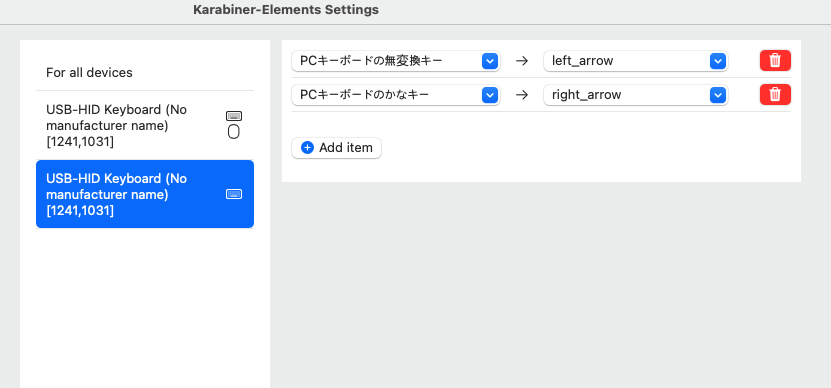

# tex shinobi 일본어배열 키맵핑하기

> **Summary**
> TEX shinobi의 일본어 배열 키 맵핑 방법에 대해 설명하며, 웹 UI가 일본어 배열을 인식하지 못해 WINDOWS에서는 레지스트리를 수정해야 하고, MAC에서는 카라비너 설정이 필요하다고 안내합니다.

---

🔗 [https://program.tex.com.tw/shinobi/#layout](https://program.tex.com.tw/shinobi/#layout)

🔗 [https://stackoverflow.com/questions/66596354/how-to-map-英数-or-かな-key-common-in-the-jis-layout-of-mac-keyboards-on-vim](https://stackoverflow.com/questions/66596354/how-to-map-英数-or-かな-key-common-in-the-jis-layout-of-mac-keyboards-on-vim)

### 근데 위에 따라해도 의미없음…

웹 ui는 일본어 특유의 배열을 인식하지 못한다.

WINDOWS는 레지스트리만져야하고

MAC은 카라비너 만져야한다

### MAC - 카라비너 설정

### 윈도우는 레지스트리 만져야합니다…

