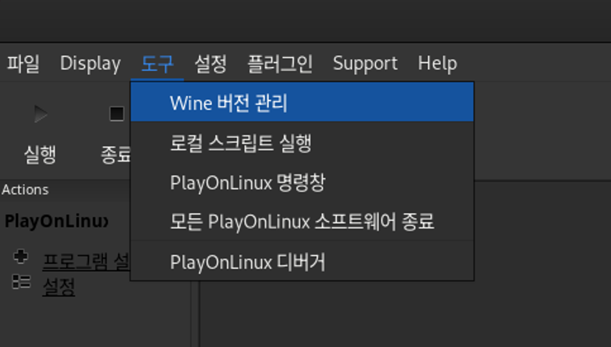
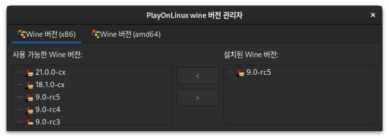

# wine 을 이용한 윈도우 앱 설치

> **Summary**
> 윈도우 앱 설치를 위해 wine과 playonlinux를 사용하며, 카카오톡, 반디집, 노션 등의 프로그램 설치 방법을 설명한다. 글꼴 설치와 exe 파일 다운로드도 안내한다.

---


[https://hamonikr.org/used_hamonikr/82280](https://hamonikr.org/used_hamonikr/82280)

[https://itlearningcenter.tistory.com/entry/【Ubuntu-2004-LTS】카카오톡-설치-1](https://itlearningcenter.tistory.com/entry/【Ubuntu-2004-LTS】카카오톡-설치-1)

[https://solearn.tistory.com/200](https://solearn.tistory.com/200)

---

## playonlinux 설치

```bash
sudo dnf install playonlinux
```

## wine 설치

> 💡 **버전관리**
> ---
>
> 
>
> 
>
>

> 💡 **LANG="ko_KR.UTF-8" wine <.exe name>**

## 글꼴 설치

> 걍 굴림체 다운받고

[https://velog.io/@kiki3700/wine-프로그램이-한글-폰트-깨질-때-해결하는-방법](https://velog.io/@kiki3700/wine-프로그램이-한글-폰트-깨질-때-해결하는-방법)

[https://ko.cooltext.com/download-font-굴림+gulim](https://ko.cooltext.com/download-font-굴림+gulim) ← 굴림 폰트는 여기서 다운받으셈…

## 그 후에 exe 파일 알아서 다운받아 설치하셈

- 카카오톡
- 반디집
- 센드애니웨어
- 노션
- termius
- 점프데스크탑
