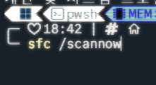

# 갑자기 exe 파일 실행 안될때

> **Summary**
> 비주얼 스튜디오로 빌드한 프로그램이 실행되지 않을 때, 파워쉘에서 

---



몬헌 모드질을 좀 하다가… 시스템파일을 건드린것같다

갑자기 비주얼 스튜디오로 빌드한 프로그램이 실행되질 않어~


파워쉘에서 다음 명령어 실행

```latex
sfc /scannow
```

그리고 재부팅하면 해결됨

