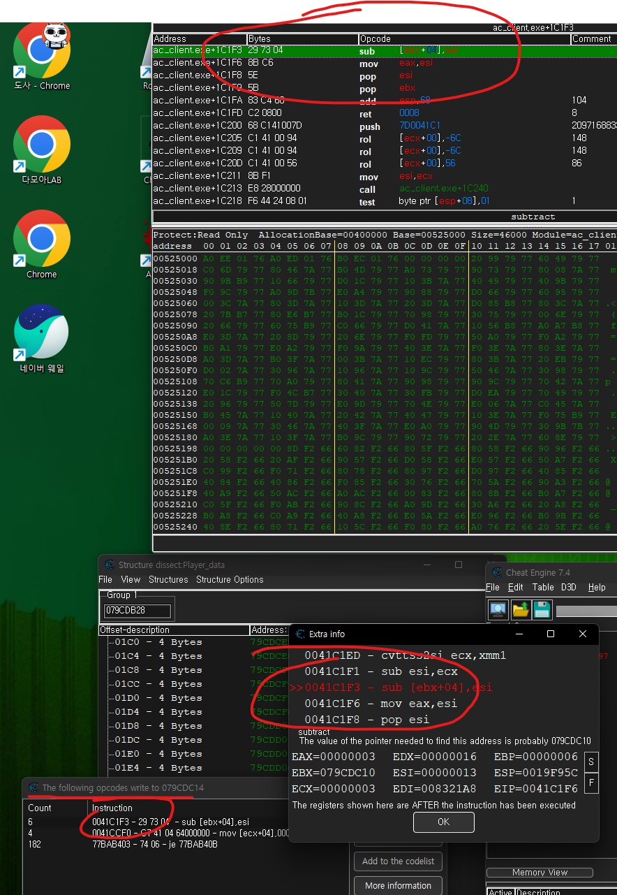
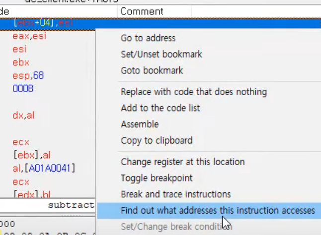

# 게임핵 개발03 

> **Summary**
> 게임핵 개발에 관한 내용으로, 포인터 찾기, 연산자 변경 함수, 피타고라스 정리 함수를 다루고 있다. 치트엔진을 활용하여 적 캐릭터의 HP를 추적하고, C#에서 double을 float으로 변환하는 함수와 2D 및 3D 거리 계산을 위한 피타고라스 법칙을 적용한 수학 함수를 구현하는 방법이 설명되어 있다.

---

🎥 [동영상 보기](https://youtu.be/9J4yQ6wny_s)

> 🔥 ****치트엔진 새로운거****
>
> 정확한 수치를 모를때 치트엔진에서 Scan Type을 Decressed value로 해두면 줄어드는 값을 확인할 수 있다
>
> 게임 내에서 적캐릭터를 공격해서 찾아낸 적캐릭터의 HP를 더블클릭하면 주소를 확인할 수 있다.
>
> F6을 눌러 HP가 깎을때마다 함수를 호출하는 포인터의 위치를 발견하고
>
> 해당 포인트를 더블클릭하면
>
> 
>
> 
>
> 해당 과정으로 클래스를 호출하는 포인터를 찾을 수 있다
>
> 또한 체력이 다는 함수를 following opcodes 하여 적 캐릭터의 HP 구조체를 찾을 수 있다
>
> 어처피 플레이어블 캐릭터에게 할당되는 클래스는 대부분 동일하기 때문이다
>
>

🎥 [동영상 보기](https://www.youtube.com/watch?v=qud3UbDIiUA&list=PLnIaYcDMsScxvz3yyClxLU9W6upAUyPzc&index=14)

> 🔥 ****Double to Float 함수 제작****
> C#에서는 메서드를 만들때 자동으로 8byte로 변경하는데 4byte인 float으로 변경하기 위해 다음과 같은 함수를 제작하여 사용한다
>
> ```c#
> private float Double2Float(double input)
>         {
>             float result = (float)input;
>             if (float.IsPositiveInfinity(result))
>             {
>                 result = float.MaxValue;
>             }
>             else if (float.IsNegativeInfinity(result))
>             {
>                 result = float.MinValue;
>             }
>             return result;
>         }
> ```
>
>

> 🔥 ****Math 함수를 활용한 피타고라스 정리****
> 시팔 ㅈㄴ어렵다
>
> ```c#
> private double Get2DDegree(PlayerData mainPlayer, PlayerData enemyPlayer)
>         {
>             //Abs = 절대값
>             //Atan = 탄젠트의 역함수
>
>             //일반적으로 거리는 양수이기 때문에 절대값을 입힙니다
>             double x = mainPlayer.x_pos - enemyPlayer.x_pos; //플레이어 캐릭터의 x위치에서 적의 x위치를 뺀 값
>             double z = mainPlayer.z_pos - enemyPlayer.z_pos;
>             double correction = 270;
>
>             if (x > 0) correction = 90; //0보다 크다는것은 Player 왼쪽에 존재한다는것
>
>             return correction + Math.Atan(z / x) * 180 / Math.PI; //2PI radian = 360
>
>             double tan = Math.Cbrt(Math.Pow(x,2) + Math.Pow(z,2));
>         }
>
>         private double GetDistance(PlayerData mainPlayer, PlayerData enemyPlayer)
>         {
>             //피타고라스법칙
>             //Sqrt = 루트
>             //Pow = 제곱
>
>             //피타고라스의 법칙을 사용해 xz_distance를 구함 (2D) (위에서 바라본 좌표)
>             double  xz_distance = Math.Sqrt(Math.Pow(mainPlayer.x_pos - enemyPlayer.x_pos, 2) + Math.Pow(mainPlayer.z_pos - enemyPlayer.z_pos, 2)); // 좌표 x의 2승
>
>             //피타고라스의 법칙을 사용해 distance 를 구함 (3D) (옆에서 바라본 좌표)
>             //(xz_distance를 먼저 구하고 그 위에 세로축을 구했기 때문에 3D가 됨)
>             double distance = Math.Sqrt(Math.Pow(xz_distance, 2) + Math.Pow(mainPlayer.y_pos - enemyPlayer.y_pos, 2));
>             return distance;
>         }
> ```
>
>
>

