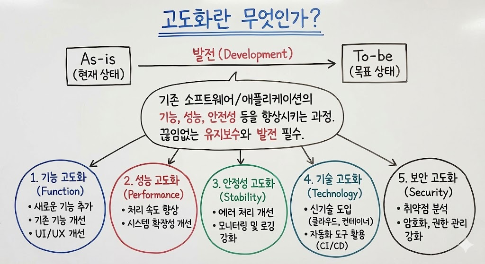

# 고도화란 무엇인가?

> **Summary**
> 고도화는 기존 소프트웨어나 애플리케이션의 기능, 성능, 안전성 등을 향상시키는 과정으로, 기능, 성능, 안정성, 기술, 보안 고도화의 다섯 가지 작업으로 나눌 수 있습니다. 이는 시스템이나 서비스를 발전시키고 효율적으로 만들기 위한 IT 용어입니다.

---

[https://yat-ong.tistory.com/entry/%EA%B3%A0%EB%8F%84%ED%99%94%EB%9E%80-%EB%AC%B4%EC%97%87%EC%9D%B8%EA%B0%80](https://yat-ong.tistory.com/entry/%EA%B3%A0%EB%8F%84%ED%99%94%EB%9E%80-%EB%AC%B4%EC%97%87%EC%9D%B8%EA%B0%80)

- **고도화**란 기존 소프트웨어나 애플리케이션의 기능, 성능, 안전성 등 여러 측면을 향상시키는 과정입니다. As-is(현 상태)에서 To-be(목표 상태)로 발전시키는 것을 의미하며, 시간이 지남에 따라 유지보수와 발전이 필수적임을 강조합니다.
- 고도화 작업은 크게 다섯 가지로 나눌 수 있습니다:
  - **기능 고도화**: 새로운 기능 추가 및 기존 기능 개선, UI/UX 개선 등
  - **성능 고도화**: 처리 속도 향상, 시스템 확장성 개선 등
  - **안정성 고도화**: 에러 처리, 모니터링 및 로깅 강화 등
  - **기술 고도화**: 신기술 도입, 자동화 도구 활용(CI/CD 등) 등
  - **보안 고도화**: 취약점 분석, 암호화, 권한 관리 등 보안 강화 작업
요약하면, 고도화는 시스템이나 서비스를 더 발전시키고 효율적으로 만들기 위한 다양한 개선 작업을 통칭하는 IT 용어입니다.

