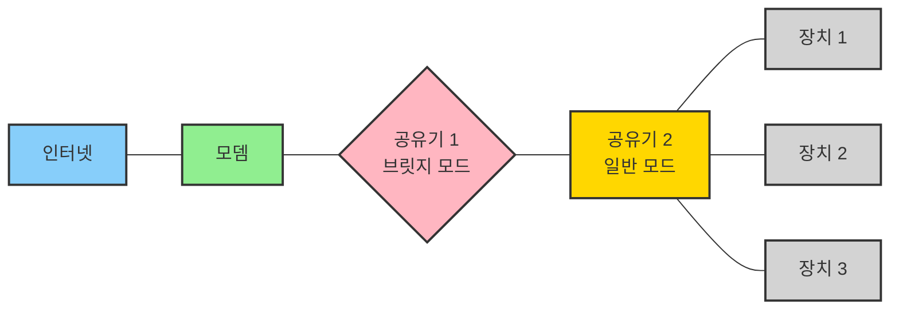
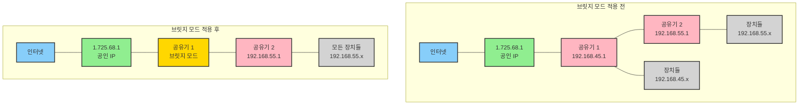

# 공유기 브릿지 모드가 뭐임?

> **Summary**
> 브릿지 모드는 네트워크를 효율적으로 확장하고 관리하는 기술로, 여러 공유기를 사용할 때 중복 IP 할당을 방지합니다. 주요 특징으로는 NAT 기능 비활성화, 단순 연결, IP 할당 기능 제거가 있으며, 네트워크 구조를 단순화하고 이중 NAT 문제를 피하는 데 유용합니다. 브릿지 모드를 적용하면 모든 장치가 단일 네트워크에 속하게 되어 관리가 간소화되고 성능이 향상됩니다.

---

[https://www.youtube.com/watch?v=sJmuShUFunM](https://www.youtube.com/watch?v=sJmuShUFunM)

## 브릿지 모드란?

브릿지 모드는 공유기의 특별한 작동 방식으로, 네트워크를 효율적으로 확장하고 관리하는 데 사용됩니다. 이 모드에서 공유기는 일반적인 라우팅 기능을 수행하지 않고, 대신 네트워크 신호를 단순히 '다리'처럼 연결하는 역할을 합니다.

> "브릿지 모드는 여러 공유기를 사용할 때 중복 IP 할당을 방지하고 네트워크를 단순화하는 기술입니다."

## 브릿지 모드의 주요 특징

1. **네트워크 확장**: 기존 네트워크의 물리적 범위를 확장합니다.
1. **NAT 기능 비활성화**: 일반적으로 공유기가 수행하는 네트워크 주소 변환(NAT) 기능을 끕니다.
1. **단순 연결**: 두 네트워크 세그먼트를 단순히 연결하는 역할을 수행합니다.
1. **IP 할당 기능 제거**: 자체적으로 IP 주소를 할당하지 않습니다.
## 브릿지 모드의 사용 사례

브릿지 모드는 주로 다음과 같은 상황에서 유용하게 사용됩니다:

- 여러 개의 공유기를 연결하여 넓은 공간에 네트워크 범위를 확장할 때
- 인터넷 서비스 제공업체(ISP)의 모뎀-공유기 콤보 장치와 별도의 공유기를 함께 사용할 때
- 네트워크 구조를 단순화하고 이중 NAT 문제를 피하고자 할 때
## 브릿지 모드 네트워크 구조

브릿지 모드를 사용한 네트워크 구조를 시각화하면 다음과 같습니다:

## 브릿지 모드 네트워크 예시

## 다이어그램 설명

### 브릿지 모드 적용 전:

- 공인 IP (1.725.68.1)에 공유기 1이 연결되어 있습니다.
- 공유기 1 (192.168.45.1)에 공유기 2 (192.168.55.1)가 연결되어 있습니다.
- 장치들은 각각의 공유기에 연결되어 다른 IP 대역을 사용합니다.
- 공유기 1에 연결된 장치들은 192.168.45.x 대역을 사용합니다.
- 공유기 2에 연결된 장치들은 192.168.55.x 대역을 사용합니다.
### 브릿지 모드 적용 후:

- 공유기 1이 브릿지 모드로 전환됩니다.
- 공유기 1은 단순히 신호를 통과시키는 역할을 합니다.
- 공유기 2 (192.168.55.1)가 모든 네트워크 관리를 담당합니다.
- 모든 장치들이 공유기 2의 단일 네트워크 (192.168.55.x)에 연결됩니다.
## 브릿지 모드의 장점

1. **네트워크 단순화**: 복잡한 네트워크 구조를 간소화합니다.
1. **이중 NAT 방지**: 네트워크 주소 변환이 한 번만 일어나므로 성능이 향상됩니다.
1. **기능성 유지**: 두 번째 공유기의 모든 고급 기능을 그대로 사용할 수 있습니다.
1. **유연한 네트워크 확장**: 필요에 따라 쉽게 네트워크를 확장할 수 있습니다.
1. **단일 네트워크**: 모든 장치가 하나의 네트워크에 속하게 됩니다.
1. **IP 충돌 방지**: 하나의 공유기만 IP를 할당하므로 중복 할당이 없습니다.
1. **간편한 관리**: 네트워크 설정과 관리가 한 곳(공유기 2)에서 이루어집니다.
1. **향상된 연결성**: 모든 장치가 서로 쉽게 통신할 수 있습니다.
## 결론

브릿지 모드는 네트워크 관리자와 홈 네트워크 사용자 모두에게 유용한 도구입니다. 네트워크 구조를 단순화하고 성능을 최적화하는 데 도움을 주며, 특히 여러 공유기를 사용해야 하는 환경에서 그 진가를 발휘합니다. 올바르게 설정된 브릿지 모드는 네트워크의 효율성과 안정성을 크게 향상시킬 수 있습니다.

브릿지 모드를 적용하면, 기존에 사용하던 첫 번째 공유기의 IP 대역(예: 192.168.45.x)은 더 이상 사용되지 않으며, 모든 장치는 두 번째 공유기의 IP 대역(예: 192.168.55.x)을 사용하게 됩니다. 이를 통해 네트워크 관리가 간소화되고, 모든 장치 간의 통신이 원활해집니다.

