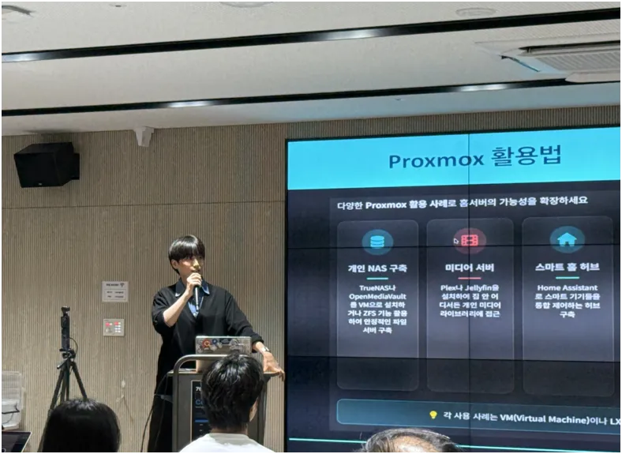

# 국가의 최소단위란 무엇인가?

> **Summary**
> 국가의 최소 단위에 대한 논의에서, 한쪽은 국토와 자원을 강조하며 물리적 기반이 국가의 본질이라고 주장하고, 다른 쪽은 국민이 국가의 진정한 실체라고 반론을 제기한다. 카르타고와 아프가니스탄의 역사적 사례를 통해, 정량적 가치만으로는 국가를 지킬 수 없음을 보여주며, 정신적 가치와 공동체의 유대감이 국가의 주체성을 형성하는 중요한 요소임을 강조한다. 결국, 인간에 대한 믿음과 신뢰가 국가의 최소 단위로서 국민을 정의하는 근본적인 이유로 제시된다.

---

# 목차

# 국가의 최소단위란 무엇인가?

> 국토냐, 국민이냐.

## 서문: 선과 악이란..?

클라우드 기술 컨퍼런스의 세션을 성황리에 마친 후, 뒷풀이에서 동아리 부회장 형님과 마주 앉아 긴 대화를 나눌 기회가 있었다. 그는 동아리 내부에서 실력있는 엔지니어이자, 나에게는 늘 엔지니어적 방향을 제시해주는 나름의 등대 같은 사람이었다.

우리의 대화는 여느 때와 같이 가벼운 농담과 애니메이션, 만화 이야기로 시작되었다. 그러나 대화는 이내 누누티비와 마나토끼 같은 불법 웹사이트에 대한 논의로 이어졌고, 급기야 VPN과 ONION을 지나 기술의 본질을 논하는 데까지 이르렀다.

> ***"기술은 결국 도구일 뿐이야. 그 자체에 선과 악은 존재하지 않지."***

그 주장에 나는 수긍의 의미로 고개를 끄덕였으나, 대화가 선과 악의 본질이라는 심오한 주제로 접어들면서 우리는 예기치 못한 흐름을 타게 되었다. 마치 잘 짜인 각본처럼 고대 중국의 제자백가 사상 속으로 빨려 들어갔고, 그 안에서 형님은 한비자를, 나는 묵자를 이야기하고 있다는 흥미로운 사실을 발견했다.

순간 기묘한 정적이 흘렀다. 한비자의 법가(法家)와 묵자의 묵가(墨家)는 수많은 사상 중에서도 가장 뚜렷한 대척점에 서 있지 않은가. 엔지니어로서 문제에 접근하는 방식이나, 세상을 바라보는 시선에 있어 너무나도 닮았다고 생각했던 우리지만, 어째서 사상의 뿌리라고 할 수 있는 지점에서 이토록 다른 인물을 마음에 품고 있었을까.

그날 밤, 나는 우리 사이에 존재하는 ‘유사함 속의 괴리감’의 정체를 파헤치고 싶어졌다.

## 대립의 시작: 국가의 최소 단위는 무엇인가?

앞서 언급했듯이, 나는 우리 사이에 존재하는 그 괴리감의 정체를 파헤치기 위해, 다음과 같은 질문을 던졌다.

> ***“국가는 국민,국토,사법 등으로 이루어져있죠, 그렇다면, 국가를 이루는 최소 단위는 뭐라고 생각해요?”***

그가 생각하는 질서의 최소 단위가 궁금해서 던진 질문이었다. 그것이 앞으로 그의 주장을 이해하는 중요한 실마리가 될 것이라 생각했다.

> ***"국가의 본질은 결국 국토야. 영토와 자원이라는 물리적 기반이 없으면 국가는 성립할 수 없어."***

형님의 주장은 명료했다. 현실에 단단히 발을 딛고 선 엔지니어다운 답변이었다. 모든 가치는 측정 가능하고 통제할 수 있는 물리적 실체에서 나온다는 시각. 이는 강력한 법과 시스템으로 국가를 통제하고 부국강병을 이루려 했던 한비자의 사상과 궤를 함께했다.

허나, 나는 반론을 제기했다.

> ***"저는 국민이라고 생각해요. 영토와 자원은 주인이 없으면 그저 땅과 돌덩이에 불과하죠. 그 땅과 자원에 의미를 부여하고, 공동체의 역사를 써 내려가는 국민이야말로 국가의 진정한 실체 아닐까요?"***

나의 관점은 묵자에게서 비롯된 것이었다. 묵자는 차별 없는 사랑(兼愛)을 통해 모든 구성원의 이익(交利)을 추구했다. 그에게 국가의 목적은 백성의 안녕과 평화였다. 시스템이 아닌, 사람 그 자체에 집중하는 사상이었다.

이 대립은 자연스럽게 두 번째 질문으로 이어졌다. '진정한 실리(實利)란 무엇인가?' 형님은 오직 정량적 평가만이 실리라고 주장했다. 눈에 보이는 자원, 측정 가능한 국부, 수치로 환산되는 군사력 같은 것들 말이다.

반면, 나는 눈에 보이지 않는 정성적 가치, 예를 들어 국민의 애국심이나 공동체의 유대감 같은 것 또한 명백한 실리라고 믿었다. 우리의 시선은 평행선을 달렸고, 나는 이 간극을 메우기 위해 오래된 역사의 한 페이지를 펼쳤다.

## 카르타고의 비극: 실리의 저울은 무엇을 담지 못했나

> ***"형님, 혹시 한니발 장군을 배출했던 고대 국가, 카르타고에 대해 아시나요?"***

하지만 카르타고에는 치명적인 결함이 있었다. 그들에게는 ‘우리’라는 정신적 구심점이 없었다. 부유한 상인과 귀족들로 이루어진 지배층은 오직 자신들의 토지와 재산을 지키는 데만 관심이 있었다. 한니발이라는 불세출의 영웅이 알프스를 넘어 로마의 심장부를 위협하며 연전연승을 거둘 때조차, 카르타고 본국 의회는 그의 승리를 질투하고 보급을 끊으며 그를 고립시켰다. 한니발의 군대는 비록 용병의 집합체였지만, 한니발 개인에 대한 충성심으로 똘똘 뭉쳐 보급이 끊긴 적지에서 10년 이상을 버텼다. 그러나 ‘국가’라는 더 큰 이름 아래에서는 하나로 뭉치지 못했다.

## 현대의 카르타고: 아프가니스탄의 교훈

이것은 단순히 먼 과거의 이야기가 아니다. 우리는 불과 몇 년 전, 현대판 카르타고의 붕괴를 목도했다. 2021년, 아프가니스탄에서 벌어진 일이다.

미국은 20년간 무려 100조 원이 넘는 천문학적인 자금을 쏟아부어 30만 명에 달하는 아프간 정부군을 창설했다. 최신 무기와 장비, 선진적인 훈련 시스템까지. 서류상의 ‘정량적 스펙’으로만 본다면 결코 약한 군대가 아니었다. 하지만 탈레반이 공세를 시작하자, 그 거대한 군대는 불과 몇 주 만에 흔적도 없이 사라졌다.

왜였을까? 군 수뇌부는 부패에 찌들어 있었고, 장부상에만 존재하는 '유령 군인'의 월급을 착복했다. 병사들은 제대로 된 보급도, 월급도 받지 못한 채 지휘관들의 사치스러운 생활을 지켜봐야 했다. 그들에게는 싸워야 할 이유가 없었다. 국가에 대한 충성심도, 공동체에 대한 소속감도, 전우에 대한 신뢰도 존재하지 않았다. ‘정성적 가치’가 완전히 붕괴된 조직은 아무리 막대한 돈을 쏟아부어도 속 빈 강정일 뿐이라는 사실을, 아프가니스탄의 비극은 뼈아프게 증명했다.

그렇다면 우리를 돌아보자. 대한민국이라는 공동체는 무엇으로 묶여 있는가? 우리는 이순신, 세종대왕, 김구, 이승만, 박정희, 노무현과 같은 역사적 인물들을 공유한다. 그들에 대한 평가는 극단적으로 갈릴지언정, 그 이름들을 중심으로 격렬하게 토론하고 때로는 분열하면서도 결국 ‘하나의 역사’를 공유하는 공동체임을 확인한다.

이 보이지 않는 역사의 끈, 이 분열적인 통일성, 이것이야말로 우리를 하나로 묶는 강력한 ‘정성적 실리’가 아니고 무엇이겠는가. 나는 형님에게 단호하게 되물었다. 

> ***"국가의 주체성을 이루는 이 ******정신적 가치****** 또한, 진정한 의미의 ******‘실리’******라고 부를 수 없겠습니까?"***

## 결론: 그럼에도 불구하고, 사람에 대한 믿음

인간은 예측 불가능한 존재다. 정량적 수치만으로 그 복잡한 내면을 어찌 다 헤아릴 수 있겠는가. 그래서 나는 ‘그럼에도 불구하고’라는 말을 참 좋아한다. 모든 불확실성에도 불구하고, 모든 예측 불가능성에도 불구하고, 우리는 선택을 해야 하기 때문이다. 국가의 최소 단위를 ‘국민’으로 규정하는 것은, 바로 이 예측 불가능한 존재에게 기꺼이 배팅하겠다는 선언이다. 그것은 계산이 아닌 신뢰의 영역이다.

어쩌면 그날 밤, 우리 둘의 생각을 갈랐던 그 기준이야말로 진정한 의미의 진보와 보수를 가르는 본질적인 차이일지도 모른다는 생각이 들었다. 여기서 말하는 진보와 보수는 얕은 정치적 구호가 아니다. 한쪽은 예측 가능한 시스템과 유형의 자산(국토, 법, 정량적 가치)에 근본적인 신뢰를 두는 반면, 다른 한쪽은 예측 불가능한 인간의 잠재력과 무형의 가치(국민, 정신, 정성적 가치)에 기꺼이 희망을 거는 것이다. 전자가 한비자의 길이라면, 후자는 묵자의 길일 테다.

무엇 하나 정답은 없을 것이다. 세상을 움직이는 데에는 두 가지 관점 모두 필요할지도 모른다. 하지만 그날 밤의 긴 대화를 통해, 우리는 서로가 마음속에 품고 있던 지도의 다른 부분을 비로소 선명하게 들여다볼 수 있었다. 우리는 서로를 더욱 깊이 이해하게 되었고, 그것이야말로 그 어떤 기술적 담론보다 값진, 우리 둘만의 유의미한 ‘실리’였다.

## 마무리하며...

형님과의 대화를 통해 깨달은 것. 우리는 같은 목표를 향해 가지만 다른 길을 걷고 있다.

국토냐 국민이냐, 정량이냐 정성이냐, 예측가능성이냐 신뢰냐... 이 모든 질문들이 결국 하나로 수렴된다.

인간을 어떻게 볼 것인가?
통제의 대상인가, 신뢰의 주체인가?

카르타고와 아프가니스탄의 역사가 우리에게 보여주는 것은 명확하다. 돈으로 살 수 있는 충성은 없다. 시스템으로 대체할 수 있는 애국심은 없다.

**그래서 나는 여전히 믿는다. 국가의 최소단위는 국민이며, 국민의 정신 또한 실리라고.**

"그럼에도 불구하고" 인간을 믿는 것. 그것은 우리의 필연이 아닐까?

## 참고문헌

1. [https://ko.wikipedia.org/wiki/%EB%B2%95%EA%B0%80](https://ko.wikipedia.org/wiki/%EB%B2%95%EA%B0%80)
1. [https://ko.wikipedia.org/wiki/%EB%AC%B5%EA%B0%80](https://ko.wikipedia.org/wiki/%EB%AC%B5%EA%B0%80)
1. [https://ko.wikipedia.org/wiki/%EB%AC%B5%EC%9E%90](https://ko.wikipedia.org/wiki/%EB%AC%B5%EC%9E%90)
1. [https://www.kci.go.kr/kciportal/ci/sereArticleSearch/ciSereArtiView.kci?sereArticleSearchBean.artiId=ART002264696](https://www.kci.go.kr/kciportal/ci/sereArticleSearch/ciSereArtiView.kci?sereArticleSearchBean.artiId=ART002264696)
1. [https://news.koreanbar.or.kr/news/articleView.html?idxno=22032](https://news.koreanbar.or.kr/news/articleView.html?idxno=22032)
1. [https://ko.wikipedia.org/wiki/%EC%B9%B4%EB%A5%B4%ED%83%80%EA%B3%A0](https://ko.wikipedia.org/wiki/%EC%B9%B4%EB%A5%B4%ED%83%80%EA%B3%A0)
1. [https://en.wikipedia.org/wiki/Mercenary_War](https://en.wikipedia.org/wiki/Mercenary_War)
1. [https://www.cliffsnotes.com/literature/p/the-prince/summary-and-analysis/chapter-12](https://www.cliffsnotes.com/literature/p/the-prince/summary-and-analysis/chapter-12)
1. [https://www.sparknotes.com/philosophy/prince/section6/](https://www.sparknotes.com/philosophy/prince/section6/)
1. [https://ko.wikipedia.org/wiki/%EC%95%84%ED%94%84%EA%B0%80%EB%8B%88%EC%8A%A4%ED%83%84_%EC%A0%84%EC%9F%81_(2001%EB%85%84~2021%EB%85%84)](https://ko.wikipedia.org/wiki/%EC%95%84%ED%94%84%EA%B0%80%EB%8B%88%EC%8A%A4%ED%83%84_%EC%A0%84%EC%9F%81_(2001%EB%85%84~2021%EB%85%84))
1. [https://namu.wiki/w/2021%EB%85%84%20%EC%95%84%ED%94%84%EA%B0%80%EB%8B%88%EC%8A%A4%ED%83%84%20%EC%B2%A0%EC%88%98](https://namu.wiki/w/2021%EB%85%84%20%EC%95%84%ED%94%84%EA%B0%80%EB%8B%88%EC%8A%A4%ED%83%84%20%EC%B2%A0%EC%88%98)
1. [https://www.perplexity.ai/search/i-jongjogdeuli-museun-jongjogi-7430mKIpRzabIFdahrH8KA](https://www.perplexity.ai/search/i-jongjogdeuli-museun-jongjogi-7430mKIpRzabIFdahrH8KA)
---

글의 흐름 메모

- 클클콘 발표를 성황리에 마친 후… 
- 클라우드클럽의 윤태형님님님과 대화를 길게 할 기회가 있었다.
- 윤태형님과의 대화 중… 기술은 선과 악을 구분하지 않는다는 이야기를 시작으로, 어쩌다보니 제자백가 이야기가 나옴
  - 윤태형님 - 한비자
  - 소병욱(나) - 묵자
- 둘이 공감하는 제자백가가 달랐음, (흥미롭게도, 한비자와 묵자, 이 둘은 대척점에 있다)
- 그러나, 우리 둘은 일단 엔지니어링 접근법에 있어서도, 정치적 색?? 까지는 같아서, 뭔가 유사한점이 매우 많았으니… 지금은 생각이 ‘유사’ 할 지언정, 뭔가 궤를 달리하는 느낌을 받았음.
- 이 괴리감을 정리하기위해 대화를 시작함.
- 나는 국가의 최소단위는 국민이라고 생각함.
- 그 형님은 국토라고 생각함.
- 난 정성적 평가도 실리라고 생각함
- 그 형님은 정량적 평가만이 실리라고 생각함
- 나는 카르타고의 부유했던 과거를 증거로 제시함
  - 국민이란, 민족의 역사와 공동체의 아이코닉으로 묶인 존재이다.
  - 한니발 장군을 배출한, 북아프리카의 고대 카르타고를 아는가?
  - 그 나라는 매우 부유했다. 전 국토는 신의 축복을 받은듯 비옥했고, 무역으로 나라는 크게 번성하여 카르타고의 백성들은 여유로웠다.
  - 하지만 카르타고 국민들에게 애국심이 없었다. 그들은 방위라는 개념을 정량적인 관점으로 용병을 구입하였기 때문이다.
  - 결국 정신과 아이코닉 없이 묶이지 못한 카르타고의 백성들은 스스로의 힘을 지키지 못하고 파멸을 맞이하였다.
  - 용병에 의존하는 국가는 결국 멸망한다. 마키아벨리의 군주론에서도 언급되는 내용이다.
  - 현 시대에 있어서도, 나는 카르타고의 실수를 저지르는 나라는 여전히 존재한다. 아프간의 군대를 보라.
  - 그리고 우리 국민들이 인정하든, 안하든, 이순신 , 세종대왕 , 김구 , 이승만 , 박정희 , 노무현이라는 존재로 묶이고 모이는 모습을 보라.
  - 과연, 국가의 주체성으로 의미를 가지는 정성적인 평가지표도, ‘실리’ 라고 볼 수 없겠는가?
  - 나는 그 질문에, 확신을 가지고 단호히 대답하겠다.
  - 국가의 최소 단위는 국민이며, 국민의 정신 또한 실리라고 말할 수 있다.
- 인간은, 예측불가능한 존재이다. 정량적 평가로 불특정 다수의 타인을 완벽하게 평가할 수 있을까?
- 그래서 나는 ‘그럼에도 불구하고’ 라는 말을 참 좋아한다. 국가의 최소단위를 ‘국민’ 으로 단정짓는다면, 우리는 필연적으로 예측 불가능한 존재에 배팅을 해야한다.
- 그렇기에, 나는 인간 관계에 있어 신뢰와 믿음을 강조하고싶다.
- 어쩌면, 우리 둘의 근본적인 생각을 가르는 그 기준이, 진정한 의미로서의 진보와 보수를 가르는 본질적인 사고의 원천이 아닐까?
- 무엇 하나 정답은 없다고 하지만… 꽤나 유의미한 결론에 도달했다는것에 우리 둘은 서로를 더욱 잘 알게 되었다.
[https://www.poweroftruth.net/m/mainView.php?kcat=&table=impeter&uid=623](https://www.poweroftruth.net/m/mainView.php?kcat=&table=impeter&uid=623)

[https://www.youtube.com/watch?v=B5iE_06s_eY](https://www.youtube.com/watch?v=B5iE_06s_eY)

[https://claude.ai/public/artifacts/146e8408-ca20-4664-b875-3330b5c972b3](https://claude.ai/public/artifacts/146e8408-ca20-4664-b875-3330b5c972b3)

