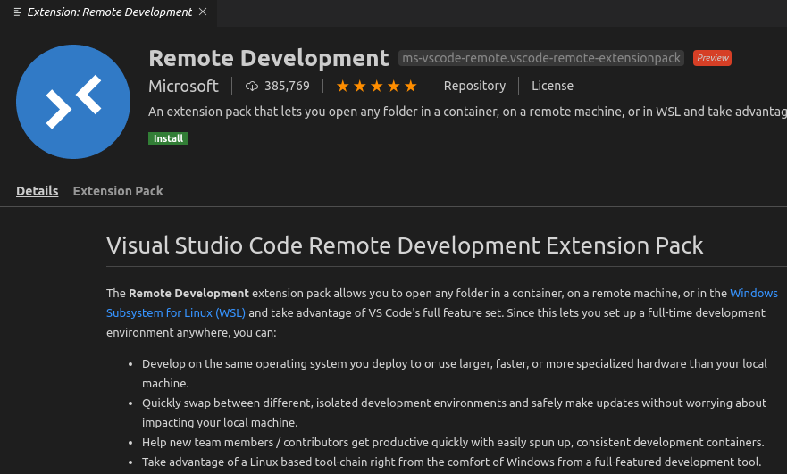
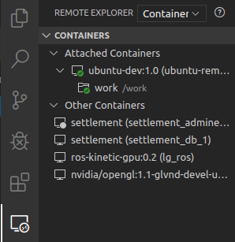
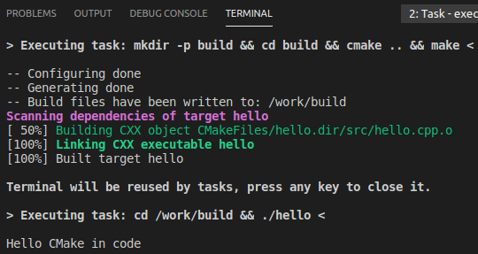
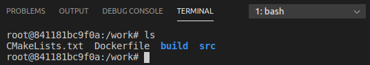

# 도커로 개발환경 구축하기

> **Summary**
> 도커를 사용하여 파이썬 개발환경을 구축하는 방법을 설명하며, 도커 이미지를 다운로드하고 실행하는 과정, Dockerfile 작성법, 그리고 VSCode에서 도커 컨테이너에 접근하는 방법을 안내합니다. 이를 통해 C++ 프로젝트에서 필요한 라이브러리를 관리하고, 재현 가능한 개발 환경을 만드는 데 도움을 줍니다.

---


🔗 [https://labs.brandi.co.kr//2021/01/20/hwangsg.html](https://labs.brandi.co.kr//2021/01/20/hwangsg.html)


> 💡 **파이썬 개발환경으로 기준**

## 1. 파이썬 도커 허브에서 다운받고자하는 이미지 탐색

🔗 [https://hub.docker.com/_/python](https://hub.docker.com/_/python)


## 2. wsl2 나 터미널환경에서 pull 해주기

```shell
sudo docker pull python:3.11.5-alpine
```

## 3. 설치된 이미지 확인

```shell
sudo docker images -a
```

## 4. 이미지 실행

```shell
sudo docker container run -it --name 'testdev' --hostname testdev -v /mnt/c/SBU/test:/home/workspace -p 80:80 -p 8080:8080 -p 3000:3000 centos /bin/bash
```

### 7-1 도커 실행상태 확인

```shell
sudo systemctl status docker
```

### 7-2 도커 실행

```shell
sudo docker run hello-world
```

### 7-3 모든 도커 종료

```shell
sudo systemctl stop docker
```

🔗 [https://goodgodgd.github.io/ian-flow/archivers/vscode-tutorial](https://goodgodgd.github.io/ian-flow/archivers/vscode-tutorial)

## 4. Docker 원격 코딩

도커(Docker)가 무엇이고 어떻게 쓰는지는 다음 링크들을 참고하길 바란다. 꼭 다음 개념들이 무엇이고 어떤 역할을 하는지 알고 넘어가야 한다: **Docker, docker image, docker container, Dockerfile**

- 도커 컴포즈를 활용하여 완벽한 개발 환경 구성하기: [https://www.44bits.io/ko/post/almost-perfect-development-environment-with-docker-and-docker-compose](https://www.44bits.io/ko/post/almost-perfect-development-environment-with-docker-and-docker-compose)
- Docker with GUI Tutorial (내가 쓴것): [https://goodgodgd.github.io/ian-flow/archivers/docker-tutorial](https://goodgodgd.github.io/ian-flow/archivers/docker-tutorial)
- Docker 설치: [https://docs.docker.com/v17.09/engine/installation/linux/docker-ce/ubuntu/](https://docs.docker.com/v17.09/engine/installation/linux/docker-ce/ubuntu/)
- Dockerfile 작성방법1: [https://docs.docker.com/develop/develop-images/dockerfile_best-practices/](https://docs.docker.com/develop/develop-images/dockerfile_best-practices/)
- Dockerfile 작성방법2: [https://docs.docker.com/engine/reference/builder](https://docs.docker.com/engine/reference/builder)
도커는 주로 웹 개발하는 분들이 많이 쓰는데 나 같은 경우에는 C++ 프로젝트를 개발할 때 필요한 여러가지 라이브러리를 시스템에 직접 설치하는 것이 부담스러워서 도커를 사용한다. C++ 프로젝트는 만들때마다 dependency 버전이 다르기 때문에 예전에 만들었던 프로젝트를 현재 환경에서 다시 실행하는 것이 어렵다. 그래서 1) 시스템 패키지를 깨끗하게 유지하고 2) 나중에 재현 가능한 환경을 만들기 위해 도커를 사용한다.

### 4.1 도커 컨테이너 실행

도커 컨테이너에 접속해서 작업을 하려면 일단 도커 컨테이너를 만들어야 하고 컨테이너에 맞는 이미지가 없으면 이미지부터 빌드해야 한다. 기존에 만들었던 **code_cmake** 프로젝트 안에서 Dockerfile 이라는 파일을 작성한다.

**Dockerfile**은 도커 이미지를 빌드하기 위해 필요한 파일이다. 어떤 이미지를 기반으로 해서 어떤 설정이나 패키지 설치를 추가하여 새로운 이미지를 만드는 것이다. 아래 예시는 `ubuntu:18.04` 이미지를 기반으로 기본적인 빌드 툴들을 설치한 이미지를 만들도록 Dockerfile을 작성한 것이다.

`# Ubuntu 18.04를 상속
FROM ubuntu:18.04

# 이미지 빌드 중엔 CLI 환경이 사용자 입력을 받을 수 없는 환경임을 알려줌
ENV DEBIAN_FRONTEND=noninteractive
# 도커 내부 빌드
RUN apt-get update \
    && apt-get upgrade \
    && apt-get install -y \
    build-essential \
    cmake \
    git \
    python3-dev`

이 파일을 이용해서 `ubuntu-dev:1.0`라는 이름의 도커 이미지를 빌드하는 명령어는 다음과 같다.

`$ docker build -t ubuntu-dev:1.0
# 이미지 확인
$ docker image list
REPOSITORY   TAG   IMAGE ID       CREATED          SIZE
ubuntu-dev   1.0   8c0c3065d72b   19 minutes ago   512MB
...`

`ubuntu-dev:1.0` 이미지로부터 `ubuntu-remote`라는 컨테이너를 만들고 컨테이너의 쉘에 접속하는 명령어는 다음과 같다. `docker run`은 Dockerfile이 위치한 곳에서 실행해야 한다.

`$ docker run --name ubuntu-remote -it -v ${PWD}:/work ubuntu-dev:1.0 bash
# 도커 내부 쉘에 접속됨
root@ca07e7e558ef:/# cd work/
root@ca07e7e558ef:/work# ls
CMakeLists.txt  Dockerfile  build  src
root@ca07e7e558ef:/work# exit`

- `docker run` : 새로운 컨테이너를 만들면서 주어진 명령을 실행하는 명령어다.
- `-name ubuntu-remote` : 컨테이너의 이름을 지정한다.
- `it` : interative terminal을 열수 있는 옵션이다.
- `v (--volume) ${PWD}:/work` : 현재 디렉토리를 컨테이너 내부의 /work 디렉토리와 공유한다. 호스트와 컨테이너 사이의 공용 디렉토리를 만드는 것이다.
- `ubuntu-dev:1.0` : 컨테이너를 만들 이미지를 지정한다.
- `bash` : 컨테이너를 만든 후 bash 쉘을 실행한다.
종료된 컨테이너를 다시 시작하고 도커 내부 쉘에 접근하는 명령어는 다음과 같다.

`$ docker start ubuntu-remote 
ubuntu-remote
$ docker exec -it ubuntu-remote bash 
root@ae8c95956ee6:/# exit
$ docker ps -a
CONTAINER ID  IMAGE           COMMAND  CREATED        STATUS           PORTS  NAMES
ae8c95956ee6  ubuntu-dev:1.0  "bash"   2 minutes ago  Up About a minute       ubuntu-remote
...`

`docker ps -a`를 했을 때 `STATUS`가 `Up`으로 나와야 컨테이터가 실행중인 것이고 그래야 vscode에서 접속할 수 있다. `Exited` 상태라면 `docker start ubuntu-remote` 명령어로 컨테이너를 활성화한다.

### 4.2 vscode에서 컨테이너 내부 접근

vscode에서 컨테이너에 접근하기 위해서는 **Remote Development** 확장이 필요하다.



설치하면 왼쪽에 Remote Explorer 패널이 생긴다. [Command Palette] (`Ctrl+Shift+P`) - [Remote-Containers: Attatch to Running Container…] 를 선택하면 현재 활성화된 컨테이너 목록이 뜨고 이 중에 [ubuntu-remote]를 선택하면 된다.

새 창이 뜨면 컨테이너 내부에서 /work 디렉토리를 연다. 그곳의 파일들은 호스트의 **code_cmake** 프로젝트 파일과 동일하지만 이제는 컨테이너에서 그 파일들을 접근하고 있는 것이다. 왼쪽의 Remote Explorer 패널을 보면 다음과 같이 나올 것이다.



각 컨테이너를 우클릭하면 `Start container`나 `Stop container` 메뉴가 떠서 UI로 컨테이너를 실행하고 끄는 것도 가능하다. 호스트에서 했던 것과 똑같이 `Ctrl+B`를 눌러 빌드하고 `Ctrl+R`을 눌러서 실행도 가능하다.



심지어 컨테이너 내부의 쉘에 접근하기 위해 따로 터미널에서 `docker exec -it ubuntu-remote bash`를 실행할 필요도 없다. 그냥 vscode의 TERMINAL 패널이 이미 컨테이너에 접속되어 있다.



그래서 C++로 무언가를 개발 할 때 버전에 민감하면서 지저분하게 많이 깔아야 하는 라이브러리를 쓴다면 (boost나 opencv, ros 같은…) 이를 시스템에 직접 깔지 말고 라이브러리가 설치된 도커 이미지를 만들고 컨테이너를 실행해서 쓰는 것이 좋다. 예전엔 이렇게 하면 개발과정이 불편한 점이 있었다. 아무리 폴더를 공유해서 호스트에서 vscode로 코드 편집을 한다고 하더라도 호스트 pc에는 라이브러리가 없기 때문에 자동완성이 되지 않아서 불편했다. 이제 vscode에서 도커 내부 접속까지 알아서 해주니 깔끔하면서도 편리해졌다.

… 이제 vscode 사용법을 알았으니 작업시작이다!

