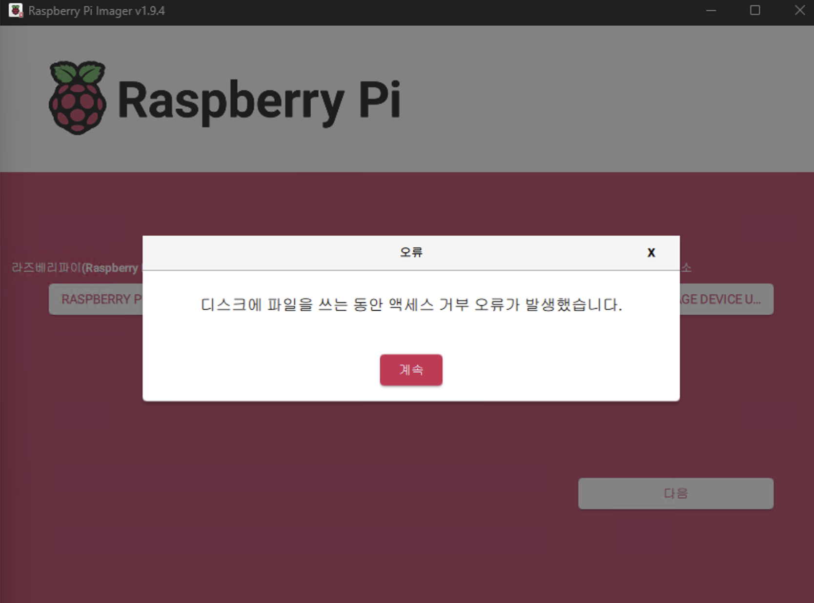

# 라즈베리파이에Lineage OS 설치 시 이미지 쓰기 오류 해결 과정

> **Summary**
> 라즈베리파이에 Lineage OS를 설치하는 과정에서 SD카드에 이미지 쓰기 오류가 발생했으나, SD 협회에서 제공하는 SD Card Formatter를 사용하여 포맷한 후 오류가 해결되었다. 일반 포맷 도구와 달리 SD Card Formatter는 SD 카드의 내부 구조를 최적화하여 정확한 파티션 정렬과 FAT 파일 시스템 구성을 수행함으로써 임베디드 장치에서의 신뢰성을 높인다.

---

라즈베리파이 4b에 Lineage OS 22를 설치하기 위해 Raspberry Pi Imager를 사용하여 이미지 쓰기를 진행하는 과정에서 “디스크에 파일을 쓰는 동안 액세스 거부 오류가 발생했습니다”라는 메시지가 지속적으로 나타났다.

처음에는 SD카드의 문제인지 혹은 프로그램 자체의 오류인지 알 수 없어 몇 가지 방법을 시도했다. 먼저 Raspberry Pi Imager를 종료하고 관리자 권한으로 재실행해봤으나 같은 오류가 발생했다. 또한 Mini Partition 도구를 사용하여 SD카드를 초기화하고 포맷해봤음에도 불구하고 동일한 오류 메시지가 지속적으로 나타났다.

이 과정에서 한 가지 궁금증이 생겼다. 일반적인 디스크 관리 도구인 Mini Partition으로도 충분히 깔끔하게 포맷했다고 생각했는데 왜 계속 이미지 쓰기가 실패하는지였다.

해결책으로 SD협회(SD Association)에서 공식적으로 제공하는 전용 프로그램인 SD Card Formatter를 사용하여 포맷을 다시 진행했다. 이 프로그램을 이용해 포맷한 후 다시 Raspberry Pi Imager로 이미지 쓰기를 시도하자, 놀랍게도 더 이상 오류 메시지가 나타나지 않고 정상적으로 이미지 쓰기가 완료되었다.

그렇다면 동일하게 보이는 두 포맷 방식에서 왜 SD Card Formatter를 통해 포맷할 때만 문제가 해결된 것일까?

그 이유는 SD Card Formatter가 일반 포맷 도구들과 달리 SD협회의 공식 규격에 따라 SD 카드 내부 구조를 최적화하여 포맷하기 때문이다. 일반적인 디스크 관리 프로그램이 단순히 데이터를 삭제하거나 파일 시스템만 간략히 정리하는 반면, SD Card Formatter는 SD 카드의 내부 플래시 메모리 구조를 고려하여 적절한 파티션 정렬과 FAT 파일 시스템 구성을 수행한다. 이로 인해 라즈베리파이와 같은 임베디드 장치가 SD카드를 정확하게 인식하고 정상적으로 읽기 및 쓰기를 수행할 수 있게 되는 것이다.

정리하면, 일반적인 포맷 도구로는 해결되지 않았던 이미지 쓰기 오류가 SD Card Formatter라는 공식 도구를 통해 해결된 것은, SD카드의 내부 구조와 공식 규격을 고려한 포맷 과정 때문이었다고 볼 수 있다. 라즈베리파이와 같은 임베디드 장치에서는 SD협회의 공식 도구를 사용하는 것이 보다 신뢰성 있는 해결책이라고 할 수 있겠다.

| **항목** | **일반 포맷 도구 (윈도우, Mini Partition 등)** | **SD Card Formatter** |
| --- | --- | --- |
| **파티션 정렬** | 도구마다 다름, 최적화 안 됨 | 내부 플래싱 구조에 맞춰 자동 정렬 () |
| **FAT/FAT32 구조** | 기본 포맷 방식 | 정확한 오프셋과 FAT 구조로 재설계 () |
| **웨어 레벨링 고려** | 고려 안 함 | 수명과 성능을 고려한 레이아웃 최적화 () |
| **불량 블록 관리** | 일반적이지 않음 | 종종 불량 블록 마킹까지 지원 () |
| **파일 시스템 규격 준수** | OS마다 다름 | SD 표준에 최적화 () |

- **포맷 표준화**: 협회 규격 그대로 포맷되어 라즈베리파이 같은 임베디드 장치와 궁합이 좋아요.
- **성능과 안정성**: 읽기/쓰기 성능 최대 50% 향상, 랜덤 쓰기에서도 큰 이득을 줬다는 실험 결과도 있어요 .
- **이미 이상해진 카드 복구**: OS 포맷으로 해결 안 되는 불량 섹터나 구조 문제도 교정 가능 .
