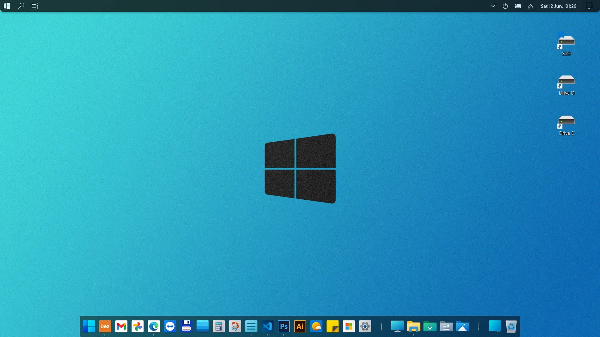

# 레딧 유저의 윈도우 세팅 like macOS

> **Summary**
> 윈도우를 macOS처럼 설정하는 방법에 대한 내용으로, 간단한 앱과 멋진 추가 기능을 활용하는 방법을 소개합니다.

---

🔗 [https://www.reddit.com/r/Windows_Redesign/comments/nxvmli/winos_with_simple_apps_and_awesome_addons/](https://www.reddit.com/r/Windows_Redesign/comments/nxvmli/winos_with_simple_apps_and_awesome_addons/)

