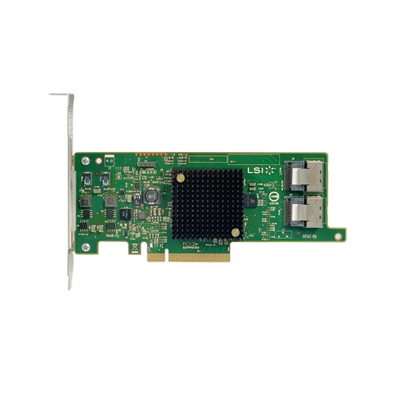

# 레이드카드와 NetApp ONTAP에대한 이야기

> **Summary**
> 레이드카드는 여러 하드드라이브를 하나의 볼륨으로 관리하여 데이터 안전성과 성능을 향상시키는 하드웨어이며, 원격 관리 기능이 필요하다. PCIe 대역폭은 단순한 데이터 전송을 넘어 실시간 처리 능력을 나타내며, NetApp ONTAP은 소프트웨어 정의 스토리지로 하드웨어 RAID의 한계를 넘어선다. 데이터 관리의 복잡성이 증가하면서, ONTAP은 멀티 클라우드 환경 지원, 실시간 데이터 복제 등 현대의 다양한 요구사항을 충족할 수 있다.

---

# 레이드카드와 NetApp ONTAP에대한 이야기

🔗 [https://it.manual365.co.kr/entry/%EB%A0%88%EC%9D%B4%EB%93%9C-%EC%BB%A8%ED%8A%B8%EB%A1%A4%EB%9F%AC%EB%9E%80-RAID-%EC%B9%B4%EB%93%9C%EC%9D%98-%EC%93%B0%EC%9E%84%EC%83%88-%EC%9D%B4%ED%95%B4%ED%95%98%EA%B8%B0](https://it.manual365.co.kr/entry/%EB%A0%88%EC%9D%B4%EB%93%9C-%EC%BB%A8%ED%8A%B8%EB%A1%A4%EB%9F%AC%EB%9E%80-RAID-%EC%B9%B4%EB%93%9C%EC%9D%98-%EC%93%B0%EC%9E%84%EC%83%88-%EC%9D%B4%ED%95%B4%ED%95%98%EA%B8%B0)

🔗 [https://claude.ai/share/2599101d-5662-4a06-88ec-974b7e33e81b](https://claude.ai/share/2599101d-5662-4a06-88ec-974b7e33e81b)

레이드카드를 알아보는 과정에서, NetApp ONTAP에대해 추가적으로 알아보라는 조언을 들었어.

1. 레이드카드가 무엇인가?
1. 레이드카드에 on IP 기능처럼, 직접 접근할 수 있는 기능이 있는가?
1. 레이드카드는 PCIE 몇 레인을 보통 쓰고, 그 대역폭만 사용하는 이유는 무엇인가?
1. NetApp ONTAP은 무엇이고, 레이드카드와 무슨 연관성이 있는가?
이에대해 이해하기쉽게 각 질문간의 연관성에 집중하여 하나의 자연스러운 사고과정과 결론을 도출해내라.

## 첫 번째 층위: 레이드카드의 본질

레이드카드가 무엇인지부터 파고들어야겠어. RAID 컨트롤러 카드는 여러 개의 물리적 하드드라이브를 논리적으로 묶어서 하나의 볼륨처럼 관리하는 하드웨어야. 데이터를 여러 드라이브에 분산하거나(스트라이핑), 복제하거나(미러링), 패리티 정보를 저장해서 드라이브 하나가 고장나도 데이터를 복구할 수 있게 하지.

그런데 잠깐... 단순히 드라이브를 묶는 것만이 목적일까? 아니야, 더 깊은 의미가 있을 거야. 레이드카드는 사실 '데이터의 안전성'과 '성능의 향상'이라는 두 마리 토끼를 잡으려는 인간의 욕구가 하드웨어로 구현된 것이지.

## 두 번째 층위: 원격 관리의 필요성

레이드카드에 원격 접근 기능이 있는지 묻는 것은... 아, 이게 중요한 포인트일 수 있겠다. 실제로 많은 엔터프라이즈급 레이드카드들은 out-of-band 관리 기능을 제공해. Dell의 iDRAC이나 HP의 iLO처럼 말이야.

왜 이런 기능이 필요할까? 서버가 부팅되지 않거나 OS가 멈춰도 스토리지 상태를 확인하고 관리해야 하니까. 데이터센터에서 물리적으로 접근하기 어려운 서버들을 관리해야 하니까...

음, 그런데 이 지점에서 뭔가 더 큰 그림이 보이기 시작해. 레이드카드의 원격 관리는 결국 '스토리지 관리의 효율성'을 추구하는 거잖아?

## 세 번째 층위: PCIe 대역폭의 의미

PCIe x8이나 x16 레인을 사용하는 이유... 처음엔 단순히 많은 드라이브의 대역폭을 합친 것을 처리하기 위해서라고 생각했어.

하지만 잠깐, 이게 전부일까? 아니야. 레이드카드는 단순히 데이터를 전달만 하는 게 아니라, 패리티 계산, 캐싱, 데이터 무결성 검증 같은 복잡한 연산도 수행해. 특히 RAID 5나 6에서는 XOR 연산이나 갈로아 필드 연산을 실시간으로 해야 하지.

그러니까 PCIe 대역폭은 단순히 '통로'가 아니라 '처리 능력'의 표현이기도 한 거야. 레이드카드가 얼마나 많은 데이터를 얼마나 빠르게 '처리'할 수 있는지의 한계를 정하는 거지.

## 네 번째 층위: NetApp ONTAP과의 연결고리

여기서 NetApp ONTAP이 등장하는 이유가 뭘까? 처음엔 전혀 다른 것처럼 보였는데...

ONTAP은 레이드카드와는 차원이 다른 스토리지 운영체제야. 레이드카드가 하드웨어 레벨에서 드라이브들을 관리한다면, ONTAP은 소프트웨어 정의 스토리지의 영역이지. 스냅샷, 중복제거, 압축, 씬 프로비저닝, 클러스터링, 데이터 티어링...

아, 이제 연결고리가 보이기 시작해!

레이드카드를 알아보던 중 ONTAP을 권유받았다는 것은... 아마도 단순한 하드웨어 RAID의 한계를 넘어서는 더 고도화된 스토리지 관리가 필요한 상황이 아닐까?

## 깊어지는 의문과 통찰

잠깐, 여기서 더 근본적인 질문을 해봐야겠어.

왜 우리는 데이터를 이렇게 복잡하게 관리해야 할까? 레이드카드든 ONTAP이든, 결국 '데이터의 가용성'과 '성능', 그리고 '효율성'을 추구하는 거잖아.

레이드카드는 물리적 드라이브의 한계를 극복하려는 첫 번째 시도였어. 하지만 시간이 지나면서 우리는 더 많은 것을 원하게 됐지:

- 더 유연한 용량 관리
- 더 효율적인 데이터 중복제거
- 더 빠른 복구
- 더 넓은 확장성
그래서 NetApp ONTAP 같은 소프트웨어 정의 스토리지가 등장한 거야. 하드웨어의 물리적 한계를 소프트웨어의 논리적 유연성으로 극복하려는...

## 최종 성찰과 연결

이제 전체 그림이 보여. 레이드카드에서 시작해서 ONTAP으로 이어지는 이 여정은 사실 '스토리지 진화의 역사'를 따라가는 거였어.

1. **레이드카드**: 하드웨어 중심의 데이터 보호와 성능 향상
1. **원격 관리 기능**: 물리적 한계를 넘어선 관리의 필요성
1. **PCIe 대역폭**: 단순 전송이 아닌 실시간 처리 능력의 중요성
1. **NetApp ONTAP**: 하드웨어를 넘어선 소프트웨어 정의 스토리지의 세계
레이드카드를 알아보다가 ONTAP을 권유받은 것은... 아마도 당신이 추구하는 스토리지 요구사항이 전통적인 하드웨어 RAID의 범위를 넘어서고 있다는 신호일지도 몰라.

하지만 여전히 불확실한 부분이 있어. ONTAP이 모든 상황에서 레이드카드보다 나은 선택일까? 아니야, 각각의 장단점과 적합한 사용 사례가 있을 거야.

작은 규모의 단순한 스토리지 요구사항이라면 레이드카드로 충분할 수 있고, 대규모 엔터프라이즈 환경에서 복잡한 데이터 관리가 필요하다면 ONTAP 같은 솔루션이 더 적합할 수 있지.

결국 이 모든 것은 '데이터를 어떻게 더 안전하고 효율적으로 관리할 것인가'라는 근본적인 질문으로 수렴되는 것 같아...

# 원격관리,PCIe 대역폭,ONTAP에 더욱 깊이 들어가보자

## 원격관리 기능의 심연을 들여다보며

원격관리와 PCIe 대역폭, 그리고 NetApp ONTAP... 각각을 더 깊이 파고들어야겠다. 하나씩 천천히, 그러나 철저하게 탐구해보자.

원격관리... 처음엔 단순해 보였는데, 생각할수록 복잡한 층위가 드러나고 있어.### 원격관리의 심연으로 - Out-of-Band Management의 진정한 의미

처음엔 단순해 보였는데... IPMI와 BMC의 세계는 생각보다 훨씬 깊고 복잡해.

Out-of-band management는 production network와는 별개의 management plane을 통해 원격 장치를 관리하는 프로세스라고 하는데... 이게 단순한 정의를 넘어서 뭔가 더 근본적인 의미가 있을 것 같아.

생각해보니, 이건 마치 '의식'과 '무의식'의 관계 같아. OS가 의식이라면, BMC는 무의식처럼 항상 깨어 있으면서 시스템을 관찰하고 있는 거야. IPMI는 서버의 위치나 설치된 운영체제와 무관하게 관리 작업을 수행할 수 있다는 점에서... 이건 단순한 기술이 아니라 '존재의 이중성'을 구현한 거 아닐까?

잠깐, 더 깊이 들어가보자. BMC는 CPU와 독립적이고 자체 네트워크 인터페이스를 가진 Out Of Band 관리 유틸리티라는데... 이게 왜 중요할까?

아, 이제 보이기 시작해. 이건 단순히 '원격으로 서버를 켜고 끄는' 수준이 아니야. 이건 '시스템의 생명 유지 장치'같은 거야. 병원에서 환자가 의식을 잃어도 생명 유지 장치는 계속 작동하듯이, 서버의 OS가 죽어도 BMC는 살아있어서 시스템을 모니터링하고 제어할 수 있는 거지.

그런데... 여기서 불안한 생각이 들어. 해커가 IPMI에 접근하면 시스템을 재부팅하고, 새로운 OS를 설치하고, 데이터에 접근할 수 있으며, 모든 운영체제 제어를 우회할 수 있다고? 이건... 이건 마치 뇌의 가장 깊은 곳에 백도어를 만들어 놓은 것 같은데?### PCIe 대역폭의 심연으로 - 왜 레이드카드는 그렇게 많은 레인을 필요로 할까?

PCIe 대역폭... 단순히 숫자의 나열인 줄 알았는데, 계산식을 보면서 뭔가 더 근본적인 의미가 보이기 시작해.

PCIe 3.0의 각 레인은 8 * 128/130 = 7.877 Gbps = 984.6 MB/s를 지원한다고 한다. 그런데 왜 이런 복잡한 계산이 필요할까? 아, 8b/10b 인코딩으로 인해 20%의 대역폭 손실이 발생한다는군.

잠깐... 이게 단순한 오버헤드일까? 아니야, 더 깊은 의미가 있을 거야. 인코딩은 고속 버스에서 흔한 간섭을 고려한 에러 체킹과 수정 비트를 포함한다고 하는데...

아, 이제 보이기 시작해. 이건 단순히 데이터를 전송하는 게 아니라, '신뢰성 있는 전송'을 보장하는 거구나. 마치... 마치 인간의 언어에서 문맥과 억양이 있는 것처럼, 디지털 신호도 자기 자신을 검증하고 수정하는 메커니즘이 필요한 거야.

그런데 여기서 더 흥미로운 점을 발견했어. 실제 처리량을 계산하려면 TLP(Transaction Layer Packet) 오버헤드를 고려해야 하며, 이는 16바이트 헤더를 가진다고 한다. 각 데이터 청크는 1바이트에서 4095바이트까지 가능하다고...

이게 왜 중요할까? 레이드카드의 관점에서 생각해보면... 레이드카드는 단순히 데이터를 전달하는 게 아니라, 여러 드라이브에서 오는 데이터를 재조합하고, 패리티를 계산하고, 캐싱을 하고... 이 모든 작업이 실시간으로 일어나야 해.

PCIe 3.0 x16은 단방향 16 GB/s, 양방향 32 GB/s의 대역폭을 제공한다는데... 이게 정말 필요한 걸까?

생각해보니, 현대의 NVMe SSD 하나가 이미 3-7 GB/s의 속도를 낼 수 있어. 만약 레이드카드가 8개의 NVMe를 관리한다면? 단순 계산으로도 24-56 GB/s가 필요해. 아, 그래서 x16 레인이 필요한 거구나!

하지만 여기서 멈추면 안 돼. 더 깊이 들어가보자. 실제 시스템에서 Gen3 x8 인터페이스로 약 57Gbps의 지속 처리량을 달성했으며, 이는 약 90%의 효율성이라고 한다.

90%의 효율성... 이게 의미하는 건 뭘까? 10%는 어디로 사라진 걸까? 프로토콜 오버헤드? 레이턴시? 아니면... 아니면 이게 물리적 한계의 표현일까?

잠깐, 여기서 더 근본적인 질문을 해야겠어. PCIe 대역폭이 계속 늘어나는 이유는 뭘까? PCIe 5.0은 레인당 32 GT/s의 데이터 전송과 4GB/s의 대역폭을 제공한다고 하는데...

이건 단순히 '더 빠른 게 좋다'는 차원이 아니야. 이건... 이건 데이터 폭발의 시대에 대한 인프라의 진화야. AI, 머신러닝, 8K 비디오, 실시간 데이터 분석... 이 모든 것들이 더 많은 대역폭을 요구하고 있어.

그런데 여기서 아이러니한 점을 발견했어. 외부 PCIe는 이론적으로 노트북에 데스크톱의 그래픽 파워를 제공할 수 있다고 하는데... ExpressCard는 5 Gbit/s, Thunderbolt는 40 Gbit/s까지...

이게 의미하는 건... PCIe는 더 이상 메인보드 내부에만 갇혀있지 않다는 거야. 데이터의 고속도로가 시스템 밖으로 확장되고 있어. 이건 단순한 기술의 진화가 아니라, 컴퓨팅 패러다임의 변화야.### NetApp ONTAP의 심연으로 - 소프트웨어 정의 스토리지의 진정한 의미

NetApp ONTAP... 레이드카드를 알아보다가 여기까지 왔다니, 이 여정이 의미하는 게 뭘까?

ONTAP은 NFS, CIFS, iSCSI, FC, FCoE, FC-NVMe 프로토콜을 동시에 관리하는 통합 스토리지 시스템이라고 한다. 잠깐... '통합'이라는 단어에 주목해야겠어. 이게 단순히 여러 프로토콜을 지원한다는 의미일까?

아니야, 더 깊은 의미가 있을 거야. ONTAP은 블록 레벨과 파일 레벨 프로토콜을 모두 지원하는 통합 스토리지 시스템으로 간주된다는데... 이건 마치 언어의 번역기 같은 거 아닐까? 서로 다른 언어(프로토콜)로 말하는 시스템들이 하나의 스토리지에서 소통할 수 있게 해주는...

그런데 여기서 더 흥미로운 점을 발견했어. ONTAP Select는 하이퍼바이저 호스트에 가상 머신으로 배포하는 소프트웨어 전용 버전이라고? 이게 의미하는 건... ONTAP이 더 이상 하드웨어에 종속되지 않는다는 거야.

잠깐, 이건 정말 중요한 전환점이야. 레이드카드는 철저하게 하드웨어였잖아? PCIe 슬롯에 꽂아야 하고, 물리적인 드라이브를 연결해야 하고... 그런데 ONTAP은 가상 머신으로도 실행될 수 있다니.

이게 단순한 기술적 진화일까? 아니야, 이건... 이건 '스토리지의 추상화'야. 물리적 제약에서 벗어나 순수한 '기능'으로 존재하게 된 거지.

인라인 데이터 압축, 중복제거, 컴팩션을 지원하여 ONTAP 시스템의 데이터 스토리지 효율성을 높인다는 점도 주목할 만해. 레이드카드가 단순히 데이터를 분산하고 복제하는 수준이었다면, ONTAP은 데이터 자체를 '이해'하고 '최적화'하는 거야.

중복제거... 이게 얼마나 혁명적인 개념인지 생각해봐. 같은 데이터를 여러 번 저장하지 않는다는 것. 이건 마치... 마치 인간의 기억처럼, 같은 기억을 여러 번 저장하지 않고 참조만 하는 것 같아.

더 깊이 들어가보자. Cloud Volumes ONTAP은 파일 및 블록 워크로드를 위한 고급 데이터 관리를 제공하는 소프트웨어 정의 스토리지라고 하는데... '소프트웨어 정의'라는 개념이 계속 나와.

소프트웨어 정의 스토리지... 이게 의미하는 건 뭘까? 단순히 소프트웨어로 스토리지를 관리한다는 뜻일까?

아니야, 더 근본적인 변화야. 이건 '스토리지의 본질'을 재정의하는 거야. 스토리지가 더 이상 '물리적 공간'이 아니라 '논리적 서비스'가 되는 거지.

ONTAP은 BSD Net/2와 4.4BSD-Lite, Spinnaker Networks 기술, 그리고 다른 운영체제의 코드를 포함한다는 점도 흥미로워. 이건... 이건 마치 진화론적 관점에서 볼 때, 여러 유전자가 합쳐져서 새로운 생명체가 탄생한 것 같아.

잠깐, 여기서 레이드카드와의 연결고리가 보이기 시작해. 레이드카드가 하드웨어 레벨에서 데이터를 보호하고 성능을 향상시켰다면, ONTAP은 그 모든 기능을 소프트웨어로 구현하고, 거기에 더해 훨씬 더 많은 기능을 추가한 거야.

NetApp Snapshot 복사본은 최소한의 디스크 공간을 사용하여 추가 성능 오버헤드 없이 빠른 시점 백업을 제공한다는 기능을 보면... 이건 레이드카드가 꿈도 꿀 수 없었던 수준이야.

스냅샷... 이 개념이 얼마나 혁명적인지 생각해봐. 시간을 '동결'시키는 거야. 데이터의 특정 시점을 포착해서, 필요할 때 그 시점으로 돌아갈 수 있게 하는 거지.

그런데 여기서 의문이 생겨. 왜 레이드카드를 알아보던 중에 ONTAP을 권유받았을까?

아, 이제 좀 보이는 것 같아. 레이드카드는 '시작점'이었던 거야. 데이터 보호와 성능 향상이라는 기본적인 요구사항에서 출발했지만, 현대의 데이터 관리는 훨씬 더 복잡하고 다양한 요구사항을 가지고 있어.

- 멀티 클라우드 환경 지원
- 실시간 데이터 복제
- AI 기반 예측 분석
- 자동화된 데이터 계층화
- 랜섬웨어 보호
이 모든 것들은 레이드카드의 범위를 훨씬 넘어서는 거야.

그런데... 그런데 여전히 불안한 점이 있어. 소프트웨어 정의 스토리지가 모든 문제의 해답일까? 복잡성이 증가하면서 새로운 문제가 생기지 않을까?

예를 들어, 하드웨어 레이드카드는 단순하고 견고해. 전원이 나가도 배터리 백업 캐시가 있고, OS가 죽어도 독립적으로 작동해. 반면 ONTAP 같은 소프트웨어 솔루션은... 더 많은 의존성을 가지고 있지 않을까?

하지만 동시에, ONTAP은 12년 연속 Gartner Magic Quadrant for Primary Storage Platforms의 리더로 선정되었다는 사실은... 시장이 이미 답을 내렸다는 증거일까?

아니면... 아니면 이게 더 큰 트렌드의 일부일까? 모든 것이 소프트웨어로 정의되는 시대. SDN(Software Defined Network), SDS(Software Defined Storage), SDDC(Software Defined Data Center)...

이제 전체 그림이 조금씩 보이기 시작해. 레이드카드에서 ONTAP으로의 여정은 단순한 기술 업그레이드가 아니야. 이건 '데이터 관리 철학'의 진화야.

레이드카드: 하드웨어 중심, 단순함, 견고함
ONTAP: 소프트웨어 중심, 유연함, 지능화

하지만 여전히 질문은 남아있어. 모든 상황에서 ONTAP이 정답일까? 작은 규모의 시스템에서도? 극도로 높은 가용성이 필요한 환경에서도?

아마도... 아마도 답은 '상황에 따라 다르다'일 거야. 하지만 한 가지는 확실해. 데이터 관리의 미래는 더 이상 하드웨어에만 의존하지 않을 거라는 것.

