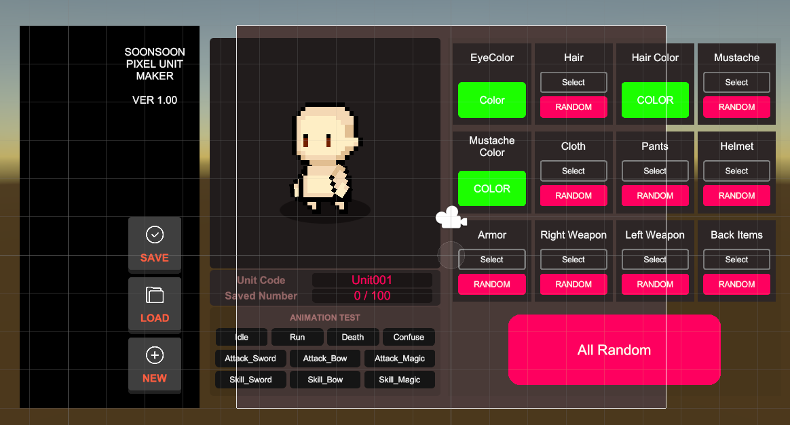
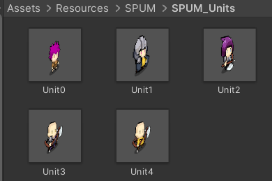

# 로그라이크 게임 제작 01

> **Summary**
> SPUM 무료버전 설치 방법과 리소스 탐색에 대한 내용으로, Voxel 환경 자산 링크도 포함되어 있습니다. 저장한 캐릭터 정보는 Resources/SPUM/SPUM_Units에 위치합니다.

---

🎥 [동영상 보기](https://www.youtube.com/watch?v=lnvNWuovnRs)

위 영상 따라하기 전에 아래 링크에서 SPUM 설치

🔗 [https://www.soonsoon.co/docs/spum-ko/free-version/](https://www.soonsoon.co/docs/spum-ko/free-version/)

🎥 [동영상 보기](https://www.youtube.com/watch?v=TvxdkMMuC1A&t=140s)

무료버전은 구버전이다 해당 영상을 참고하자

> 🔥 **저장한 캐릭터 정보는 Resources/SPUM/SPUM_Units 에 존재함**

# 리소스 탐색

🔗 [https://maxparata.itch.io/voxel-desert-town](https://maxparata.itch.io/voxel-desert-town)

