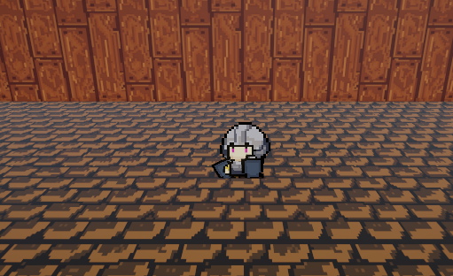

# 로그라이크 게임 제작 02

> **Summary**
> 유니티 로그라이크 게임 제작을 위한 플레이어 이동 및 회전 구현 방법을 설명하며, 기존 인풋 시스템을 활용하여 플레이어의 위치 이동과 애니메이션 활성화를 위한 코드를 제공한다.

---



## InputSystem을 활용하면 좋을거같은데 일단은 기존 인풋시스템을 활용했다

```c#
//Player.cs

using System.Collections;
using System.Collections.Generic;
using UnityEngine;
using UnityEngine.InputSystem; //새롭게 설치한 Player Input System 을 사용하기 위해 임포트

public class Player : MonoBehaviour
{
    public Vector3 inputVec;
    public float speed;
    Rigidbody rigid;
    
    void Awake()
    {
        rigid = GetComponent<Rigidbody>();
    }

    void Update()
    {
        //input키에 Horizontal 은 [left, right] Vertical 은 [up, down] 키가 매핑되어있음
        inputVec.x = Input.GetAxisRaw("Horizontal");
        inputVec.z = Input.GetAxisRaw("Vertical");
    }

    //FixedUdate는 물리 연산 프레임마다 호출되는 함수다
    void FixedUpdate() 
    {
        //어느 방향이든 벡터값을 1로 고정
        Vector3 nextVec = inputVec.normalized * speed * Time.deltaTime;

        //3.위치 이동
        //MovePostion은 위치 이동이라 현재 위치를 더해줘야함
        //이 코드에서 현재 위치는 rigid.postion 이다
        //인풋값과 현재위치를 더해주면 플레이어가 나아가야 할 방향을 계산한다
        rigid.MovePosition(rigid.position + nextVec);
    }

    void LateUpdate()
    {
        if (inputVec.x != 0)
            this.transform.localScale = new Vector3(-1.5f, 1.5f, 1.5f);
        if (inputVec.x < 0)
            this.transform.localScale = new Vector3(1.5f, 1.5f, 1.5f);
    }
}
```


# 플레이어를 회전시키고 이동시키고 애니메이션을 활성화시켜보자

```c#
void Awake()
{
    rigid = GetComponent<Rigidbody>();
    anim = **GetComponentInChildren**<Animator>();
}


//플레이어 이동 구현
void Move()
{
    //input키에 Horizontal 은 [left, right] Vertical 은 [up, down] 키가 매핑되어있음
    inputVec.x = Input.GetAxisRaw("Horizontal");
    inputVec.z = Input.GetAxisRaw("Vertical");

    //어느 방향이든 벡터값을 1로 고정
    Vector3 nextVec = inputVec.normalized * speed * Time.deltaTime;

    // ... 위치 이동
    //MovePostion은 위치 이동이라 현재 위치를 더해줘야함
    //이 코드에서 현재 위치는 rigid.postion 이다
    //인풋값과 현재위치를 더해주면 플레이어가 나아가야 할 방향을 계산한다
    rigid.MovePosition(rigid.position + nextVec);
    **if(nextVec != Vector3.zero)
        anim.SetFloat("RunState", 0.5f);
    else
        anim.SetFloat("RunState", 0.0f);**
}

//플레이어 회전 구현
void Turn()
{
    **if (inputVec.x != 0)
        this.transform.localScale = new Vector3(-1.5f, 1.5f, 1.5f);
    if (inputVec.x < 0)
        this.transform.localScale = new Vector3(1.5f, 1.5f, 1.5f);**
}
```

