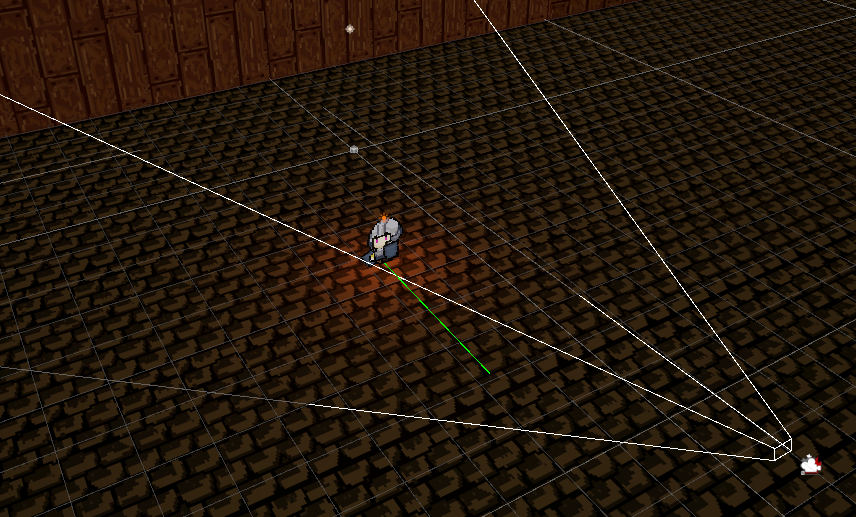
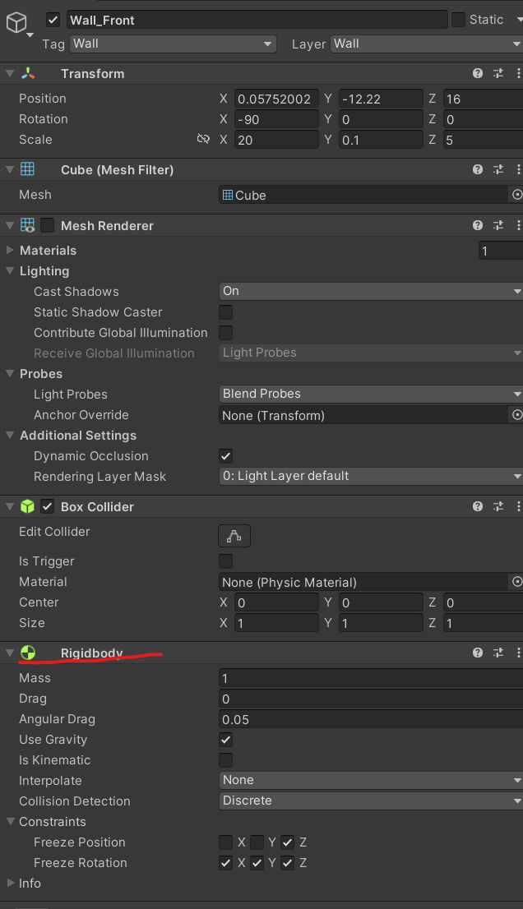

# 로그라이크 게임 제작 04

> **Summary**
> 카메라의 화각을 조절하는 방법을 구현하기 위해 Rigidbody를 추가해야 Raycast가 제대로 작동한다는 것을 발견했다. Player.cs에 캐릭터가 벽에 부딪혔을 때 카메라의 위치와 FOV를 조정하는 코드를 추가하였다.

---




## Raycast가 True인 상황에서도 True가 반환이 안되어 머리를 싸매고 그 이유를 알았다


## 바로 Rigidbody도 추가되어야 Raycast가 제대로 충돌을 감지할 수 있다는걸…




그리고 Player.cs에 다음과 같은 코드를 추가해줍니다 (고마워요 GPT맨)

```c#
//Player.cs

//캐릭터의 -z방향에서 벽을 만났을경우, Camera의 z값을 고정하고 FOV값을 조정
void StopToWall()
{
    // -3.5는 Raycast의 거리
    //Raycast 시각화
    Debug.DrawRay(transform.position, transform.forward * -3.5f, Color.green);

    Ray ray = new Ray(transform.position, transform.forward * -3.5f);
    isBorder = Physics.Raycast(transform.position, transform.forward, -3.5f, LayerMask.GetMask("Wall"));
    
    if (Physics.Raycast(ray, out RaycastHit hit, 100f))
    {
        if (!isBorder)
        {
            Vector3 cameraPosition = VCamera.transform.position;
            cameraPosition.z = hit.point.z;
            VCamera.transform.position = cameraPosition;

            // Calculate the distance between player and wall
            float distance = Vector3.Distance(transform.position, hit.point);

            //최소화각 최대화각 설정
            float fov = Mathf.Lerp(25f, 45f, distance / 7f);
            VCamera.m_Lens.FieldOfView = fov;
        }
    }
}
```


## 화면 밖을 벗어난 카메라를 제어하는 방법

🎥 [동영상 보기](https://youtu.be/mWqX8GxeCBk)

