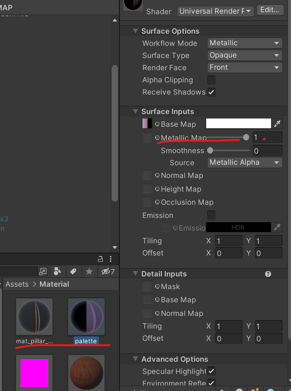

# 로그라이크 게임 제작 07

> **Summary**
> 기둥의 opacity를 추가하고, 메탈릭 및 Smoothness 값을 조절하여 현실적인 광원 효과를 만드는 방법을 설명합니다. 또한, 박스 콜라이더를 카메라에 추가하여 특정 태그의 콜라이더와 충돌 시 MeshRender를 비활성화하는 방법을 다룹니다.

---

🎥 [동영상 보기](https://www.youtube.com/watch?v=IpdgeNbXN5o)

🎥 [동영상 보기](https://www.youtube.com/watch?v=4XZ4Xn2Rt-U)

## OBJ 내부에 머터리얼은 인스펙터에서 수정할수가 없어서 머터리얼만 따로 복사해옵니다





> 🔥 **플레이어와 기둥 오브젝트가 겹쳤을 때 기둥 오브젝트의 material 값을 수정하는 방**


## 박스 콜라이더를 카메라에 추가하여 카메라와 닿는 특정 태그의 콜라이더의 MeshRender를 잠시 비활성화 할겁니다


```c#
**void OnTriggerEnter(Collider other)**
    {
        if(other.tag == "Item")
        {
            //Item 태그에 있는 다른 컴포넌트를 받아온다
            Item item = other.GetComponent<Item>();
        }
    }
```

