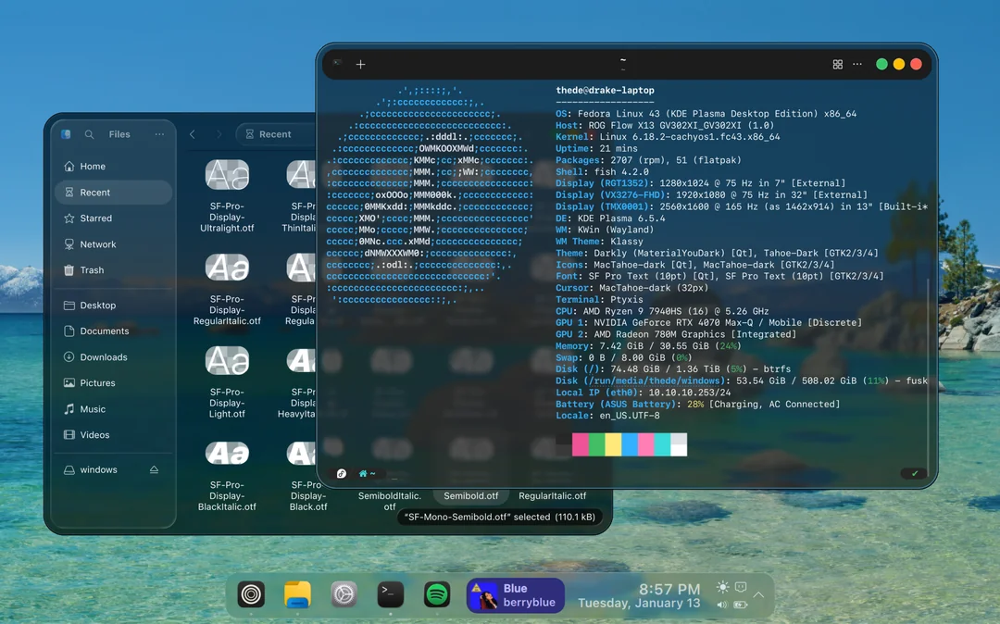

# 맛도리 KDE RICING 모음집.

> **Summary**
> 다양한 KDE 테마 설정을 소개하며, 각 테마의 특징과 링크를 제공합니다. 페도라와 윈도우의 통합, 최신 쿠분투 기능, 밸브 디자인 영감을 받은 테마, 독특한 사용자 인터페이스, 극단적인 단순함을 추구하는 흑백 테마, 윈도우 에어로와 물고기 배경의 조화, 90년대 복고풍 감성을 담은 설정 등이 포함되어 있습니다.

---

### 1. Fedora Like MAC OS

페도라와 윈도우를 동시에 사용하는 유저를 위한 설정입니다. 두 운영체제 사이의 시각적 이질감을 줄이고, 작업 효율을 높이는 깔끔한 레이아웃이 특징입니다.

- **특징:** 생산성 중심의 정갈한 패널 배치
- **링크:** [Reddit 바로가기](https://www.reddit.com/r/unixporn/comments/1qcajv6/kde_my_fedorawindows_dual_boot_setup/)
🔗 [https://github.com/vinceliuice/MacTahoe-kde](https://github.com/vinceliuice/MacTahoe-kde)

### 2. Kubuntu 25.10

최신 쿠분투 버전을 기반으로 한 설정입니다. KDE Plasma의 최신 기능을 활용하여 부드러운 애니메이션과 현대적인 데스크탑 환경을 구현했습니다.

- **특징:** 최신 배포판의 안정성과 세련된 UI의 조화
- **링크:** [Reddit 바로가기](https://www.reddit.com/r/unixporn/comments/1pmp08y/kde_kubuntu_2510/)
🎥 [동영상 보기](https://packaged-media.redd.it/lom5h83xh87g1/pb/m2-res_1080p.mp4?m=DASHPlaylist.mpd&v=1&e=1768726800&s=2bd0895cd6a9cc69b45ec324136c52bc3d877f39)

### 3. Obsession with Valve

밸브(Valve)사와 스팀(Steam)의 디자인 언어에 영감을 받은 테마입니다. 마치 SteamOS를 데스크탑 환경으로 옮겨온 듯한 게이밍 감성을 전달합니다.

- **특징:** 스팀 덱(Steam Deck) 스타일의 아이콘과 다크 모드 테마
- **링크:** [Reddit 바로가기](https://www.reddit.com/r/unixporn/comments/1qbn8wd/kde_obsession_with_valve/)

### 4. A Bit Different Aesthetic

일반적인 데스크탑 레이아웃에서 벗어나 사용자만의 독특한 시각을 반영한 설정입니다. 위젯의 배치나 창의 형태에서 실험적인 시도가 돋보입니다.

- **특징:** 전형적인 하단 바 형식을 탈피한 창의적인 인터페이스
- **링크:** [Reddit 바로가기](https://www.reddit.com/r/unixporn/comments/1ogex5s/kde_i_went_for_something_a_bit_different_this/)

### 5. Minimalist Monochrome

"색상은 사치(Bloat)"라는 철학 아래 설계된 흑백 테마입니다. 시각적 요소를 최소화하여 사용자가 오로지 텍스트와 작업에만 집중할 수 있게 돕습니다.

- **특징:** 극도의 단순함, 높은 대비를 통한 가독성 확보
- **링크:** [Reddit 바로가기](https://www.reddit.com/r/unixporn/comments/1g5im30/kde_plasma_minimalist_monochrome_because_color_is/)

### 6. Aero Fish

과거 윈도우의 에어로(Aero) 테마가 주는 투명함과 물고기 배경화면의 청량함을 결합했습니다. 향수를 불러일으키면서도 현대적인 투명 효과가 인상적입니다.

- **특징:** 유리 같은 투명도(Glass effect)와 푸른 색조의 강조
- **링크:** [Reddit 바로가기](https://www.reddit.com/r/unixporn/comments/1l2c4fk/kde_aero_fish/)

### 7. Retro Liminal

90년대 복고풍 감성과 리미널 스페이스(Liminal Space)의 기묘한 분위기를 담은 설정입니다. 저해상도 텍스처와 빈티지한 색감이 독특한 몰입감을 줍니다.

- **특징:** 로우파이(Lo-fi) 스타일의 비주얼과 향수를 자극하는 UI
- **링크:** [Reddit 바로가기](https://www.reddit.com/r/unixporn/comments/1m8h3we/kde_retro_liminal/)

