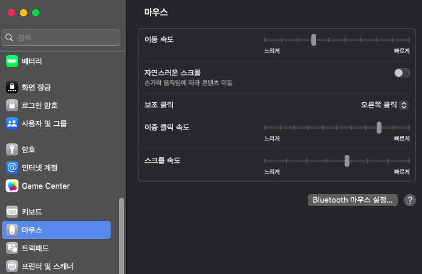
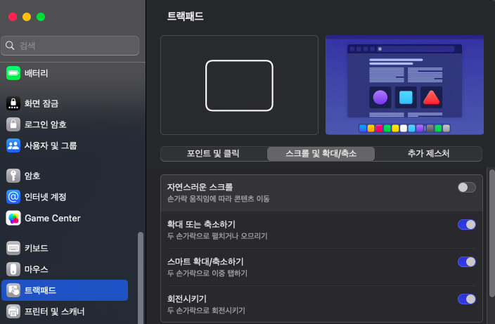
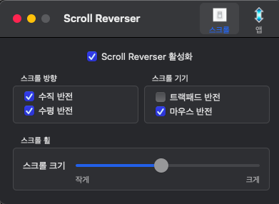

# 맥(해킨토시 T480) OS 마우스 설정

> **Summary**
> 트랙패드와 빨콩 방향을 조정하고, 자연스러운 스크롤을 꺼야 하며, ScrollReverser 앱을 설치하여 쾌적한 환경을 설정할 수 있습니다.

---






### 스크롤 리버서 앱 설정 (아래 ScrollReverser 깔아야함)

```bash
brew install scrollReverser
```




이제 쾌적한 환경 사용 가능~

