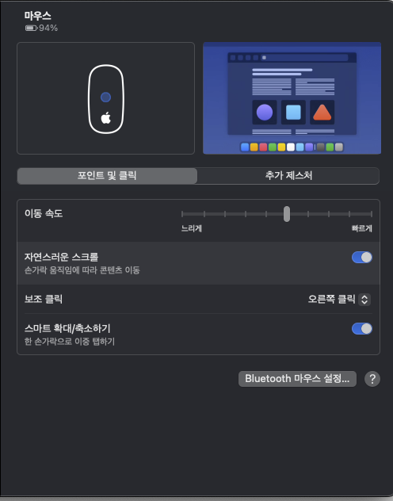

# 맥 마우스 감도 조절

> **Summary**
> Mac에서 마우스 감도를 조절하기 위해 터미널을 사용하여 마우스 스케일링 값을 조회하고 설정할 수 있습니다. 기본 명령어로 감도를 조정한 후 재부팅하면 변경 사항이 적용됩니다.

---

Windows를 사용하다가 Mac으로 넘어오면 마우스감도가... 느려터져서 설정으로 해결 못하는 경우가 많다!



마우스 설정에 들어가서 이동속도를 빠르게 바꿔도 윈도우처럼 빠릿빠릿하지 않으니... 답답함..

---

**1. Cmd+Space -> "Terminal 실행"**

[현재 마우스 스케일링 조회]

```shell
defaults read .GlobalPreferences com.apple.mouse.scaling
```

[마우스 스케일링 설정]

```shell
defaults write .GlobalPreferences com.apple.mouse.scaling 5
```

~ scaling 5 <- 숫자 5를 원하는 만큼 조절 해주고 재부팅 해주면 감도가 바뀜!

