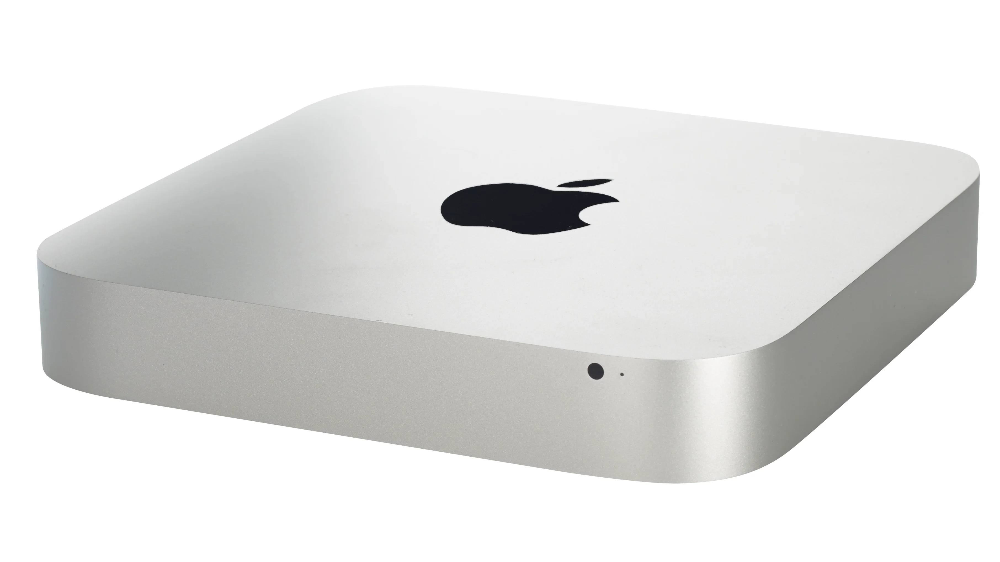

# 맥 초기 세팅

> **Summary**
> 맥 초기 세팅에 대한 다양한 리소스와 팁을 제공하며, 필수 앱, 한영 전환 딜레이 해결 방법, 유니티 개발환경 세팅, 윈도우 설치 방법, 그리고 셀레니움 설정 시 보안 속성 삭제 방법을 포함하고 있습니다.

---

🔗 [https://github.com/uyu423/TIL/blob/master/MacOS/MacOS%20%EC%B4%88%EA%B8%B0%ED%99%94%20%ED%9B%84%20%EA%B0%9C%EB%B0%9C%ED%99%98%EA%B2%BD%20%EC%84%B8%ED%8C%85.md](https://github.com/uyu423/TIL/blob/master/MacOS/MacOS%20%EC%B4%88%EA%B8%B0%ED%99%94%20%ED%9B%84%20%EA%B0%9C%EB%B0%9C%ED%99%98%EA%B2%BD%20%EC%84%B8%ED%8C%85.md)

🔗 [https://itchallenger.tistory.com/376](https://itchallenger.tistory.com/376)

🔗 [https://velog.io/@ho2yahh/mac-인생-첫-맥북-개발자-초기-세팅](https://velog.io/@ho2yahh/mac-인생-첫-맥북-개발자-초기-세팅)

🔗 [https://f-dever-error-log.tistory.com/29](https://f-dever-error-log.tistory.com/29)

🔗 [https://shanepark.tistory.com/167](https://shanepark.tistory.com/167)

🔗 [https://shanepark.tistory.com/164](https://shanepark.tistory.com/164)

🔗 [https://torbjorn.tistory.com/658](https://torbjorn.tistory.com/658)

🔗 [https://wooono.tistory.com/299](https://wooono.tistory.com/299)

🔗 [https://ssafy-story.tistory.com/37](https://ssafy-story.tistory.com/37)

# 설치 앱

🔗 [https://mstoryteller.tistory.com/9](https://mstoryteller.tistory.com/9)

# 한영전환 딜레이

🔗 [https://mangoooooo.tistory.com/12](https://mangoooooo.tistory.com/12)

🔗 [https://brunch.co.kr/@sungchulkang/6](https://brunch.co.kr/@sungchulkang/6)

# 유니티 설정

🔗 [https://pokycookie.tistory.com/42](https://pokycookie.tistory.com/42)

# 맥 윈도우 설치

[아이맥(인텔)에 윈도우11 설치하기 (tistory.com)](https://ilikeafrica.tistory.com/70)

# 맥에서 셀레니움 설정

해당 경고 메시지는 ‘chromedriver’ 파일에 대한 Apple의 보안 정책 때문에 발생하는 것입니다. 이를 해결하기 위해서는 ‘chromedriver’ 파일에 대한 보안 속성을 삭제해주어야 합니다.

다음 명령어를 터미널에서 실행하여 ‘chromedriver’ 파일에 대한 보안 속성을 삭제해보세요.

`xattr -d com.apple.quarantine /path/to/chromedriver
`복사

위 명령어에서 ‘/path/to/chromedriver’ 부분은 chromedriver 파일이 저장된 경로로 변경해주어야 합니다.

참고로, chromedriver가 설치된 경로를 확인하려면 다음 명령어를 실행하면 됩니다.

`which chromedriver
`복사

위 명령어를 실행하면 chromedriver가 설치된 경로가 출력됩니다.

