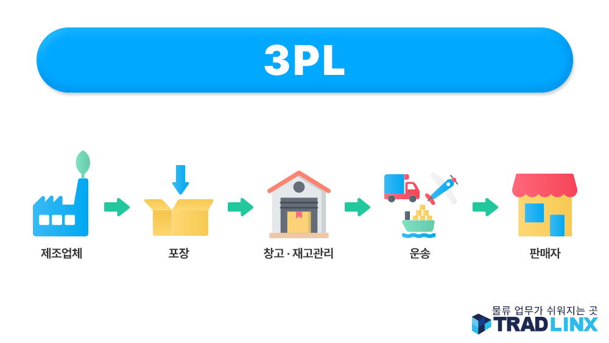

# 물류에서 

> **Summary**
> 3PL은 기업이 물류를 전문 업체에 외주하여 운영하는 방식으로, 비용 절감, 전문성, 운영 효율화, 글로벌 확장 등의 장점을 제공합니다. 물류 단계는 1PL부터 5PL까지 있으며, 3PL은 운송, 창고, 재고관리 등을 포함하는 물류 대행 서비스입니다. 쇼핑몰 창업자와 중견/대기업이 주로 활용합니다.

---

**3PL이란?**

3PL은 기업이 자체적으로 물류를 처리하지 않고, 전문 물류업체에 맡기는 방식입니다. 즉, 제품의 보관, 운송, 재고관리, 주문처리 등을 ‘외주’ 형식으로 운영하는 것이죠. 덕분에 기업은 핵심 사업에만 집중할 수 있고, 물류는 전문가에게 맡겨 효율성과 비용 절감 효과를 누릴 수 있습니다.

---

**물류 단계별 정의 (1PL~5PL)**

| 구분 | 적용 대상 | 정의 및 특징 |
| --- | --- | --- |
|---|---|---|
| 1PL | 생산자 | 본인이 직접 운송 및 관리 |
|---|---|---|
| 2PL | 운송업체 | 창고~고객까지 단순 운송만 제공 |
|---|---|---|
| 3PL | 물류 대행사 | 운송, 창고, 재고관리 등 전반적 물류 외주 |
|---|---|---|
| 4PL | 통합관리업체 | 여러 3PL을 종합적으로 관리·최적화 |
|---|---|---|
| 5PL | IT 기반 기업 | 최신 디지털·IT 기술 기반 통합 물류 관리 |

---

**3PL의 주요 장점**

- **비용 절감:** 설비, 인력, 차량 등 직접 갖추지 않아도 됨
- **전문성:** 여러 기업의 물류 경험·노하우를 활용
- **운영 효율화:** 주문 폭주, 성수기에도 유연하게 대응 가능
- **글로벌 확장:** 해외 물류, 통관 업무 등도 대행 가능
**활용 사례**

- 쇼핑몰 창업자: 상품 보관·포장부터 운송까지 ‘올인원’ 서비스 사용
- 중견/대기업: 대량 주문, 해외 진출시 경쟁력 강화
