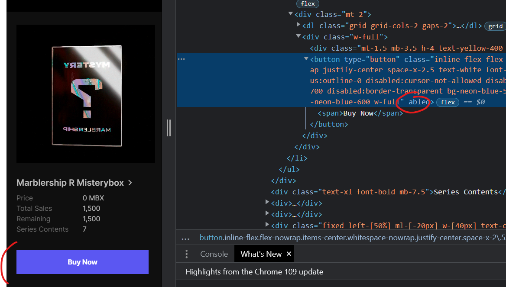

# 민팅 매크로 개발 02

> **Summary**
> xpath를 사용하여 클릭 기능을 구현하려 했으나, 로그인 계정마다 xpath가 달라져 클릭이 실패했다. pyautogui와 RGB_CLICK 함수를 활용하여 팝업을 인식하고 클릭하는 방법으로 문제를 해결했으며, 최종적으로는 잘못된 URL로 인해 실제 코드를 잘못 실행한 결과를 겪었다.

---

# HTML에서 바로 xpath 뽑을걸… able하니까 클릭가능하게 바뀌네…



//*[@id="headlessui-tabs-panel-:r1a:"]/div/div[1]/ul/li/div[2]/div/button

//*[@id="headlessui-tabs-panel-:r1a:"]/div/div[1]/ul/li/div[2]/div/button


# 얏됐다! 로그인게정마다 xpath가 조금씩 변해서 로그인하고나면 클릭이 안돼!!!!


```python
#//*[@id="headlessui-tabs-panel-:r3:"]/div/div[1]/ul/li/div[2]/div/button #(로그인안했을땐 동일)
#//*[@id="headlessui-tabs-panel-:**ro**:"]/div/div[1]/ul/li/div[2]/div/button #(A계정 로그인)
#//*[@id="headlessui-tabs-panel-:**ri**:"]/div/div[1]/ul/li/div[2]/div/button #(B계정 로그인)
```

## 크히힣!!! 난 잠 다잤다!!!


<details>
<summary>눈물의 해치웠나? 똥꼬쇼 기존코드</summary>

```python
if __name__ == '__main__':
    while True:
        current_time = datetime.datetime.now().strftime("%H:%M:%S")
        if current_time == "00:44:50":
            endhope=False
            while not endhope:
                tim=datetime.datetime.now()
                if tim.second>=59 and tim.microsecond>600000:
                    
                    ####웹사이트 BUY NOW 클릭 시도####
                    count = 0
                    while True:
                        try:
														#xpath가 바뀐다....!!!!
                           ** element = wait.until(EC.element_to_be_clickable((By.XPATH, '//*[@id="headlessui-tabs-panel-:r3:"]/div/div[1]/ul/li/div[2]/div/button')))
                            driver.find_element(By.XPATH, '//*[@id="headlessui-tabs-panel-:r3:"]/div/div[1]/ul/li/div[2]/div/button').click()
                            print("클릭성공 시간 : ",tim)
                            break**
                        except:
                            count += 1
                            print("시도실패",count)
                    ####팝업 BUY NOW 클릭 시도####
                    for i in range(10):
                        keyboard.press_and_release('down')
                    pyautogui.click(int(width * 20 / 100), int(height * 20 / 100))
                    RGB_CLICK(int(width * 10 / 100), int(height * 20 / 100), int(width * 90 / 100), int(height * 80 / 100), MAIN_RGB, 50, 3)
                    RGB_CLICK(int(width * 10 / 100), int(height * 20 / 100), int(width * 90 / 100), int(height * 80 / 100), MAIN_RGB, 50, 3)
                    ####Confrim 팝업 클릭(테스트부분 지워도 됩니다)####
                    element = wait.until(EC.element_to_be_clickable((By.XPATH, '//*[@id="__next"]/div[2]/div/div/div[2]/div[1]/div/div[2]/div/div[2]/div/button[2]')))
                    driver.find_element(By.XPATH, '//*[@id="__next"]/div[2]/div/div/div[2]/div[1]/div/div[2]/div/div[2]/div/button[2]').click()
                    driver.switch_to.window(driver.window_handles[-1])
                    element = wait.until(EC.element_to_be_clickable((By.XPATH, '//*[@id=":r1:"]')))
                    driver.find_element(By.XPATH, '//*[@id=":r1:"]').click()
                    element = wait.until(EC.element_to_be_clickable((By.XPATH, '//*[@id="root"]/main/section/div[1]/div/form/button')))
                    driver.find_element(By.XPATH, '//*[@id="root"]/main/section/div[1]/div/form/button').click()
                    driver.switch_to.window(driver.window_handles[-1])
                    #확인차 다시 클릭하는부분
                    element = wait.until(EC.element_to_be_clickable((By.XPATH, '//*[@id="headlessui-tabs-panel-:r3:"]/div/div[1]/ul/li/div[2]/div/button')))
                    driver.find_element(By.XPATH, '//*[@id="headlessui-tabs-panel-:r3:"]/div/div[1]/ul/li/div[2]/div/button').click()
                    endhope=True
                    break
                else:
                    time.sleep(0.1)
                    print(tim)
```

</details>


> Xpath클릭도 실패했고… datetime 이나 time.sleep 으로는 고정 시간기준으로 클릭만 가능하여
Xpath가 아니라면 팝업을 인지하고 다음 단계로 이동하는걸 구현하지 못했었는데..

## 해치웠다!!!(진짜로)


> Xpath 사용 없이 해결한 방법은 바로

`**”len(driver.window_handles)”**`

pyautogui 와 PIL 라이브러리를 활용해 만든 RGB_CLICK함수를 일단 한번 클릭하면 함수를 종료하게 만들고 while 문을 활용해 크롬탭이 하나뿐이라면 계속해서 RGB_CLICK을 하게 만들었다


쨌든 오늘 꿀잠…다행이다…


# 전체코드

