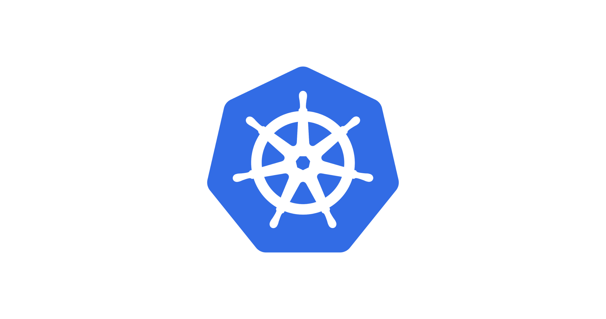

# 반드시 알아야 할 쿠버네티스 디자인 패턴 10가지

> **Summary**
> 쿠버네티스 디자인 패턴 10가지를 소개하며, Docker와 관련된 소켓 서버 운영의 어려움에 대한 내용을 다룹니다.

---

🔗 [https://elky84.github.io/2020/07/05/difficult_operate_a_socket_server_with_docker/](https://elky84.github.io/2020/07/05/difficult_operate_a_socket_server_with_docker/)

🔗 [https://jflip.tistory.com/m/13](https://jflip.tistory.com/m/13)

