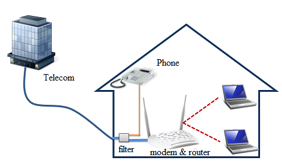
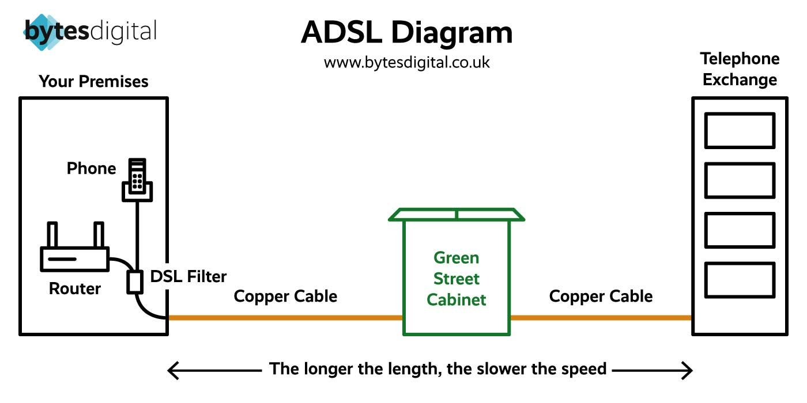

# 백화점은 왜 ADSL을 사용할까? 구시대 기술의 의외의 생존기

> **Summary**
> 백화점의 결제 시스템에서 ADSL을 사용하는 이유는 기존 전화선 인프라의 활용, 안정성과 보안, 결제 데이터의 특성 때문이다. 시간이 지나면서 새로운 백화점들은 랜 기반 네트워크로 전환하고 있지만, 일부 오래된 백화점에서는 여전히 ADSL 시스템을 유지하고 있다. 이는 과거의 유산이자 기술 발전 과정에서의 효율성과 안정성을 반영한다.

---

### 백화점은 왜 ADSL을 사용할까? 구시대 기술의 의외의 생존기

백화점의 결제 시스템, 즉 포스(POS) 단말기는 언뜻 최신 기술의 집약체처럼 보이지만, 그 통신 방식의 근간을 살펴보면 의외로 'ADSL'이라는 구형 기술이 언급되곤 한다. 최첨단 유통의 상징과 같은 백화점에서 왜 여전히 전화선을 기반으로 한 ADSL을 사용하는 것일까?

### ADSL이란 무엇인가?

ADSL(Asymmetric Digital Subscriber Line, 비대칭 디지털 가입자 회선)은 기존의 구리 전화선을 이용해 고속 데이터 통신을 가능하게 하는 기술이다. 1990년대 후반부터 2000년대 초반까지 광랜(LAN)이 보급되기 전, 초고속 인터넷 시대를 연 주역이다.

이름에 '비대칭'이 붙는 이유는 데이터의 다운로드 속도와 업로드 속도가 다르기 때문이다. 당시 인터넷 사용자 대부분이 콘텐츠를 내려받는(다운로드) 비중이 압도적으로 높았기에, 다운로드 속도를 업로드 속도보다 훨씬 빠르게 설정하여 효율을 높였다. ADSL의 핵심은 음성 통화(저주파 대역)와 데이터 통신(고주파 대역)에 사용하는 주파수 대역을 분리하여, 전화와 인터넷을 동시에 사용할 수 있다는 점이었다.

### 백화점이 ADSL을 선택했던 이유

과거 백화점들이 ADSL을 결제 시스템의 통신 방식으로 채택했던 이유는 명확하다.

1. **기존 인프라의 활용:** 백화점 건물에는 이미 방대한 전화선 네트워크가 촘촘하게 깔려 있었다. 모든 매장에 새로운 인터넷 랜선을 설치하는 대규모 공사 없이, 기존 전화선을 그대로 활용하여 결제 시스템을 구축할 수 있다는 것은 엄청난 비용 및 시간 절감 효과를 가져왔다.
1. **안정성과 보안:** 백화점은 자체 교환기(PBX)를 통해 내부 전화망을 독립적으로 운영했다. 이 폐쇄적인 내부 통신망에 연결된 ADSL 결제 시스템은 외부 인터넷망에 직접 노출되는 것보다 상대적으로 보안에 강점을 가질 수 있었다. 결제 정보라는 민감한 데이터를 다루는 입장에서 이는 중요한 고려사항이었다.
1. **결제 데이터의 특성:** 신용카드 승인과 같은 결제 데이터는 용량이 매우 작다. 따라서 광랜처럼 넓은 대역폭이 필요하지 않았다. ADSL이 제공하는 속도만으로도 결제 승인 요청과 응답을 처리하기에 충분했으며, 안정적인 통신만 보장된다면 굳이 더 높은 비용을 들여 시스템을 교체할 유인이 적었다.
### 현재는 어떻게 변화하고 있는가?

물론 시간이 흐르면서 백화점의 통신 환경도 변화했다. 대부분의 신축 또는 리모델링된 백화점은 초기 설계부터 랜선을 기반으로 한 네트워크 시스템을 도입한다. 포스 시스템 역시 재고 관리, 고객 관리, 매출 분석 등 단순 결제를 넘어선 다기능을 수행하게 되면서 더 빠르고 안정적인 데이터 전송이 가능한 랜(LAN) 방식으로 전환되는 추세다.

그럼에도 불구하고 오래된 백화점 건물이나 특정 매장에서는 여전히 기존에 구축된 ADSL 기반 시스템을 유지 보수하며 사용하는 경우가 존재한다. 시스템 전체를 교체하는 데 따르는 막대한 비용과 영업 중단에 대한 부담 때문이다. 따라서 '백화점에서 ADSL을 쓴다'는 말은 과거의 유산이 여전히 작동하고 있음을 보여주는 동시에, 기술의 발전 과정 속에서 효율성과 안정성을 이유로 한때 최적의 선택이었음을 시사한다.

### 참고

[https://www.xpeed2.net/01_product/03_hanafos_m01.php](https://www.xpeed2.net/01_product/03_hanafos_m01.php)

[https://m.blog.naver.com/opcom-/221911519613](https://m.blog.naver.com/opcom-/221911519613)

[https://ko.wikipedia.org/wiki/%EB%B9%84%EB%8C%80%EC%B9%AD_%EB%94%94%EC%A7%80%ED%84%B8_%EA%B0%80%EC%9E%85%EC%9E%90_%ED%9A%8C%EC%84%A0](https://ko.wikipedia.org/wiki/%EB%B9%84%EB%8C%80%EC%B9%AD_%EB%94%94%EC%A7%80%ED%84%B8_%EA%B0%80%EC%9E%85%EC%9E%90_%ED%9A%8C%EC%84%A0)

[https://www.google.com/url?sa=i&url=https%3A%2F%2Fwww.bytesdigital.co.uk%2Fblog%2Fwhat-is-adsl-and-how-does-it-work&psig=AOvVaw0XL5h4x84Fx_lkbPypVQh9&ust=1759312173620000&source=images&cd=vfe&opi=89978449&ved=0CBUQjRxqFwoTCNC_r-WagJADFQAAAAAdAAAAABAE](https://www.google.com/url?sa=i&url=https%3A%2F%2Fwww.bytesdigital.co.uk%2Fblog%2Fwhat-is-adsl-and-how-does-it-work&psig=AOvVaw0XL5h4x84Fx_lkbPypVQh9&ust=1759312173620000&source=images&cd=vfe&opi=89978449&ved=0CBUQjRxqFwoTCNC_r-WagJADFQAAAAAdAAAAABAE)

