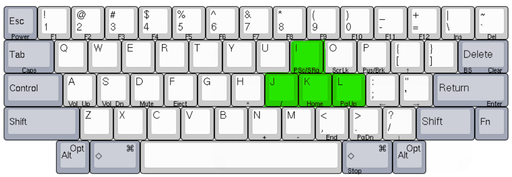

# 변태 키배열 만들기

> **Summary**
> 윈도우 + L 조합을 비활성화하기 위해 AutoHotkey를 설치하고, 특정 스크립트를 사용하여 키 배열을 설정하는 방법을 설명합니다. PowerToys의 키배열 설정도 포함되어 있습니다.

---




WIN + {J I K L} 조합으로 만들려면 몇가지 작업이 필요하다… 이유는 바로


```c#
win + L 
```


때문…


# 윈도우 + L 비활성화

### [`윈도우 win + L 비활성화 하기`](https://www.notion.so/e2e4269d107f413eac708099bd840641)

일단 다음을 따라서 win l 을 비활성화 해준다


# AutoHotKey 설치

🔗 [https://www.autohotkey.com/](https://www.autohotkey.com/)

 

### winL2R.ahk

```c#
#l::
Send, {Right}
```

```c#
/*
#+l::
Send, +{Right}
*/
```

# PowerToys 키배열 설정


다음경로에 폴더째로 붙여넣기

```c#
C:\Users\thqud\AppData\Local\Microsoft\PowerToys
```


