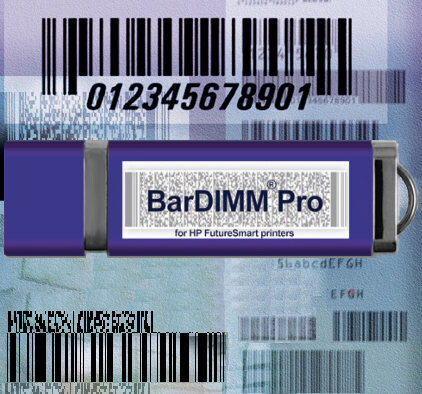

# 보이지 않는 바코드의 표준, Bardimm은 어떻게 독점 구조를 만들었나

> **Summary**
> Bardimm은 일반 사무용 프린터에 바코드 인쇄 기능을 부여하는 지능형 하드웨어 모듈로, SAP ERP 시스템과의 협력을 통해 독점적 생태계를 구축했다. 이 기술은 프린터 내부에서 복잡한 바코드 생성 작업을 처리하여 시스템 부하를 줄이고 안정성을 높인다. Bardimm은 SAP의 공식 인증을 통해 경쟁자를 배제하고, 글로벌 기업에 널리 사용되며 독점적 지위를 강화하고 있다. 이러한 성공 사례는 기술력과 전략적 파트너십의 중요성을 보여준다.

---

### 보이지 않는 표준, Bardimm은 어떻게 독점 구조를 만들었나

기업의 수많은 문서에는 바코드가 필수적으로 따라붙습니다. 재고 관리 라벨, 물류 송장, 생산 지시서 등 바코드 없이는 현대 비즈니스가 돌아가지 않는다고 해도 과언이 아닙니다. 보통 바코드를 인쇄하려면 값비싼 전용 프린터를 떠올리지만, 수많은 글로벌 기업, 특히 SAP ERP 시스템을 사용하는 곳에서는 수십 년간 당연하게 사용해 온 '보이지 않는 표준'이 있습니다. 바로 **Bardimm**입니다.

Bardimm은 단순한 바코드 솔루션이 아닙니다. 특정 기술 환경과 거대 소프트웨어 기업의 전략이 맞물려 강력한 독점적 생태계를 구축한 성공적인 B2B 기술의 교과서적 사례입니다. 이 글에서는 Bardimm이 무엇인지, 그리고 어떻게 SAP 환경의 대체 불가능한 솔루션으로 자리 잡을 수 있었는지 그 독점 구조의 비밀을 종합적으로 파헤쳐 봅니다.

---

### 1. Bardimm이란 무엇인가? - 프린터를 위한 '하드웨어 컴파일러'

Bardimm을 한 문장으로 정의하면 "일반 사무용 프린터에 장착하여 바코드 인쇄 기능을 부여하는 지능형 하드웨어 모듈"입니다. 

USB 메모리나 작은 보드 형태의 이 장치를 프린터에 꽂기만 하면, 기존 프린터는 복잡한 1D, 2D 바코드를 막힘없이 인쇄하는 고성능 바코드 프린터로 변신합니다.

Bardimm이 특별한 이유는 작동 방식에 있습니다.

- **단순 폰트가 아닌, 언어의 확장:** Bardimm은 PC에 바코드 '폰트'를 설치하는 방식이 아닙니다. 프린터 제어 언어(PCL5) 자체를 확장하여, 프린터가 바코드 생성 명령어를 직접 해석하고 처리하게 만듭니다.
- **시스템 부하 제로:** SAP 같은 ERP 시스템은 "이 데이터를 바코드로 만들어라"는 간단한 명령어만 프린터에 보냅니다. 그러면 Bardimm 모듈이 바코드 이미지 생성, 오류 검증을 위한 체크섬(Checksum) 계산 등 모든 복잡한 연산을 프린터 내부에서 자체적으로 처리합니다. 이는 서버나 네트워크에 가해지는 부하를 극적으로 줄여, 전사적 시스템의 안정성과 인쇄 속도를 보장하는 핵심 기술입니다.
- **하드웨어 기반의 실시간 번역기:** 이런 이유로 Bardimm은 '하드웨어 기반의 컴파일러' 또는 '실시간 번역기'에 비유할 수 있습니다. 고급 언어(바코드 생성 명령어)를 입력받아 저급 언어(프린터가 인쇄할 이미지 데이터)로 즉시 번역하여 결과물을 내놓는 것과 같습니다.
이 기술적 우위는 Bardimm이 단순한 편의성 도구를 넘어, 기업의 핵심 업무 시스템에 깊숙이 통합될 수 있는 발판을 마련해주었습니다.

---

### 2. 독점 구조의 서막: SAP는 왜 Bardimm이 필요했나?

Bardimm의 독점적 지위는 세계 최대의 ERP 소프트웨어인 SAP와의 관계를 빼놓고는 설명할 수 없습니다. 1990년대 후반에서 2000년대 초반, 수많은 기업이 SAP R/3 시스템을 도입하던 시절, SAP는 한 가지 기술적 딜레마에 직면했습니다.

- SAP의 고민: 바코드 인쇄의 부하와 복잡성
  기업 고객들은 SAP 시스템에서 출력되는 문서에 당연히 바코드가 포함되길 원했습니다. 하지만 SAP 서버가 직접 바코드 이미지를 생성하여 수많은 프린터로 전송하는 방식은 시스템에 엄청난 부하를 유발했습니다. 또한, 전 세계 수천, 수만 종류의 프린터 드라이버와 호환성을 유지하며 안정적으로 바코드를 인쇄하는 것은 거의 불가능에 가까운 과제였습니다.

- SAP의 선택: 외부 전문 솔루션과의 협력
  SAP는 이 문제를 직접 해결하는 대신, 가장 효율적이고 안정적인 길을 선택했습니다. 바로 바코드 생성이라는 복잡한 과업을 프린터단에서 처리하는 외부 하드웨어 모듈을 공식적으로 지원하는 것이었습니다. 그리고 이 전략의 완벽한 파트너가 바로 제트모바일(Jetmobile, Bardimm 개발사)의 Bardimm이었습니다.

Bardimm은 SAP가 겪고 있던 기술적 고민을 완벽하게 해결해주었습니다. 시스템 부하 없이, 어떤 PCL5 호환 프린터에서든 안정적으로 바코드를 인쇄할 수 있었기 때문입니다.

---

### 3. 독점의 완성: SAP의 '공식 인증'과 경쟁자 배제 전략

Bardimm은 기술적 우위를 바탕으로 SAP와 긴밀한 파트너십을 맺고, 경쟁자가 넘볼 수 없는 견고한 성을 쌓았습니다. 그 과정은 다음과 같습니다.

1. **기술 표준으로의 통합:** SAP는 자사 시스템의 프린터 드라이버(Device Type)에 Bardimm에서만 사용하는 전용 제어 명령어를 내장했습니다. 이는 SAP 사용자가 별도의 개발 없이 설정만으로 Bardimm을 통해 바코드를 출력할 수 있게 만들었으며, Bardimm을 SAP 프린팅 환경의 '공식 부품'처럼 만들었습니다.
1. **공식 기술 문서(OSS Note)를 통한 독점 선언:** 결정적으로, SAP는 공식 기술 지원 문서(OSS Note)를 통해 Bardimm의 독점적 지위를 공인했습니다. 해당 문서에는 다음과 같은 내용이 명시되었습니다.
> "이러한 제어 시퀀스는 SAP가 HP 레이저 프린터에 대해 지원하는 '제트모바일 Bardimm' 모듈에만 해당한다. 다른 바코드 모듈도 시장에 있지만, SAP에서 지원하지 않는다."

  이 한 문장은 경쟁사들의 시장 진입을 원천적으로 차단하는 강력한 장벽이 되었습니다. 기업의 IT 담당자 입장에서 SAP가 공식적으로 지원하지 않는 솔루션을 도입하는 것은 큰 리스크였습니다. 결국 'SAP 환경에서 안정적인 바코드 인쇄 = Bardimm'이라는 공식이 시장의 상식이 되었습니다.

1. **선점 효과와 생태계 구축:** SAP의 공식 파트너로서 시장을 선점한 Bardimm은 수많은 글로벌 기업에 납품되며 거대한 생태계를 구축했습니다. 한번 도입되면 교체하기 어려운 기업 인프라의 특성상, Bardimm의 독점적 지위는 더욱 공고해졌습니다.
이처럼 Bardimm의 독점 구조는 **뛰어난 자체 기술력**에 **거대 플랫폼(SAP)의 기술적 필요성**이 더해지고, **배타적인 공식 파트너십**으로 쐐기를 박아 완성된 것입니다.

---

### 4. 결론: 기술과 전략이 만든 '보이지 않는 거인'

Bardimm을 개발한 제트모바일은 이후 셀리보(Celiveo)로 사명을 변경하고 클라우드 프린팅, 보안 출력 솔루션 등 사업 영역을 확장하며 혁신을 계속하고 있습니다. 하지만 여전히 Bardimm은 이 회사의 상징적인 솔루션이자, B2B 기술 기업의 성공 전략을 보여주는 완벽한 사례로 남아있습니다.

Bardimm의 이야기는 우리에게 중요한 교훈을 줍니다. 최고의 기술을 만드는 것만큼이나, 그 기술이 필요한 거대 생태계의 핵심 문제를 해결하고, 파트너십을 통해 대체 불가능한 표준으로 자리매김하는 전략이 얼마나 중요한지를 말입니다. 다음에 사무실 프린터에서 바코드가 찍힌 문서가 나온다면, 그 뒤에는 수십 년간 시장을 지배해 온 '보이지 않는 표준', Bardimm의 견고한 기술과 날카로운 비즈니스 전략이 숨어있을지도 모릅니다.

