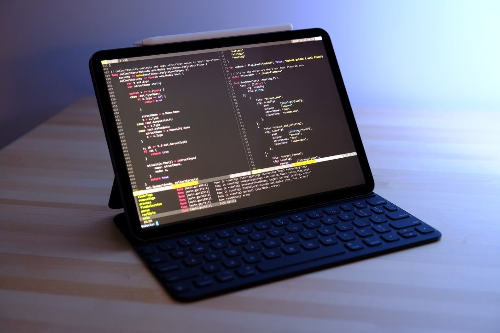

# 서버 구축하여 아이패드로 코딩하기

> **Summary**
> 아이패드로 코딩하기 위한 서버 구축 방법과 관련된 유용한 링크들을 제공하며, 구글 클라우드에서 VM을 생성하고 SSH 접속하는 방법에 대한 안내를 포함하고 있습니다. 추가로, 개발 서버를 무료로 구하는 방법과 예산 초과 시 알림 설정 방법도 소개됩니다.

---

🔗 [https://boxnwhis.kr/2020/01/11/coding_with_ipad.html](https://boxnwhis.kr/2020/01/11/coding_with_ipad.html)

🔗 [https://brunch.co.kr/@topasvga/705](https://brunch.co.kr/@topasvga/705)

🔗 [https://brunch.co.kr/@topasvga/168](https://brunch.co.kr/@topasvga/168)

🔗 [https://nhj12311.tistory.com/317](https://nhj12311.tistory.com/317)

🔗 [https://fourz.tistory.com/28](https://fourz.tistory.com/28)

🔗 [https://fourz.tistory.com/29?category=953211](https://fourz.tistory.com/29?category=953211)

🔗 [https://nhj12311.tistory.com/318](https://nhj12311.tistory.com/318)

