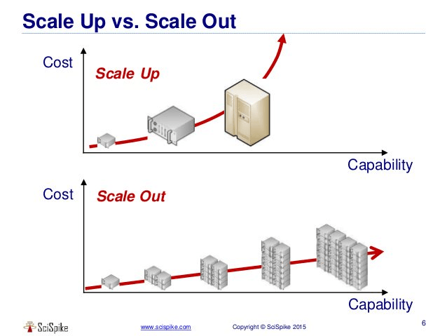

# 수직확장 vs 수평확장

> **Summary**
> 수직 확장은 서버의 자원을 늘려 처리 능력을 향상시키고, 수평 확장은 서버를 추가하여 부하를 분산하는 방식입니다. 수직 확장은 비용이 들 수 있지만 한계가 있으며, 수평 확장은 클라우드 환경에서 더 흔히 사용됩니다. 3티어 아키텍처에서는 각 티어에 적합한 확장 방식을 선택할 수 있습니다.

---

- 수직확장 - 컴퓨팅 파워를 강화하는거. DB는 그대로 옮겨짐 → 마이그레이션 필연적
- 수평확장 - 같은일하는 컴퓨터 여러개 연결시키고, DB끼리 연결함 → 클러스터링이 필연적
---

