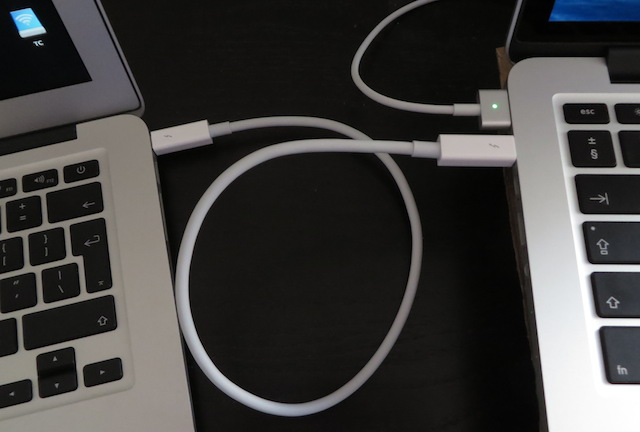

# 썬더볼트를 이용한 mac , windows , linux 연결

> **Summary**
> 썬더볼트를 이용하여 mac, windows, linux 간 연결 방법을 설명합니다. Windows와 macOS 간 직접 화면 공유는 불가능하지만, 네트워크 설정 후 원격 데스크톱 소프트웨어를 사용하여 화면을 공유할 수 있습니다. Linux와 macOS는 Thunderbolt 네트워킹을 통해 직접 연결할 수 있으며, 파일 전송과 원격 제어가 가능합니다. 각 시스템의 네트워크 설정 방법도 안내합니다.

---

# Windows ↔ Windows

[https://www.intel.co.kr/content/www/kr/ko/download/822291/thunderbolt-share.html](https://www.intel.co.kr/content/www/kr/ko/download/822291/thunderbolt-share.html)

[https://www.intel.co.kr/content/www/kr/ko/newsroom/news/intel-unlocks-ultra-fast-pc-to-pc-with-thunderbolt-share.html](https://www.intel.co.kr/content/www/kr/ko/newsroom/news/intel-unlocks-ultra-fast-pc-to-pc-with-thunderbolt-share.html)

# macOS ↔ macOS

[https://support.apple.com/ko-kr/guide/mac-help/mchld53dd2f5/mac](https://support.apple.com/ko-kr/guide/mac-help/mchld53dd2f5/mac)

# Windows ↔ macOS

현재 인텔의 썬더볼트 쉐어 기능은 Windows 전용이므로, Mac과 Windows 간 썬더볼트를 통한 직접 화면 공유는 공식적으로 불가능합니다. 대신 두 컴퓨터를 Thunderbolt 케이블로 연결하고 네트워크 인터페이스(Mac의 Thunderbolt Bridge와 Windows의 Thunderbolt 네트워킹)를 구성한 후, VNC, TeamViewer, AnyDesk 등의 원격 데스크톱 소프트웨어로 화면을 공유할 수 있습니다.

설정 방법은 다음과 같습니다:

1. **Thunderbolt 네트워크 연결 설정**
  - Mac에서는 시스템 설정 > 네트워크에서 Thunderbolt Bridge 인터페이스를 활성화하고 IP 주소를 할당합니다.
  - Windows에서는 Thunderbolt 네트워킹을 지원하는 경우 자동으로 어댑터가 인식되며, IP 설정을 진행합니다.
1. **원격 데스크톱/화면 공유 소프트웨어 사용**
  - 두 컴퓨터가 네트워크로 연결되면, VNC, TeamViewer, AnyDesk 등의 원격 화면 공유 프로그램으로 서로의 화면을 공유할 수 있습니다.
이 방법으로 Thunderbolt의 고속 데이터 전송을 활용할 수 있지만, 네트워크 설정과 추가 소프트웨어 설치가 필요합니다.

# Linux ↔ macOS

[https://askubuntu.com/questions/874587/connect-mac-to-ubuntu-with-usb-to-usb-cable](https://askubuntu.com/questions/874587/connect-mac-to-ubuntu-with-usb-to-usb-cable)

Mac과 Ubuntu Linux 데스크탑(Thunderbolt 카드 장착)은 Thunderbolt 네트워킹으로 직접 연결할 수 있습니다. 두 시스템이 모두 Thunderbolt 네트워크 인터페이스를 지원하면, 케이블 연결 시 자동으로 "Thunderbolt Bridge" 또는 새로운 네트워크 인터페이스가 생성됩니다.

설정 순서는 다음과 같습니다:

1. 두 컴퓨터를 Thunderbolt 케이블로 연결합니다.
  - Mac에서는 시스템 설정 > 네트워크에서 "Thunderbolt Bridge" 인터페이스를 확인합니다.
  - Ubuntu에서는 Thunderbolt 카드가 인식되면 'ip addr' 또는 'ifconfig' 명령어로 새 네트워크 인터페이스를 확인할 수 있습니다.
1. 네트워크를 설정합니다.
  - Mac과 Ubuntu에서 자동으로 링크 로컬 IP가 할당되지만, 필요한 경우 수동으로 IP 주소를 지정할 수 있습니다(예: Mac: 10.0.0.1/24, Ubuntu: 10.0.0.2/24).
  - Ubuntu에서는 터미널에서 "sudo ip addr add 10.0.0.2/24 dev [인터페이스명]" 및 "sudo ip link set [인터페이스명] up" 명령으로 설정합니다.
1. 연결이 완료되면 두 시스템이 같은 네트워크에 있게 되어, SCP, NFS, Samba, VNC 등의 도구로 파일 전송, 원격 제어, 화면 공유가 가능합니다.
이 방법으로 Thunderbolt의 고속 데이터 전송을 활용하여 Mac과 Ubuntu Linux 간 직접 네트워크를 구성할 수 있습니다. 단, Ubuntu에서 Thunderbolt 드라이버와 보안 설정이 올바르게 구성되어 있어야 합니다.

