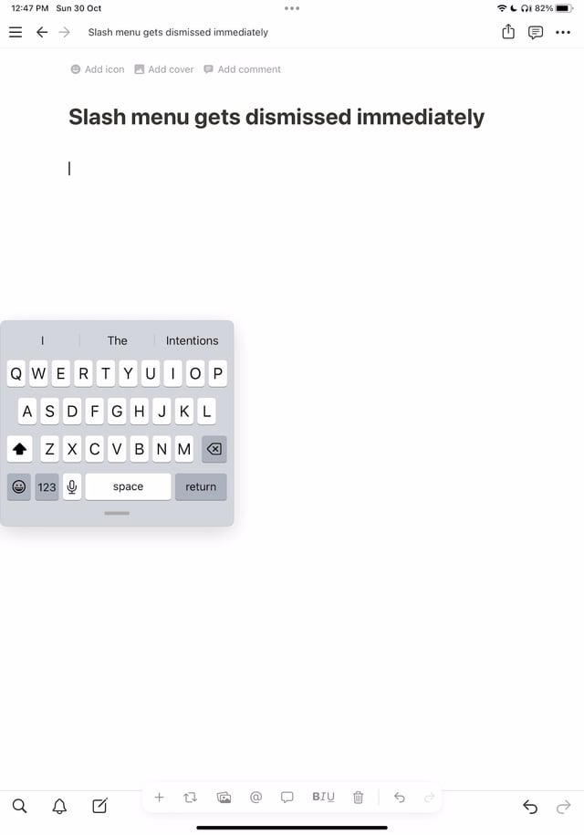

# 아이패드 노션에서 ‘/’ 미작동시 해결방법

> **Summary**
> 아이패드에서 슬래시 메뉴가 작동하지 않을 경우, 설정에서 일반 > 키보드 > 예측 텍스트를 활성화하면 문제를 해결할 수 있습니다.

---

🔗 [https://www.reddit.com/r/Notion/comments/yh81fe/slash_menu_not_working_on_ipad_pro_app/](https://www.reddit.com/r/Notion/comments/yh81fe/slash_menu_not_working_on_ipad_pro_app/)

**일반 > 키보드 > 예측에서 예측 텍스트를 다시** 켜면 실제로 수정됩니다. 어쨌든 지금 막 나를 위해 일했습니다!

