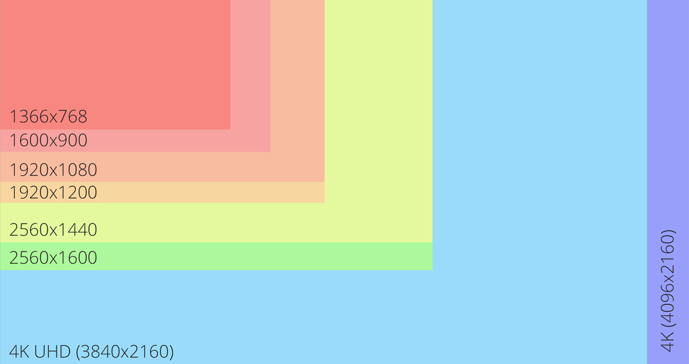

# 아이패드를 위한 윈도우 해상도 고정

> **Summary**
> 레지스트리를 수정하여 아이패드의 해상도를 고정하는 방법에 대한 안내로, M1 아이패드의 해상도는 2388 x 1668이며, 특정 레지스트리 경로에서 설정을 변경해야 합니다.

---



🔗 [https://zkim0115.tistory.com/2570](https://zkim0115.tistory.com/2570)

> 💻 **레지스트리로 이동 후**
> ```basic
> HKEY_LOCAL_MACHINE\SYSTEM\CurrentControlSet\Control\GraphicsDrivers\Configuration
> ```
>
>

> 💻 **해당 디렉토리 최하단에존재하는 폴더안에 ‘00’ 폴더에 해상도관련 레지스트리 전부 변경**

M1 아이패드의 해상도는 2388 x 1668

