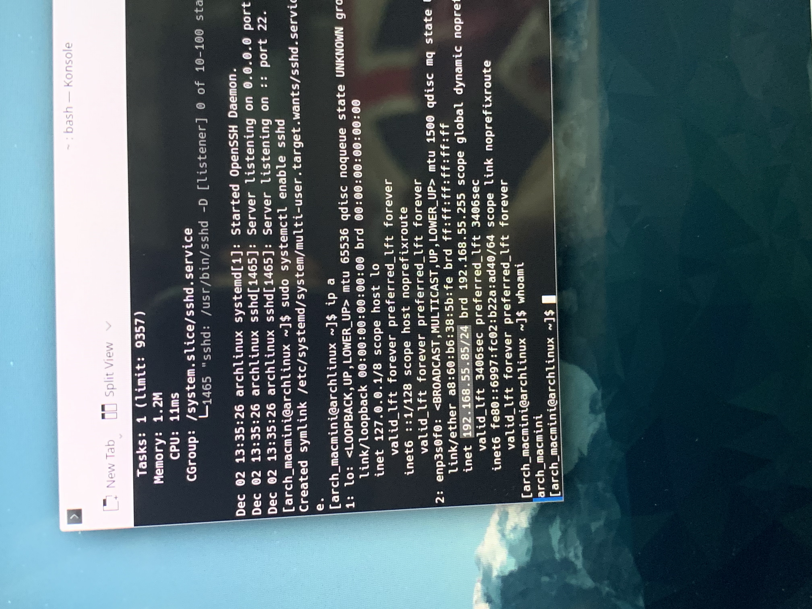

# 아치리눅스 ssh서버 개통!

> **Summary**
> Arch Linux에서 SSH 서버를 설정하고 최적화하는 방법을 설명하며, 필요한 패키지 설치 및 서비스 시작, IP 주소 확인 명령어를 포함합니다. MacMini와 MacPro 6,1의 네트워크 인터페이스 정보도 제공됩니다.

---

🔗 [https://ciksiti.com/ko/chapters/3504-arch-linux-ssh-server-setup-customization-and-optimization](https://ciksiti.com/ko/chapters/3504-arch-linux-ssh-server-setup-customization-and-optimization)

```javascript
sudo pacman -Sy
```

```javascript
sudo pacman -S openssh
```

```javascript
sudo systemctl status sshd
```

```javascript
sudo systemctl start sshd
```

```javascript
sudo systemctl enable sshd
```

```javascript
ip a
```


### 맥미니 서버



### MacPro 6,1

```javascript
[sbu@archlinux ~]$ ip a
1: lo: <LOOPBACK,UP,LOWER_UP> mtu 65536 qdisc noqueue state UNKNOWN group default qlen 1000
    link/loopback 00:00:00:00:00:00 brd 00:00:00:00:00:00
    inet 127.0.0.1/8 scope host lo
       valid_lft forever preferred_lft forever
    inet6 ::1/128 scope host noprefixroute 
       valid_lft forever preferred_lft forever
2: enp11s0: <BROADCAST,MULTICAST,UP,LOWER_UP> mtu 1500 qdisc mq state UP group default qlen 1000
    link/ether 00:3e:e1:c6:3d:f5 brd ff:ff:ff:ff:ff:ff
    inet <u>**192.168.55.113/24**</u> brd 192.168.55.255 scope global dynamic noprefixroute enp11s0
       valid_lft 3585sec preferred_lft 3585sec
    inet6 fe80::f9b0:f8d4:178c:c030/64 scope link noprefixroute 
       valid_lft forever preferred_lft forever
3: enp12s0: <NO-CARRIER,BROADCAST,MULTICAST,UP> mtu 1500 qdisc mq state DOWN group default qlen 1000
    link/ether 00:3e:e1:c6:3d:f4 brd ff:ff:ff:ff:ff:ff
```

