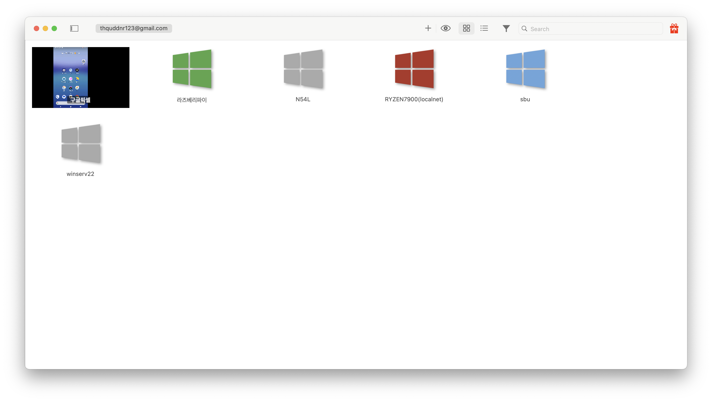
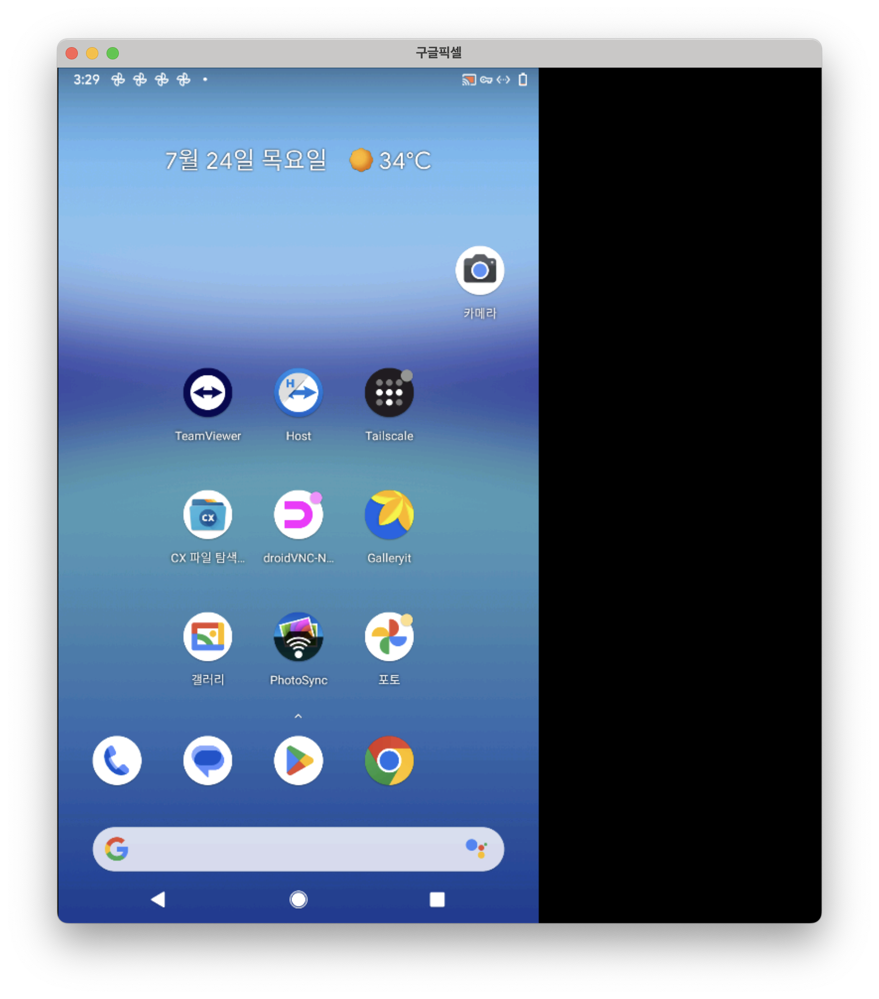

# 안드로이드 서버, 어떻게 원격 제어할까? (feat. droidVNC-NG)

> **Summary**
> 안드로이드 기기를 원격으로 제어하기 위해 

---

## 안드로이드 원격 제어, 더 가볍고 편리한 방법을 찾아서

내 픽셀 서버 프로젝트를 진행하면서 한 가지 아쉬운 점이 있었다. 바로 원격으로 화면을 직접 보며 제어할 방법이 마땅치 않다는 것이었다. 물론 팀뷰어(TeamViewer) 같은 유명한 솔루션이 먼저 떠오르지만, 솔직히 좀 부담스러웠다. 기능이 많은 만큼 무겁고, 개인적인 용도로 쓰기엔 과하다는 느낌을 지울 수 없었다. 내 오래된 픽셀 서버에 불필요한 부담을 주고 싶지 않았다.

그래서 더 가볍고 본질에 충실한 방법을 찾아 헤맸고, 마침내 `droidVNC-NG`라는 완벽한 해답을 찾았다.

내가 이 앱을 선택한 이유는 명확했다. 첫째, **오픈소스**다. 누구나 코드를 들여다볼 수 있어 투명하고, 불필요한 기능 없이 VNC 서버라는 본질에만 집중한다. 둘째, **루팅(root) 권한이 필요 없다.** 안드로이드의 '접근성 서비스' API를 활용하는 방식인데, 이는 매우 영리한 접근이다. 루팅 없이도 화면을 제어할 수 있게 해주므로 보안 걱정을 덜 수 있었다.

설정은 놀라울 만큼 간단했다. 구글 플레이스토어에서 앱을 설치하고, 앱이 요구하는 대로 '접근성 서비스' 권한만 허용해 주면 준비는 끝난다. 앱을 켜고 서버 시작 버튼을 누르니, 화면에 접속할 IP 주소와 포트 번호가 바로 나타났다. 이제 내 PC에서 접속할 일만 남았다.

VNC 클라이언트는 여러 가지가 있지만, 나는 평소 애용하는 `JumpDesktop`을 사용했다. `JumpDesktop`에 `droidVNC-NG`가 알려준 주소를 그대로 입력하니, 지체 없이 안드로이드 화면이 내 PC 모니터에 나타났다. 반응 속도도 만족스러웠고, 마우스로 기본적인 조작을 하기에 전혀 무리가 없었다.

하지만 나를 가장 만족시킨 기능은 따로 있었다. 바로 **‘부팅 시 자동으로 VNC 서버 시작’** 옵션이다. 이걸 활성화하니, 내 픽셀 서버가 어떤 이유로 재부팅되더라도 신경 쓸 필요 없이 VNC 서버가 자동으로 켜졌다. 원격 서버로 활용하는 기기에는 이보다 더 편리할 수 없는 기능이다. 더 이상 문제가 생겼을 때 기기를 직접 확인하러 가지 않아도 된다는 해방감은 기대 이상이었다.

만약 당신도 나와 같이 안드로이드 기기를 원격으로 제어할 가볍고 안정적인 방법이 필요하다면, `droidVNC-NG`와 `JumpDesktop` 조합을 추천한다.

