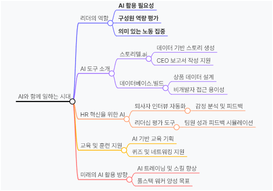

# 엑셀 데이터를 활용하여 보고서를 자동으로 작성하는 등의 다양한 AI 도구들

> **Summary**
> AI 도구를 활용하여 리더는 올바른 지시와 구성원 역량 평가를 할 수 있으며, 구성원은 의미 없는 노동을 줄이고 가치 있는 일에 집중할 수 있다. 스토리텔.ai와 데이터베이스.빌드를 통해 데이터 분석과 보고서 작성이 효율적으로 이루어지며, AI는 HR 혁신을 통해 퇴사자 인터뷰와 리더십 평가를 지원하고 데이터 기반 인사이트를 제공한다.

---

🎥 [동영상 보기](https://youtu.be/6IsYJy3ussQ?si=ZI2lNzclluvAmaur)

🔗 [https://lilys.ai/digest/3653061/2276893?s=1&nid=2276893](https://lilys.ai/digest/3653061/2276893?s=1&nid=2276893)

- 리더는 AI를 먼저 활용해 올바른 지시와 구성원 역량 평가를 해야 하며, 구성원은 AI를 통해 의미 없는 노동을 줄이고 가치 있는 일에 집중할 수 있다.
- 스토리텔.ai와 데이터베이스.빌드 같은 AI 도구를 활용하면 데이터 분석과 보고서 작성이 효율적으로 이루어질 수 있다.
- AI는 HR 혁신을 통해 퇴사자 인터뷰와 리더십 평가를 지원하며, 기업의 인적 자원 관리에 데이터 기반 인사이트를 제공한다.
---

[https://lilys.ai/digest/3653061/2276893?s=1&nid=2276893](https://lilys.ai/digest/3653061/2276893?s=1&nid=2276893)

