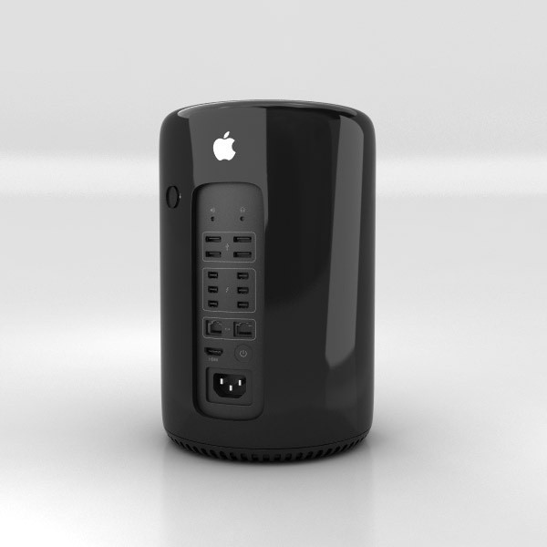

# 연탄맥(2013) 에 여러 OS 설치

> **Summary**
> 연탄맥에 윈도우 설치 후 D300 활성화 방법, 우분투 네이티브 설치 과정, Fedora 기반의 Bazzite 설치 및 재설치 해결 방법에 대한 설명이 포함되어 있습니다. 각 OS 설치에 필요한 링크와 절차가 제공됩니다.

---

# 연탄맥에 윈도우 설치 후 d300 활성화

🔗 [https://www.reddit.com/r/macpro/comments/p32m2g/anyone_can_install_ati_driver_of_d300/?rdt=50818&onetap_auto=true](https://www.reddit.com/r/macpro/comments/p32m2g/anyone_can_install_ati_driver_of_d300/?rdt=50818&onetap_auto=true)

지금 보고 있는 링크는 매우 오래되어 2021년에는 의미가 없습니다. Boot Camp와 함께 제공되는 Apple 소프트웨어 업데이트를 사용하여 AMD 드라이버를 쉽게 설치하거나 AMD 웹 사이트로 이동하여 "Boot Camp 통합 드라이버"를 다운로드할 수 있어야 합니다. WIndows 10용 R4” [https://www.amd.com/en/support/kb/release-notes/apple-boot-camp](https://www.amd.com/en/support/kb/release-notes/apple-boot-camp) .

🔗 [https://www.amd.com/en/support/kb/release-notes/apple-boot-camp](https://www.amd.com/en/support/kb/release-notes/apple-boot-camp)

# 드라이브 날리고 우분투 네이티브 설치

archilinux install gdisk 로드라이브 날리고 그 후에 ubuntu 설치

🔗 [https://amkorousagi-money.tistory.com/entry/우분투-부팅-usb-설치-방법-우분투-설치-파티션-설정](https://amkorousagi-money.tistory.com/entry/우분투-부팅-usb-설치-방법-우분투-설치-파티션-설정)

# fedora 기반의 bozzite

🔗 [https://www.youtube.com/watch?v=te1AEj_RA64](https://www.youtube.com/watch?v=te1AEj_RA64)

🔗 [https://github.com/ublue-os/bazzite/](https://github.com/ublue-os/bazzite/)

🔗 [https://bazzite.gg/](https://bazzite.gg/)

🔗 [https://universal-blue.discourse.group/docs?topic=1146](https://universal-blue.discourse.group/docs?topic=1146)

🔗 [https://appleinsider.com/inside/mac/tips/how-to-turn-your-vintage-mac-into-a-steam-gaming-machine-using-bazzite](https://appleinsider.com/inside/mac/tips/how-to-turn-your-vintage-mac-into-a-steam-gaming-machine-using-bazzite)

🔗 [https://chaidarun.com/fedora-mbp](https://chaidarun.com/fedora-mbp)

# 재설치 해결했다

1. 터미널 들어가서 (복구모드든… 일반 OS들어가서든,,,) 디스크 정보 보고
1. macOS 제외한 디스크들 다 언마운트하고
1. 해당 디스크들 삭제하고
1. 남는 프리 디스크 강제로 합병하고
1. ms-DOS로 새롭게 마운트함 (안되면 터미널에서 강제로 마운트)
1. 그리고 [MAC EFI boot 찌꺼기 삭제하기](https://www.notion.so/7e96a6c1114c4d5f89ff5aace5ac2bff) 기존 EFI 정보 날리고
1. 1회정도는 재부팅으로 맥OS 들어가서 마운트된거보고
1. option누르고 재부팅하고 재설치
1. fedora 나오면 설치 디스크에서 자동으로 해두고 공간 확보해야한다고하면 아까 ms DOS로 생성한 디스크 삭제해서 공간확보 후 OS설치

