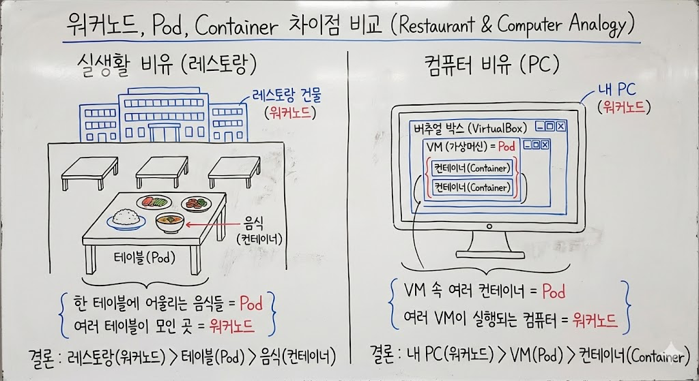

# 워커노드 , Pod , Container 의 차이점

> **Summary**
> 워커 노드는 레스토랑, 팟은 테이블, 컨테이너는 음식에 비유되어 설명된다. 워커 노드는 PC, 팟은 VM, 컨테이너는 VM 내의 컨테이너로 생각할 수 있다.

---

# 실생활의 비유

- **워커 노드(Worker Node):**워커 노드는 **레스토랑**이에요. 레스토랑 안에는 여러 테이블이 있고, 각 테이블에서 음식이 제공됩니다.
- **팟(Pod):**팟은 레스토랑 안의 **테이블**이에요. 한 테이블에는 서로 어울리는 음식들이 함께 있습니다. 마치 같은 테이블에서 밥과 반찬을 함께 먹는 것처럼요.
- **컨테이너(Container):**컨테이너는 테이블 위의 **음식**이에요. 각 음식은 모든 재료가 준비된 완성된 요리입니다. 여러 음식이 한 테이블에 있으면 더 맛있는 식사가 되죠.
정리하면, 레스토랑(워커 노드) 안에 여러 테이블(팟)이 있고, 각 테이블에는 맛있는 음식(컨테이너)이 차려져 있는 구조라고 볼 수 있겠네요…

# 컴퓨터로 생각해보자

- 워커노드 : 내 PC 자체
- Pod : 버추얼 박스 속 VM
- 컨테이너 : VM속 컨테이너

