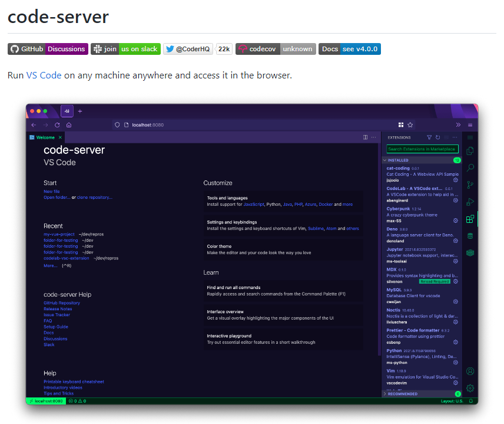

# 웹 코드서버 구축

> **Summary**
> 코드 서버 구축에 대한 내용을 다루며, 개인용 서버 만들기와 관련된 링크를 포함하고 있습니다.

---

🔗 [https://jspark33.tistory.com/76#Code%20server%20%EB%9E%80%3F%C2%A0-1](https://jspark33.tistory.com/76#Code%20server%20%EB%9E%80%3F%C2%A0-1)

🔗 [https://ckdals29672.tistory.com/3](https://ckdals29672.tistory.com/3)

