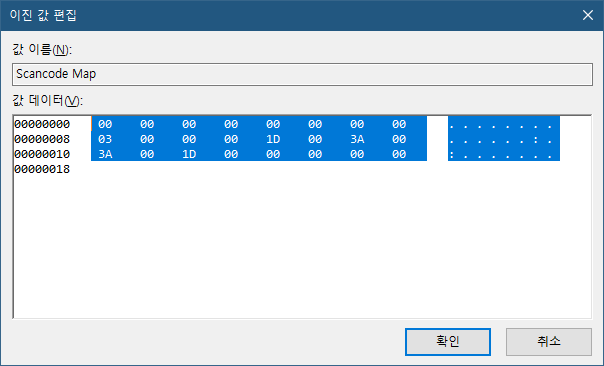
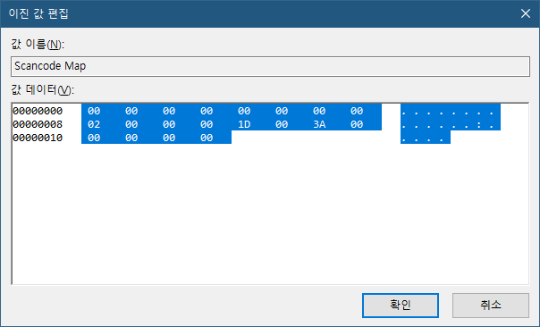

# 윈도우 Ctrl ←→ CapsLock 바꾸기

> **Summary**
> 윈도우에서 Ctrl 키와 Caps Lock 키의 위치를 변경하는 방법을 설명하며, 레지스트리 편집기를 사용하여 

---


🔗 [https://m.blog.naver.com/minhyupp/222211206474](https://m.blog.naver.com/minhyupp/222211206474)

윈도우키 + R : regedit

```c#
컴퓨터\HKEY_LOCAL_MACHINE\SYSTEM\CurrentControlSet\Control\Keyboard Layout
```

`Scancode Map` 이름으로 **이진값 새로 만들기** 후 입력한 다음 재부팅....


**03이 캡스락, XT값은 3A**

**58이 컨트롤 XT 값은 1D**


1D 00 3A의 뜻은 1D(컨트롤키)를 3A키(캡스락)에 할당해주시오. 라는 뜻.




Ctrl <-> Caps Lock 위치 변경



CapsLock 조차 Ctrl 키로 바꿔버리기


# 이거 자동화 할 방법 없나?

🔗 [https://dora-guide.com/레지스트리-편집기-실행/](https://dora-guide.com/레지스트리-편집기-실행/)

🔗 [https://blog.naver.com/starbros/220466856335](https://blog.naver.com/starbros/220466856335)


