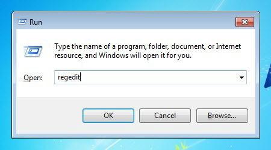
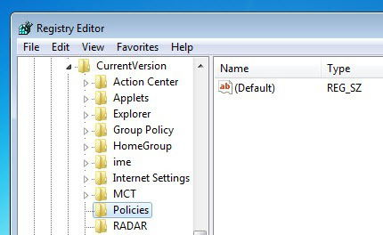
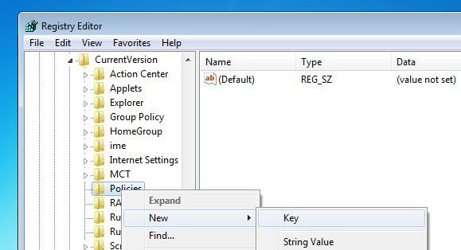
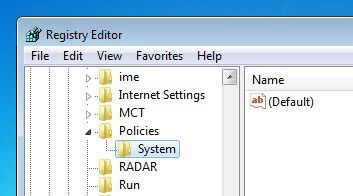
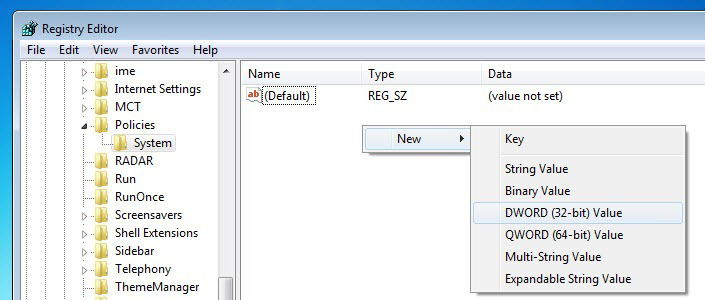
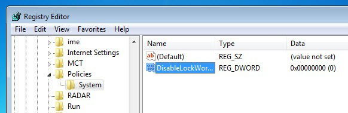
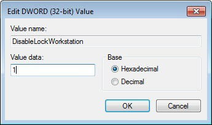
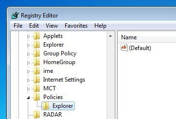
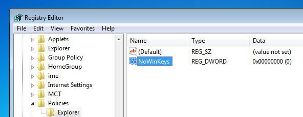
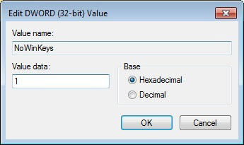

# 윈도우 win + L 비활성화 하기

> **Summary**
> Windows에서 "Win + L" 단축키를 비활성화하려면 레지스트리 편집이 필요하며, "HKEY_CURRENT_USER\\Software\\Microsoft\\Windows\\CurrentVersion\\Policies" 경로로 이동하여 "System" 키를 생성하고 "DisableLockWorkstation" 값을 1로 설정해야 합니다. 전체 Win + 키 단축키를 비활성화하려면 "Explorer" 키를 생성하고 "NoWinKeys" 값을 1로 설정하면 됩니다. 변경 후 시스템을 재시작하거나 로그오프해야 합니다.

---

🔗 [https://www.maketecheasier.com/disable-lock-screen-shortcut-key-windows/](https://www.maketecheasier.com/disable-lock-screen-shortcut-key-windows/)

Windows를 잠시라도 사용한다면 Windows 컴퓨터를 잠그는 가장 빠른 방법은 내장된 단축키인 "Win + L"을 사용하는 것이라는 사실을 아실 것입니다. 유용하기는 하지만 자신이나 다른 사용자가 실수로 이 단축키를 사용하는 것을 방지하기 위해 때때로 이 단축키를 비활성화해야 할 수도 있습니다.

따라서 필요한 경우 Windows 시스템에서 Win + L 단축키를 쉽게 비활성화할 수 있는 방법은 다음과 같습니다.

## **Win + L 단축키 비활성화**

**참고:** Windows 레지스트리를 편집하기 전에 혹시라도 [Windows 레지스트리를](https://www.maketecheasier.com/backup-restore-windows-registry/) 제대로 백업했는지 확인하세요 .

Windows에서 "Win + L" 단축키를 비활성화하는 것은 매우 쉽습니다. 당신이 해야 할 일은 레지스트리 키를 편집하는 것뿐입니다. 그렇게 하려면 Win+를 눌러 R실행 대화 상자를 열고 `regedit`Enter 키를 눌러 Windows 레지스트리를 엽니다.

Windows 레지스트리가 열리면 다음 키로 이동하십시오.

`HKEY_CURRENT_USER`` \Software\Microsoft\Windows\CurrentVersion\Policies`

이제 새로운 키를 생성해야 합니다. 그렇게 하려면 왼쪽에 나타나는 "정책" 키를 마우스 오른쪽 버튼으로 클릭하고 "새로 만들기" 옵션을 선택한 다음 "키"를 선택하십시오.

키 이름을 "System"으로 지정하고 Enter 버튼을 누릅니다. 이 작업을 수행하면 필요한 키가 생성됩니다. 키가 생성되면 다음과 같습니다.

키를 만든 후에는 새 DWORD 값을 만들어야 합니다. 그렇게 하려면 오른쪽 창을 마우스 오른쪽 버튼으로 클릭하고 "새로 만들기" 옵션을 선택한 다음 "DWORD(32비트) 값"을 선택합니다.

키 이름을 "DisableLockWorkstation"으로 지정하고 Enter 버튼을 누릅니다. 키가 생성되면 다음과 같습니다. 기본값 데이터는 "0"으로 설정되어 있습니다.

"Win + L" 단축키를 비활성화하려면 새로 생성된 값을 두 번 클릭하고 값 데이터를 "1"로 입력한 다음 "확인" 버튼을 클릭하여 변경 사항을 저장합니다.

이제 로그오프하거나 시스템을 다시 시작하면 됩니다. "Win + L" 바로가기를 다시 가져오려면 방금 만든 DWORD 값을 삭제하면 됩니다.

## **전체 Win + 키 단축키 비활성화**

물론 원한다면 전체 Win+ Key단축키를 비활성화할 수도 있습니다. 그렇게 하려면 "정책" 아래에 "Explorer"라는 새 키를 생성하세요.

이제 오른쪽 창에 새 DWORD 값을 만들고 이름을 "NoWinKeys"로 지정한 다음 Enter 버튼을 누릅니다.

새 값을 생성한 후 해당 값을 두 번 클릭하고 값 데이터를 "1"로 입력합니다. 이제 "확인" 버튼을 클릭하여 변경 사항을 저장하세요.

시스템을 다시 시작하거나 로그오프하면 모든 "Win + 키" 단축키가 비활성화됩니다. 변경 사항을 롤백하려면 방금 생성한 키를 삭제하면 됩니다.

Win위의 방법을 사용하여 Windows에서 + 단축키를 비활성화하는 방법에 대한 생각과 경험을 공유하려면 아래에 의견을 남겨주세요 L.

