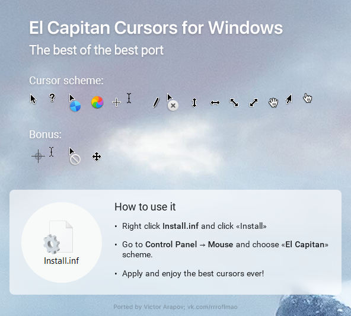
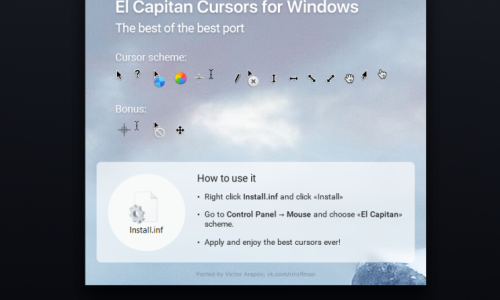
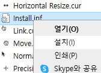
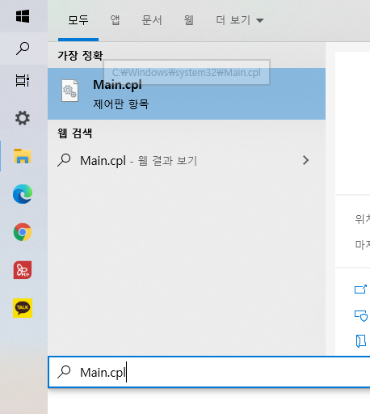
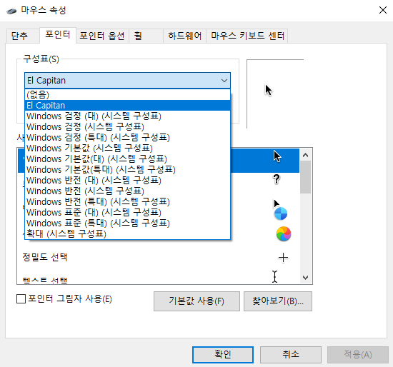

# 윈도우 마우스 커서 MAC처럼 변경

> **Summary**
> 윈도우 운영체제를 사용하는 사용자들을 위해 맥 OS 마우스 커서를 설치하는 방법을 설명합니다. 파일을 다운로드하고 압축을 풀어 설치한 후, 마우스 속성에서 새로운 커서를 선택하여 적용하면 됩니다.

---

# 윈도우 커서 MAC처럼

🔗 [https://m.blog.naver.com/minidexon/222079787488](https://m.blog.naver.com/minidexon/222079787488)

> 💡 **해당 파일 다운로드 받고 아래 튜토리얼 진행**
>

# 윈도우 마우스 커서 설치 및 바꾸기!

학교에서도, 회사에서도 항상 같은 윈도우 운영체제를 사용하다 보면 윈도우가 질리기 마련이죠.

물론 그렇다고 해서 윈도우를 대체할만한 제품은 아직 없다고 봅니다.

맥이나... 안드로이드나.... 아직 윈도우만큼 상용화 되어있다고 보기는 힘들죠..

그런 분들을 위해서 윈도우 테마 꾸미기 시리즈를 준비하였습니다!

1탄은 바로 마우스 커서 스킨 바꾸기 입니다!!

너무나도 다양한 마우스 커서가 있지만 이번 시간에는 애플의 맥 OS 마우스커서로 바꿔볼건데요!

사용법만 알면 다른 커서도 적용방법은 다 똑같기 때문에 쉽게 적용하실 수 있을거에요.

# 1. 적용방법

---

해당 게시글에서 파일을 다운로드 해주세요!

[**[MacOS 마우스 커서] 엘케피탄 마우스커서 스킨 설치 & 다운로드**](https://blog.naver.com/minidexon/222079790460)[맥 OS 마우스커서 스킨입니다.적용 방법 및 사용방법은 아래 링크로 걸어두었습니다 :)다운...](https://blog.naver.com/minidexon/222079790460)[blog.naver.com](https://blog.naver.com/minidexon/222079790460)

다운로드가 완료되면 데스크톱이나 다른 위치의 새 폴더에 zip 파일의 압축을 풀어주세요.

압축을 풀려면 zip 파일을 마우스 오른쪽 버튼으로 클릭하고 모두 압축 해제를 클릭 한 다음 압축 해제 파일을 저장할 위치를 선택한 다음 압축 풀기 버튼을 클릭하시면 됩니다.

**Install.inf**라는 파일을 찾아 마우스 오른쪽 버튼으로 클릭 한 다음 설치 옵션을 클릭하여 Windows 10에 Mac 커서를 설치하시면 됩니다.

이제 Mac 커서를 설치 했으므로 새로 설치된 커서를 선택할 차례입니다.

시작 메뉴 또는 실행 명령 상자에 Main.cpl을 입력 한 다음 Enter 키를 눌러 마우스 속성 대화 상자를 열어주세요.

포인터 옵션에 가서 구성표에 보시면 설치된 마우스 커서가 있습니다 그걸 클릭해주시고 적용해주시면 완료됩니다!

