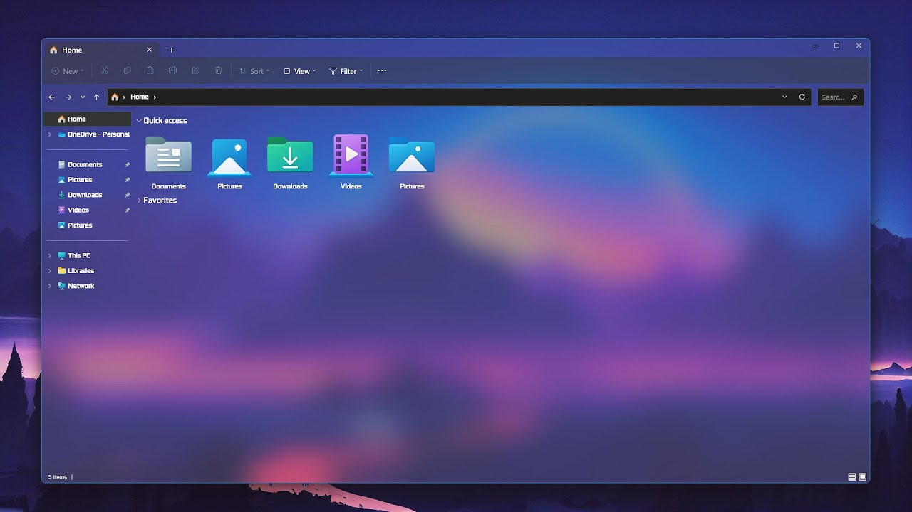

# 윈도우 탐색기 투명하게

> **Summary**
> Ctrl + Mouse 3을 사용하여 윈도우의 투명도를 조절하고, Win + Mouse 3으로 원래 상태로 복원할 수 있으며, 오토핫키를 통해서도 창 투명도를 제어할 수 있다. 모든 배경화면을 투명하게 만드는 방법도 가능하다.

---



## 윈도우 터미널 투명 설정

🎥 [동영상 보기](https://www.youtube.com/watch?v=ycm8sjeSVnQ&t=14s)

🎥 [동영상 보기](https://www.youtube.com/watch?v=JMnBWRviIDQ)

🔗 [https://virtualcustoms.net/showthread.php/84948-System-Transparency-by-Prisoner7-for-Windows-7-w8-8-1-w10-w10-19h1](https://virtualcustoms.net/showthread.php/84948-System-Transparency-by-Prisoner7-for-Windows-7-w8-8-1-w10-w10-19h1)

## → 이거 모든 배경화면 투명하게 만들기 가능함

```c++
Ctrl + Mouse 3 누르면 투명화
Win + Mouse 3 누르면 원래대로
```

## → 오토핫키로도 가능한듯?

🔗 [https://www.reddit.com/r/AutoHotkey/comments/lywlnt/control_window_transparency_with_the_mouse_wheel/](https://www.reddit.com/r/AutoHotkey/comments/lywlnt/control_window_transparency_with_the_mouse_wheel/)


