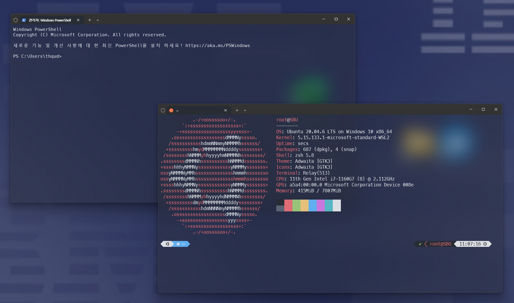

# 윈도우 터미널 투명하게

> **Summary**
> 윈도우 터미널의 투명도를 설정하는 방법에 대한 설명과 포커스 모드 설정 방법이 포함되어 있으며, 배터리 효율을 향상시키면 투명도가 복원될 수 있다는 내용이 언급되어 있습니다. 설정 JSON에서 \\"compatibility.enableUnfocusedAcrylic\\": true 옵션을 활성화하면 포커스가 아닐 때도 투명하게 설정할 수 있습니다.

---




## 윈도우 터미널 투명 설정

🔗 [https://chooi9522.tistory.com/36](https://chooi9522.tistory.com/36)

## windows terminal opacity when not focused

🔗 [https://www.reddit.com/r/microsoft/comments/sm8ugv/windows_terminal_is_only_transparent_when_focused/](https://www.reddit.com/r/microsoft/comments/sm8ugv/windows_terminal_is_only_transparent_when_focused/)


in your settings json`**"compatibility.enableUnfocusedAcrylic": true**`, [<u>**Windows terminal preview only**</u>](https://www.microsoft.com/store/productId/9N8G5RFZ9XK3?ocid=pdpshare)


> **근데 터미널 미리보기에선 위에 옵션 설정할 필요 없이, 
그냥 자동으로 다중 투명블러가 적용되는듯?**
> ```javascript
> "defaults": 
>         {
>             "backgroundImageOpacity": 0.5, // 수정해도 안바뀜
>             "colorScheme": "One Half Dark",
>             "font": 
>             {
>                 "face": "MesloLGS NF"
>             },
>             "opacity": 50, // 터미널 미리보기에서는 얘만 수정해주면 됨
>             "useAcrylic": true
>         },
> ```
>
>

## 포커스 모드 설정

🔗 [https://new.atsit.in/3106/](https://new.atsit.in/3106/)

# 만약 투명이 풀렸다?

→ 랩탑을 쓰는 경우, 배터리효율을 향상된 배터리를 사용하면 다시 돌아옴

