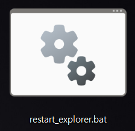

# 윈도우 파일탐색기 재시작 배치파일 제작

> **Summary**
> 윈도우 파일 탐색기를 재시작하는 배치파일을 작성하는 방법을 설명합니다. 작업표시줄이 먹통이 될 때마다 작업관리자를 이용하는 대신, 배치파일을 통해 간편하게 재시작할 수 있도록 코드를 제공하고, 이를 단축키에 등록하는 방법을 제안합니다.

---




윈도우 wsl 추가이후로 참 좋은데…

이것저것 커스터마이징을 하다보니 작업표시줄이 먹통이 되는 경우가 가끔 있다.

맨날 작업관리자 들어가서 재시작하기도 귀찮아서 배치파일로 재시작 코드를 작성하여 단축키에 등록해보고자 한다

```powershell
@echo off

taskkill /f /im explorer.exe
start explorer.exe

exit
```


> 💡 **귀찮으면 다운 ㄱ**
> ---
>
>


