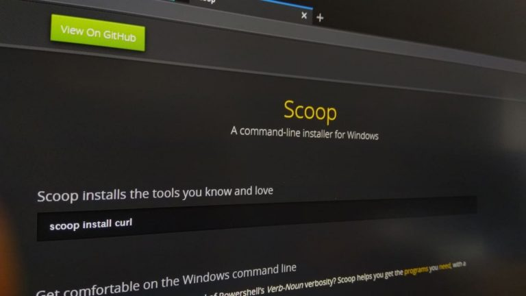

# 윈도우 패키지 관리자 scoop 설치

> **Summary**
> Windows에서 Scoop 패키지 관리자를 설치하려면 관리자 권한으로 PowerShell을 열고 실행 정책을 RemoteSigned로 설정한 후, 설치 명령을 실행해야 합니다. 설치가 완료되면 Scoop이 성공적으로 설치되며, 'scoop help'를 입력하여 사용법을 확인할 수 있습니다.

---



## scoop설치

[https://scoop.sh/](https://scoop.sh/)

🔗 [https://orcacore.com/install-use-scoop-windows/](https://orcacore.com/install-use-scoop-windows/)

# **Windows에서 Scoop을 설치하고 사용하는 단계**

[**이 가이드를 완료하려면 Windows 클라이언트**](https://orcacore.com/tag/windows-cl/) 에 로그인 하고 아래 단계를 따라야 합니다.

여기서는 관리자 권한으로 Windows 10을 사용합니다.

### **Scoop Windows 패키지 관리자 설치**

먼저 관리자 권한으로 PowerShell을 열어야 합니다. 그런 다음 PowerShell에서 아래 명령을 실행하여 실행 정책을  **RemoteSigned** 로 설정해야 합니다 .

이렇게 하면 인터넷에서 작성하거나 다운로드한 PowerShell 스크립트를 실행할 수 있습니다.

```bash
Set-ExecutionPolicy RemoteSigned -Scope CurrentUser
```

y를 눌러 실행 정책 변경을 확인합니다.

이 시점에서 Scoop 설치 프로그램을 다운로드하고 아래 명령을 사용하여 설치할 수 있습니다.

```bash
Invoke-Expression "& {$(Invoke-RestMethod get.scoop.sh)} -RunAsAdmin"
```

```plain text
Output
Initializing...
Downloading ...
Extracting...
Creating shim...
Adding ~\scoop\shims to your path.
Scoop was installed successfully!
Type 'scoop help' for instructions.
```

