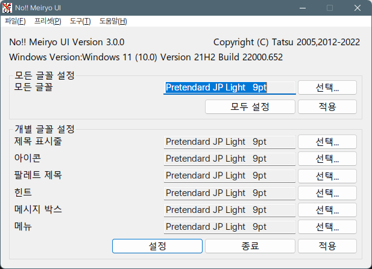

# 윈도우 폰트 MAC처럼 변경

> **Summary**
> 윈도우에서 폰트를 맥과 리눅스처럼 변경하기 위한 방법을 설명합니다. MacType을 사용하여 폰트 렌더링 엔진을 FreeType으로 바꾸고, noMeiryoUI를 통해 시스템 폰트를 변경합니다. Pretendard 폰트를 사용하면 더 나은 결과를 얻을 수 있으며, ini 파일을 설정하여 렌더링을 조정하는 방법도 포함되어 있습니다. 추가적으로, 특정 프로그램에서의 호환성 문제를 해결하는 방법과 브라우저에서의 폰트 적용 방법도 안내합니다.

---

🔗 [https://gigglehd.com/gg/soft/12183718](https://gigglehd.com/gg/soft/12183718)


이전부터 윈도우에서 맥과 리눅스와 같은 FreeType 렌더링을 사용하는 폰트로 바꾸기 위한 노력들은 계속해서 이루어졌습니다. 그중에서 제일 유명한 것이라면 아무래도 MacType이겠지요.

다만, MacType은 폰트의 렌더링 엔진을 기존의 윈도우의 ClearType에서 FreeType으로 바꾸어 줄 뿐 폰트를 제대로 바꿔주진 않습니다. 폰트는 noMeiryoUI를 이용해 바꿔야 합니다.


그런데 이 내용들을 한꺼번에 정리해놓은 글을 찾기가 생각보다 쉽지 않았습니다.

MacType 자체는 글이 많으나 오래된 글이 많고 noMeiryoUI를 조합한 글도 소수에 불과했습니다. 특히 여기에 애플 폰트를 최대한 따라해보려 본고딕을 개조한 Pretendard 폰트를 조합한 글은 사실상 기글에서 1N9님의 글밖에 찾지를 못 했습니다.

저 둘과 Pretendard 폰트를 사용하면 그야말로 맥과 리눅스에서 보던 그런 폰트와 흡사해집니다. 나중에 제가 잊어먹을 때를 대비하는 겸 저 말고도 도움 되실 분들이 있을까 하여 글로 작성해보고자 합니다.

~~이 뻘글은 전부 다 예전의 ~~[~~1N9님이 올리신 글~~](https://gigglehd.com/gg/bbs/12037312)~~을 보고 삘을 받아 시작해 제가 나중에 참고용으로 쓰려는 글에서 출발했습니다.~~

준비물은 아래와 같습니다:

> Pretendard JP


각 준비물의 최신 버전을 받아 둡니다.

각자 설치화면에서 다음 다음 눌러주시면 됩니다. 총 3개의 파일을 받게 될 텐데 설치 순서는 딱히 상관없습니다. MacType은 슬슬 업데이트가 한 번 나올 때가 된 것 같긴 합니다만, 현재로선 저게 최신이라 그대로 사용합니다.

저 셋을 각각 압축을 풀어주거나 설치를 미리 해두시면 되겠습니다.


위의 폰트들은 다 한 세트이니 마우스를 우클릭하고 (윈11은 더 많은 옵션을 누르시고) 설치합니다. Variable이라는 하나로 합쳐진 가변 폰트 파일이 존재하긴 합니다만, 이게 윈도우에도 적용되는지를 몰라서 저는 그냥 고전적인 트루타입 폰트(.ttf) 파일을 사용하였습니다.



폰트 설치 후에는 NoMeiiyuo UI 3.0을 사용해 폰트들을 다 바꿔줍니다. 레귤러나 미디엄 굵기는 생각보다 너무 굵던 느낌이라 저는 Light를 사용했으며 모두 설정 버튼을 누르면 모든 글꼴에 전부 적용됩니다. 일단 이러면 폰트는 바뀌지만, 아직 렌더링까지 바꿔주진 못합니다.


이제 MacType에 사용하기 위한 ini 파일을 만들 겁니다. 메모장 등의 텍스트 에디터를 이용해서 이름.ini 같은 형식으로 저장해두시면 됩니다.

자세한 ini 파일의 내용은 [https://gigglehd.com/gg/bbs/12043933](https://gigglehd.com/gg/bbs/12043933) 1N9님의 글을 참조하시면 되는데 1N9님의 글은 Pretendard 기본 폰트를 사용하였기에 그 부분만 <u>**Pretendard JP로 모두 바꿔주시면 되겠습니다.**</u>

```shell
[General]
HintingMode=2
AntiAliasMode=2
NormalWeight=3
BoldWeight=0
ItalicSlant=0
EnableKerning=0
GammaMode=1
LcdFilter=1
BolderMode=0
TextTuning=0
TextTuningR=0
TextTuningG=0
TextTuningB=0
GammaValue=2.5
Contrast=1.3
RenderWeight=2.3
Fontlink=1
HookChildProcesses=1
FontLoader=0
FontSubstitutes=1
Shadow=0,0,0,0x0,0,0x0
MaxBitmap=0
DirectWrite=1
HintSmallFont=1
CacheMaxFaces=256
CacheMaxSizes=12554432
CacheMaxBytes=12108864
Name=Pretendard

 

[UnloadDll]
ccApp.exe
Illustrator.exe
AIRobin.exe


[exclude]

[FontSubstitutes]
굴림=Pretendard
Gulim=Pretendard
굴림체=Pretendard
Gulimche=Pretendard
새굴림=Pretendard
돋움=Pretendard
Dotum=Pretendard
돋움체=Pretendard
Dotumche=Pretendard
바탕=Pretendard
Batang=Pretendard
바탕체=Pretendard
Batangche=Pretendard
맑은 고딕=Pretendard
맑은 고딕 Black=Pretendard
맑은 고딕 Bold=Pretendard
맑은 고딕 Semibold=Pretendard
맑은 고딕 Semilight=Pretendard
malgun=Pretendard
malgunbd=Pretendard
malgunsl=Pretendard
Malgun Gothic=Pretendard
Malgun Gothic Black=Pretendard
Malgun Gothic Bold=Pretendard
Malgun Gothic Semibold=Pretendard
Malgun Gothic Semilight=Pretendard
MS Reference Sans Serif=Pretendard
Lucida Console=Pretendard
Lucida Sans Unicode=Pretendard
segui=Pretendard
seguibd=Pretendard
seguisb=Pretendard
seguil=Pretendard
seguisl=Pretendard
seguibl=Pretendard
seguii=Pretendard
seguivar=Pretendard
Segoe UI=Pretendard
Segoe UI Black=Pretendard
Segoe UI Black Italic=Pretendard
Segoe UI Bold=Pretendard
Segoe UI Bold Italic=Pretendard
Segoe UI Semibold=Pretendard
Segoe UI Semibold Italic=Pretendard
Segoe UI Semilight=Pretendard
Segoe UI Semilight Italic=Pretendard
Segoe UI Light=Pretendard
Segoe UI Light Italic=Pretendard
Segoe UI Historic=Pretendard
Segoe UI Variable=Pretendard Variable
Segoe UI Variable Display=Pretendard Variable
Segoe UI Variable Display Bold=Pretendard Variable
Segoe UI Variable Display Light=Pretendard Variable
Segoe UI Variable Display Semilight=Pretendard Variable
Segoe UI Variable Display Semibold=Pretendard Variable
Segoe UI Variable Small Light=Pretendard Variable
Segoe UI Variable Small=Pretendard Variable
Segoe UI Variable Small Bold=Pretendard Variable
Segoe UI Variable Small Semibold=Pretendard Variable
Segoe UI Variable Small Semilight=Pretendard Variable
Segoe UI Variable Text=Pretendard Variable Variable
Segoe UI Variable Text Bold=Pretendard Variable
Segoe UI Variable Text Light=Pretendard Variable
Segoe UI Variable Text Semibold=Pretendard Variable
Segoe UI Variable Text Semilight=Pretendard Variable
Tahoma=Pretendard
Verdana=Pretendard

 

[Individual]
[ExcludeSub]


[DirectWrite]
RenderingMode=5
GammaValue=2.2
Contrast=1.22
ClearTypeLevel=1
```


이제 폰트 렌더링을 바꿔주기 위해 MacType을 사용합니다. MacType Wizard를 실행하면 위와 같은 화면이 나옵니다. 옛날에는 레지스트리 모드가 가능했습니다만, 윈도우 10부터는 불가능하므로 서비스 모드를 선택한 후 다음을 눌러주세요.


오른쪽 아래의 주황색 십자표를 눌러 미리 만들어뒀던 ini 파일을 찾아야합니다. 그걸 찾아 추가하고 선택한 후 완료하면 사실상 가장 중요한 작업이 완료됩니다.

만일 ini 파일 적용 후 특정 프로그램들이 제대로 작동하지 않는다면 ini 파일을 다시 열어 [UnloadDll] 항목에 작동하지 않는 프로그램의 파일 이름과 확장자를 다 써주시면 되겠습니다.


마지막으로 [http://gigglehd.com/gg/bbs/12043933](http://gigglehd.com/gg/bbs/12043933) 글의 댓글에서 인용해 온 부분입니다.

> 1) 시작 메뉴에서 실행을 눌러 regedit를 실행합니다.


간혹 시작메뉴 부분이 폰트가 바뀌질 않고 기존 윈도우 폰트들로 돌아오는 경우가 있습니다. 아마도 MacType보다 explorer.exe가 먼저 실행되면서 생기는 문제가 아닐까 추정되는데 이런 경우 작업관리자에서 용량 큰 explorer.exe를 강제 종료합니다.

그런 다음 파일 -> 새 작업 실행에 들어가서 explorer.exe를 실행하면 제대로 바꾼 폰트가 적용되어서 나타나더군요. 참 아쉬운 부분이긴 하나 윈도우의 기본 파일인 explorer가 우선순위가 높은 만큼 이는 어쩔 수가 없는 것 같습니다.


당연히 인터넷 브라우저에서도 폰트를 바꿀 수 있습니다. 다만, Pretendard가 너무 작은 글씨에서는 번짐 현상이 생기던지라 저는 글자 크기를 기본 상태보다 조금 더 크게 키운 게 맘에 들더군요. 셰리프나 고정 폭 폰트는 아니다 보니 그 둘은 다른 폰트를 썼습니다.

1N9님 덕분에 이런 과정을 거쳐서 더욱 예뻐진 윈도우를 만족스럽게 사용하고 있습니다. 1N9님께 다시 한번 감사의 말씀을 드리며 다른 방법들을 찾다 못해 그냥 제가 직접 시행착오 거치면서 쓴 이 글이 여러분도 시스템 폰트를 탈바꿈하는 데 도움이 될 수 있기를 바랍니다.

- - - - - - - - - - - - - - - - - - - - - - - - - - - - - - - - - - - - - - - -
※ 크로미움 계열의 브라우저에서 보안 문제로 서드파티 DLL를 막는 경우가 있습니다. 레지스트리 모드를 사용하던 시절의 문제점이긴 하나 혹여 이런 경우로 MacType가 브라우저에서만 작동하지 않는다면 RendererCodeIntegrity 기능을 꺼야 하는데 방법은 공식적으로 두 가지가 존재합니다.

1. 인터넷 브라우저의 바로가기 속성에서 바로가기 탭에 들어가 대상 끝 부분에 --disable-features=RendererCodeIntegrity라고 매개변수를 추가해줍니다. 하지만, 이렇게 할 경우 수정한 바로가기 파일에만 해당 사항이 적용됩니다.

2. 아예 브라우저 자체의 RendererCodeIntegrity를 끄고 싶다면 아래와 같이 레지스트리를 수정합니다.

> 1) 시작 메뉴에서 실행을 눌러 regedit를 실행합니다.

※ 파이어폭스에서는 일반적으로 DirectWrite 모드 덕분에 문제 없이 작동하지만, 간혹 DirectWrite의 렌더링이 MacType의 GDI와 맞지 않는 경우가 발생할 때가 있습니다. 이런 경우 버전에 따라 아래와 같은 방법을 써볼 수 있습니다.

1. 파이어폭스 69버전 이상인 경우

> 1) 파이어폭스 주소창에 about:config를 입력해 들어가세요.

2. 파이어폭스 68버전 이하인 경우

> 1) 파이어폭스 주소창에 about:config를 입력해 들어가세요.

이제 파이어폭스를 재시작해 MacType의 폰트가 제대로 렌더링되는지 확인하시면 됩니다.

※ Java 기반 앱들에서 제대로 작동하지 않는 경우 ini 파일에 clipboxfix=1을 추가해 이를 보완할 수 있습니다. 예를 들어 개발용 프로그램인 IntelliJ IDEA의 경우 ini 파일에 다음과 같이 문구를 추가하시면 됩니다.

> [Experimental@idea64.exe]

※ 레지스트리 모드를 권장하던 시절의 문제점이라 서비스 모드를 기본으로 사용하는 지금은 해당 사항이 없어야 합니다만, Secure Boot가 켜져 있을 때 문제가 발생하는 경우가 있습니다. 혹시 문제가 생겼고 Secure Boot가 필요 없으신 분은 해제해보세요. 다만, Secure Boot를 해제하는 일은 일반적으로 권장하지 않습니다.

윈도우 폰트를 맥/리눅스처럼 바꿔보기 - 인터넷 / 소프트웨어 - 기글하드웨어 : https://gigglehd.com/gg/?mid=soft&document_srl=12183718

